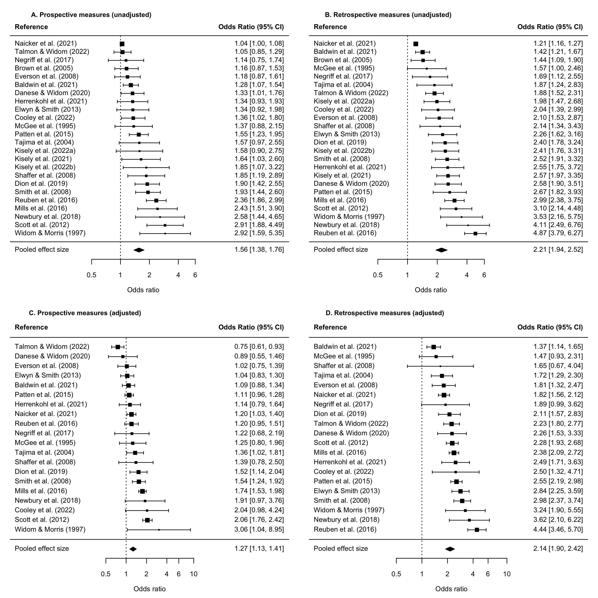
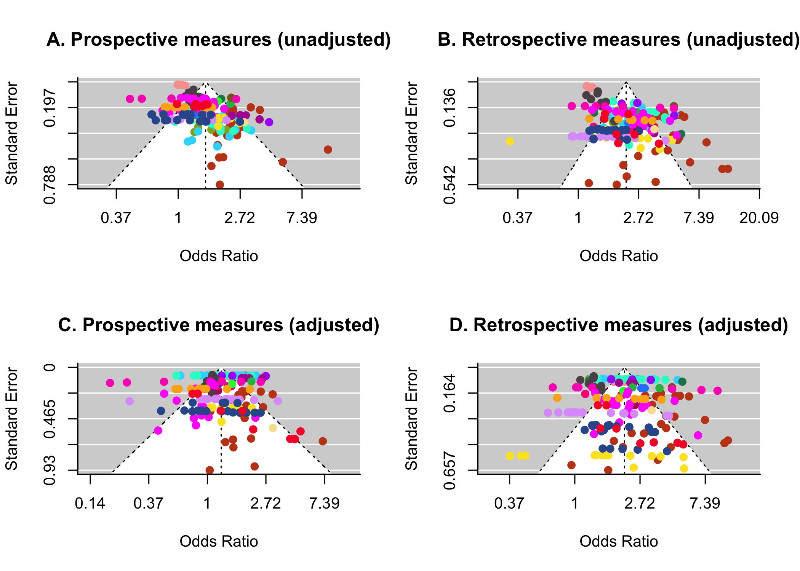
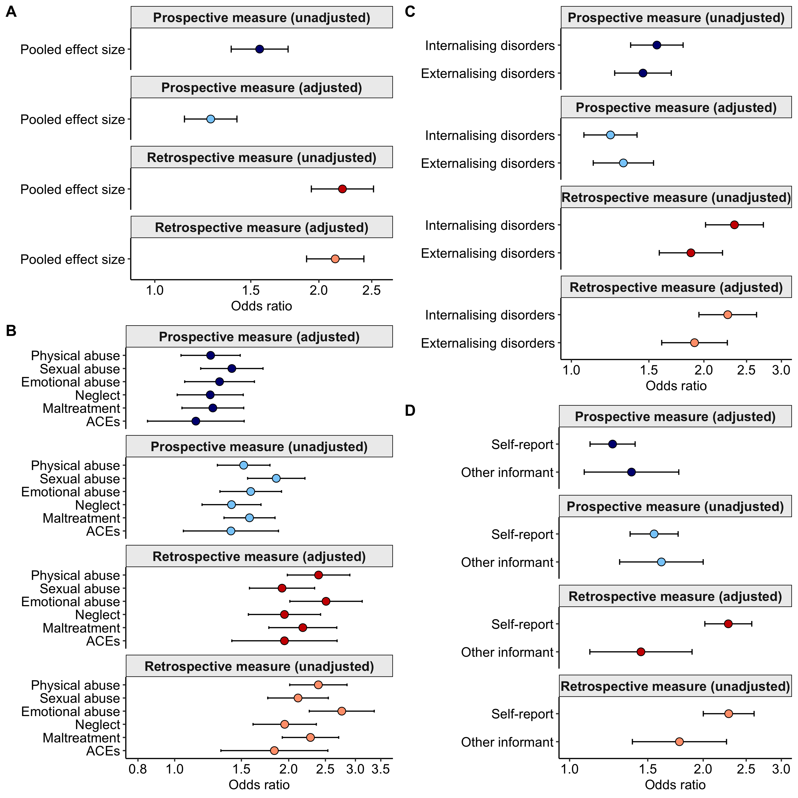

Prospective and retrospective measures of maltreatment and their
associations with psychopathology
================
Jessie Baldwin

-   [Load packages](#load-packages)
-   [Load data](#load-data)
-   [Convert effect sizes to odds
    ratios](#convert-effect-sizes-to-odds-ratios)
    -   [Examine raw effect sizes](#examine-raw-effect-sizes)
    -   [Generate new variables with odds ratio effect sizes and
        standard
        errors](#generate-new-variables-with-odds-ratio-effect-sizes-and-standard-errors)
    -   [Convert standardised mean differences to odds
        ratios](#convert-standardised-mean-differences-to-odds-ratios)
    -   [Convert correlations to odds
        ratios](#convert-correlations-to-odds-ratios)
    -   [Convert risk ratios to odds
        ratios](#convert-risk-ratios-to-odds-ratios)
-   [Derive additional variables needed for
    meta-analysis](#derive-additional-variables-needed-for-meta-analysis)
-   [Results](#results)
    -   [Search results - descriptives](#search-results---descriptives)
    -   [Meta-analyses on the associations between prospective and
        retrospective measures of maltreatment and
        psychopathology](#meta-analyses-on-the-associations-between-prospective-and-retrospective-measures-of-maltreatment-and-psychopathology)
        -   [Unadjusted associations between prospective and
            retrospective measures of maltreatment and
            psychopathology](#unadjusted-associations-between-prospective-and-retrospective-measures-of-maltreatment-and-psychopathology)
        -   [Sensitivity analysis restricting to studies with both
            unadjusted and adjusted effect
            sizes](#sensitivity-analysis-restricting-to-studies-with-both-unadjusted-and-adjusted-effect-sizes)
        -   [Adjusted associations between prospective and retrospective
            measures of maltreatment and
            psychopathology](#adjusted-associations-between-prospective-and-retrospective-measures-of-maltreatment-and-psychopathology)
        -   [Make forest plots with study-average effect
            sizes](#make-forest-plots-with-study-average-effect-sizes)
    -   [Sensitivity analyses](#sensitivity-analyses)
        -   [Publication bias analyses](#publication-bias-analyses)
        -   [Leave-one-out analyses](#leave-one-out-analyses)
    -   [Moderators of the associations between prospective and
        retrospective measures of child maltreatment and
        psychopathology](#moderators-of-the-associations-between-prospective-and-retrospective-measures-of-child-maltreatment-and-psychopathology)
        -   [Type of maltreatment](#type-of-maltreatment)
        -   [Type of psychopathology](#type-of-psychopathology)
        -   [Type of prospective measure](#type-of-prospective-measure)
        -   [Informant reporting on
            psychopathology](#informant-reporting-on-psychopathology)
        -   [Type of retrospective
            measure](#type-of-retrospective-measure)
        -   [Age at retrospective report](#age-at-retrospective-report)
        -   [Longitudinal vs cross-sectional study
            design](#longitudinal-vs-cross-sectional-study-design)
        -   [Sex differences](#sex-differences)
        -   [Study quality](#study-quality)
    -   [Create tables with moderation
        results](#create-tables-with-moderation-results)
        -   [Moderation of the associations between prospective measures
            &
            psychopathology](#moderation-of-the-associations-between-prospective-measures--psychopathology)
        -   [Moderation of the associations between retrospective
            measures &
            psychopathology](#moderation-of-the-associations-between-retrospective-measures--psychopathology)
    -   [Create plot with moderation
        results](#create-plot-with-moderation-results)
        -   [Main meta-analysis summary
            plot](#main-meta-analysis-summary-plot)
        -   [Type of psychopathology](#type-of-psychopathology-1)
        -   [Type of informant](#type-of-informant)
        -   [Type of maltreatment](#type-of-maltreatment-1)
        -   [Combine plots](#combine-plots)
    -   [Create table with results from quality/risk of bias
        assessment](#create-table-with-results-from-qualityrisk-of-bias-assessment)

# Load packages

``` r
library(readxl) # read in Excel data
library(psych) # for description of data
library(polycor) # for deriving tetrachoric correlations
library(metafor) # for meta-analysis
library(MAd) # for aggregating effect sizes within studies
library(dplyr) # for data wrangling
library(effectsize) # for effect size conversions
library(ggplot2) # for plots
library(gridExtra) # for arranging plots
library(cowplot) # for arranging plots
library(forcats) # for handling categorical variables
library(mgsub) # for formatting strings
library(multcomp) # for pairwise comparisons
library(kableExtra) # for tables
library(plyr) # for renaming variables
library(ggpubr) # for arranging plots
```

# Load data

``` r
## Open dataset 
setwd(Data)
data <- data.frame(read_excel("pro_retro_dataset_20231127.xlsx"))
str(data)

#### Remove Tabone & Cho
# Note: Cho et al. (2016) was excluded because it uses the same cohort as the newer Cooley paper but it’s a smaller sample with less comprehensive measures
data <- subset(data, author!="Tabone" & author!="Cho")
```

# Convert effect sizes to odds ratios

In the below sections, we:

-   Examine raw effect sizes
-   Create new variables for the converted effect sizes (odds ratios)
-   Convert standardised mean differences to odds ratios
-   Convert correlation coefficients to odds ratios
-   Convert risk ratios to odds ratios

### Examine raw effect sizes

``` r
## Examine types of effect sizes before conversion
table(data$p_unadj_es_type)  # prospective measures, unadjusted
table(data$r_unadj_es_type) # retrospective measures, unadjusted 
table(data$p_adj_es_type) # prospective measures, adjusted
table(data$r_adj_es_type) # retrospective measures, adjusted 

# View studies with odds ratios
data %>% dplyr::filter (p_unadj_es_type=="odds_ratio") %>% 
  dplyr::select(author, p_unadj_es_type, p_unadj_es)

# View studies with log odds ratios
data %>% dplyr::filter (p_unadj_es_type=="log_odds") %>% 
  dplyr::select(author, p_unadj_es_type, p_unadj_es)
```

### Generate new variables with odds ratio effect sizes and standard errors

``` r
## Generate new effect variables with ORs in (and input ORs from studies that already reported ORs or log odds)
# Prospective - unadjusted
data$p_unadj_or <- NA
data$p_unadj_or[data$p_unadj_es_type=="odds_ratio"] <- data$p_unadj_es[data$p_unadj_es_type=="odds_ratio"]
data$p_unadj_or[data$p_unadj_es_type=="log_odds"] <-  exp(data$p_unadj_es[data$p_unadj_es_type=="log_odds"])

# Retrospective - unadjusted
data$r_unadj_or <- NA
data$r_unadj_or[data$r_unadj_es_type=="odds_ratio"] <- data$r_unadj_es[data$r_unadj_es_type=="odds_ratio"]
data$r_unadj_or[data$r_unadj_es_type=="log_odds"] <- exp(data$r_unadj_es[data$r_unadj_es_type=="log_odds"])

# Prospective - adjusted
# note: R includes NAs in "data$p_adj_es_type=="odds_ratio" so need to also specify that we do not include NAs
data$p_adj_or <- NA
data$p_adj_or[data$p_adj_es_type=="odds_ratio" & !is.na(data$p_adj_es)] <- 
  data$p_adj_es[data$p_adj_es_type=="odds_ratio" & !is.na(data$p_adj_es)]

# Retrospective - adjusted
# note: R includes NAs in "data$p_adj_es_type=="odds_ratio" so need to also specify that we do not include NAs
data$r_adj_or <- NA
data$r_adj_or[data$r_adj_es_type=="odds_ratio" & !is.na(data$r_adj_es)] <-
  data$r_adj_es[data$r_adj_es_type=="odds_ratio" & !is.na(data$r_adj_es_type)]

## Generate new log odds standard error variables (and input SEs from studies that already reported ORs or log odds)
# Prospective - unadjusted
data$p_unadj_logOR_se <- NA
data$p_unadj_logOR_se[data$p_unadj_es_type=="odds_ratio"] <- data$p_unadj_se[data$p_unadj_es_type=="odds_ratio"]
data$p_unadj_logOR_se[data$p_unadj_es_type=="log_odds"] <- data$p_unadj_se[data$p_unadj_es_type=="log_odds"]

# Retrospective - unadjusted
data$r_unadj_logOR_se <- NA
data$r_unadj_logOR_se[data$r_unadj_es_type=="odds_ratio"] <- data$r_unadj_se[data$r_unadj_es_type=="odds_ratio"]
data$r_unadj_logOR_se[data$r_unadj_es_type=="log_odds"] <- data$r_unadj_se[data$r_unadj_es_type=="log_odds"]

# Prospective - adjusted
data$p_adj_logOR_se <- NA
data$p_adj_logOR_se[data$p_adj_es_type=="odds_ratio" & !is.na(data$p_adj_se)] <- 
  data$p_adj_se[data$p_adj_es_type=="odds_ratio" & !is.na(data$p_adj_se)]

# Retrospective - adjusted
data$r_adj_logOR_se <- NA
data$r_adj_logOR_se[data$r_adj_es_type=="odds_ratio" & !is.na(data$r_adj_se)] <-
  data$r_adj_se[data$r_adj_es_type=="odds_ratio" & !is.na(data$r_adj_se)]

# Check number of effect sizes already as odds ratios
describe(data$p_unadj_or, na.rm=TRUE) # prospective measures, unadjusted
describe(data$r_unadj_or, na.rm=TRUE) # retrospective measures, unadjusted
describe(data$p_adj_or, na.rm=TRUE) # prospective measures, adjusted
describe(data$r_adj_or, na.rm=TRUE) # retrospective measures, adjusted
```

### Convert standardised mean differences to odds ratios

-   To convert standardised mean differences (SMDs) to odds ratios, we
    use the “d_to_oddsratio” function from the “effectsize” package.
-   To convert SMD standard errors to log odds standard errors, we
    derive a function from formulae
    [here](https://www.meta-analysis.com/downloads/Meta-analysis%20Converting%20among%20effect%20sizes.pdf).

``` r
# View studies with SMDs 
data %>% dplyr::filter (p_unadj_es_type=="smd") %>% 
  dplyr::select(author, p_unadj_es_type, p_unadj_es)

### Convert effect sizes 
# Prospective - unadjusted
data$p_unadj_or[data$p_unadj_es_type=="smd"] <- d_to_oddsratio(data$p_unadj_es[data$p_unadj_es_type=="smd"])
# Retrospective - unadjusted
data$r_unadj_or[data$r_unadj_es_type=="smd"] <- d_to_oddsratio(data$r_unadj_es[data$r_unadj_es_type=="smd"])
# Prospective - adjusted
data$p_adj_or[data$p_adj_es_type=="smd" & !is.na(data$p_adj_es)] <- 
  d_to_oddsratio(data$p_adj_es[data$p_adj_es_type=="smd" & !is.na(data$p_adj_es)])
# Retrospective - adjusted
data$r_adj_or[data$r_adj_es_type=="smd" & !is.na(data$r_adj_es)] <-
  d_to_oddsratio(data$r_adj_es[data$r_adj_es_type=="smd" & !is.na(data$r_adj_es)])

# Check converted effect sizes
describe(data$p_unadj_or, na.rm=TRUE) # prospective measures, unadjusted
describe(data$r_unadj_or, na.rm=TRUE) # retrospective measures, unadjusted
describe(data$p_adj_or, na.rm=TRUE) # prospective measures, adjusted
describe(data$r_adj_or, na.rm=TRUE) # retrospective measures, adjusted

### Convert standard erorrs from SMD to log odds SE
# Derive function based on formulae here: https://www.meta-analysis.com/downloads/Meta-analysis%20Converting%20among%20effect%20sizes.pdf
se_smd_logodds <- function(smd_se) {
  smd_var <- smd_se^2
  logodds_var <- smd_var*(3.1416^2/3)
  logodds_se <- sqrt(logodds_var)
  return(c(logodds_se))
}

### Convert standard errors from SMD to log odds SE
# Prospective - unadjusted
data$p_unadj_logOR_se[data$p_unadj_es_type=="smd"] <- se_smd_logodds(data$p_unadj_se[data$p_unadj_es_type=="smd"])

# Retrospective - unadjusted
data$r_unadj_logOR_se[data$r_unadj_es_type=="smd"] <- se_smd_logodds(data$r_unadj_se[data$r_unadj_es_type=="smd"])

# Prospective - adjusted
data$p_adj_logOR_se[data$p_adj_es_type=="smd" & !is.na(data$p_adj_se)] <- 
  se_smd_logodds(data$p_adj_se[data$p_adj_es_type=="smd" & !is.na(data$p_adj_se)])

# Retrospective - adjusted
data$r_adj_logOR_se[data$r_adj_es_type=="smd" & !is.na(data$r_adj_se)] <- 
  se_smd_logodds(data$r_adj_se[data$r_adj_es_type=="smd" & !is.na(data$r_adj_se)])
```

### Convert correlations to odds ratios

-   To convert correlations to odds ratios, we use the “r_to_oddsratio”
    function from the “effectsize” package.
-   We then derive variance of correlation from formulae
    [here](https://www.meta-analysis.com/downloads/Meta-analysis%20Effect%20sizes%20based%20on%20correlations.pdf).
-   Next, we convert variance of correlations to log odds standard
    errors from formulae
    [here](https://www.meta-analysis.com/downloads/Meta-analysis%20Converting%20among%20effect%20sizes.pdf).

``` r
# View studies with correlations
data %>% dplyr::filter (p_adj_es_type=="correlation" | p_unadj_es_type=="correlation") %>% 
  dplyr::select(author, p_unadj_es_type, p_adj_es_type)

### Convert correlations to odds ratios
# Prospective - unadjusted
data$p_unadj_or[data$p_unadj_es_type=="correlation"] <-  r_to_oddsratio(data$p_unadj_es[data$p_unadj_es_type=="correlation"])
# Retrospective - unadjusted
data$r_unadj_or[data$r_unadj_es_type=="correlation"] <- 
  r_to_oddsratio(data$r_unadj_es[data$r_unadj_es_type=="correlation"])
# Prospective - adjusted
data$p_adj_or[data$p_adj_es_type=="correlation" & !is.na(data$p_adj_es)] <- 
  r_to_oddsratio(data$p_adj_es[data$p_adj_es_type=="correlation" & !is.na(data$p_adj_es)])
# Retrospective - adjusted
data$r_adj_or[data$r_adj_es_type=="correlation" & !is.na(data$r_adj_es)] <-
  r_to_oddsratio(data$r_adj_es[data$r_adj_es_type=="correlation" & !is.na(data$r_adj_es)])

# Check converted effect sizes
describe(data$p_unadj_or, na.rm=TRUE) # prospective measures, unadjusted
describe(data$r_unadj_or, na.rm=TRUE) # retrospective measures, unadjusted
describe(data$p_adj_or, na.rm=TRUE) # prospective measures, adjusted
describe(data$r_adj_or, na.rm=TRUE) # retrospective measures, adjusted

# Derive variance of correlation, see: https://www.meta-analysis.com/downloads/Meta-analysis%20Effect%20sizes%20based%20on%20correlations.pdf
# Prospective, unadjusted
data$p_unadj_var_r <- NA
data$p_unadj_var_r[data$p_unadj_es_type=="correlation"] <- 
  (1-data$p_unadj_es[data$p_unadj_es_type=="correlation"]^2)^2/
  (data$n[data$p_unadj_es_type=="correlation"]-1)

# Retrospective, unadjusted
data$r_unadj_var_r <- NA
data$r_unadj_var_r[data$r_unadj_es_type=="correlation"] <- 
  (1-data$r_unadj_es[data$r_unadj_es_type=="correlation"]^2)^2/
  (data$n[data$r_unadj_es_type=="correlation"]-1)

# Prospective, adjusted
data$p_adj_var_r <- NA
data$p_adj_var_r[data$p_adj_es_type=="correlation" & !is.na(data$p_adj_es)] <- 
  (1-data$p_adj_es[data$p_adj_es_type=="correlation" & !is.na(data$p_adj_es)]^2)^2/
  (data$n[data$p_adj_es_type=="correlation" & !is.na(data$p_adj_es)]-1)

# Retrospective, adjusted
data$r_adj_var_r <- NA
data$r_adj_var_r[data$r_adj_es_type=="correlation" & !is.na(data$r_adj_es)] <- 
  (1-data$r_adj_es[data$r_adj_es_type=="correlation" & !is.na(data$r_adj_es)]^2)^2/
  (data$n[data$r_adj_es_type=="correlation" & !is.na(data$r_adj_es)]-1)

# Convert variance of correlation to variance of log odds ratio

# Derive function to convert from variance of correlation to SE of log odds ratio
var_r_se_logOdds <- function(var_r, r) {
  # convert variance of r to variance of d
  var_d <- 4*var_r/(1-r^2)^3
  # convert variance of d to variance of log odds
  var_logOdds <- var_d*(3.1416^2/3)
  # convert variance of log odds to se of log odds
  se_logOdds <- sqrt(var_logOdds)
  return(se_logOdds)
}

### Convert variance to log odds standard errors
# Prospective - unadjusted
data$p_unadj_logOR_se[data$p_unadj_es_type=="correlation"] <- 
  do.call( function(p_unadj_var_r, p_unadj_es,...) 
  var_r_se_logOdds(p_unadj_var_r, p_unadj_es), data[data$p_unadj_es_type=="correlation",])

# Retrospective, unadjusted
data$r_unadj_logOR_se[data$r_unadj_es_type=="correlation"] <- 
  do.call( function(r_unadj_var_r, r_unadj_es,...) 
    var_r_se_logOdds(r_unadj_var_r, r_unadj_es), data[data$r_unadj_es_type=="correlation",])

# Prospective, adjusted
data$p_adj_logOR_se[data$p_adj_es_type=="correlation" & !is.na(data$p_adj_es)] <- 
  do.call( function(p_adj_var_r, p_adj_es,...) 
    var_r_se_logOdds(p_adj_var_r, p_adj_es), data[data$p_adj_es_type=="correlation" & !is.na(data$p_adj_es),])

# Retrospective, adjusted
data$r_adj_logOR_se[data$r_adj_es_type=="correlation" & !is.na(data$r_adj_es)] <- 
  do.call( function(r_adj_var_r, r_adj_es,...) 
    var_r_se_logOdds(r_adj_var_r, r_adj_es), data[data$r_adj_es_type=="correlation" & !is.na(data$r_adj_es),])
```

### Convert risk ratios to odds ratios

To convert relative risks to Cohen’s d, we will:

-   derive a variable indexing the prevalence of the mental health
    outcome (p) in non-exposed individuals (needed for the conversion)
-   convert relative risks (RR) to log odds ratios using the formula:
    logOR = log(((1 - p) \* RR) / (1 - RR \* p))

``` r
# Check studies reporting risk ratios
data %>% dplyr::filter (p_unadj_es_type == "risk_ratio") %>% 
  group_by(author) 

## Define function to convert RR to OR
# RR = OR/ (1-p + (p * OR)) 
# OR = ((1 - p) * RR) / (1 - RR * p).
# where RR is the relative risk, OR is the odds ratio, and p is the control event rate
# e.g. the prevalence rate in the non-exposed individuals
# formula recommended by Grant et al., BMJ 2014: https://www.bmj.com/content/348/bmj.f7450
# and referenced in https://www.r-bloggers.com/2014/01/how-to-convert-odds-ratios-to-relative-risks/
# and https://www.researchgate.net/post/Can-we-Convert-Risk-Ratio-to-Odd-Ratios-what-is-the-baseline-risk-p-of-a-selection-of-populations-to-either-suffer-die-from-coronary-heart-disease

RR_to_OR <- function(RR, p) {
  OR <- ((1 - p) * RR) / (1 - RR * p)
  return(OR)
}

## Define function to derive log odds SE from RR and confidence intervals
RR_to_OR_SE <- function(RR, RR_lowCI, RR_upCI, p) {
  OR <- ((1 - p) * RR) / (1 - RR * p)
  log_OR <- log(OR)
  OR_lowCI <- ((1 - p) * RR_lowCI) / (1 - RR_lowCI * p)
  OR_upperCI <- ((1 - p) * RR_upCI) / (1 - RR_upCI * p)
  log_OR_SE <- (log(OR_upperCI) - log(OR_lowCI))/3.92
  return(log_OR_SE)
}

#### Danese & Widom, convert RR to OR
# As the conversion equation requires the prevalence of the outcome in individuals not exposed to maltreatment,
# make new variable with prevalence of outcome in those with neither pro nor retro measures of maltreatment 
# This variable will be used to derive ORs for adjusted analyses for pro and retro measures
data$prev_unexp_neither_pro_retro <- NA
data$prev_unexp_neither_pro_retro[data$author=="Danese"] <- 
  c(0.61, # maltreatment & any_psychopathology_diagnosis
    0.26, # maltreatment & any_internalising_disorder_diagnosis
    0.51, # maltreatment & any_externalising_disorder_diagnosis
    0.15, # maltreatment & depression_diagnosis
    0.06, # maltreatment & dysthymia_diagnosis
    0.05, # maltreatment & generalized_anxiety_disorder_diagnosis
    0.14, # maltreatment & PTSD_diagnosis
    0.03, # maltreatment & antisocial_personality_disorder_diagnosis
    0.46, # maltreatment & alcohol_abuse_and_or_dependence__diagnosis
    0.28, # maltreatment & drug_abuse_and_or_dependence
    0.62, # physical_abuse & any_psychopathology_diagnosis
    0.30, # physical_abuse & any_internalising_disorder_diagnosis
    0.51, # physical_abuse & any_externalising_disorder_diagnosis
    0.68, # sexual_abuse & any_psychopathology_diagnosis
    0.32, # sexual_abuse & any_internalising_disorder_diagnosis
    0.60, # sexual_abuse & any_externalising_disorder_diagnosis
    0.60, # neglect & any_psychopathology_diagnosis
    0.31, # neglect & any_internalising_disorder_diagnosis
    0.55) # neglect & any_externalising_disorder_diagnosis

# Check that all effect sizes from Danese & Widom now have data on prevalence of unexposed participants
data %>% dplyr::filter (p_adj_es_type == "risk_ratio") %>%
  dplyr::select(author, p_exposure_type, mh_outcome, prev_unexp_neither_pro_retro) 

## Convert adjusted RRs to OR for Danese & Widom
# Prospective, adjusted
data$p_adj_or[data$p_adj_es_type=="risk_ratio" & data$author=="Danese"] <- 
  do.call( function(p_adj_es, prev_unexp_neither_pro_retro,...) 
    RR_to_OR(p_adj_es, prev_unexp_neither_pro_retro), 
    data[data$p_adj_es_type=="risk_ratio" & data$author=="Danese",])

# Retrospective, adjusted
data$r_adj_or[data$p_adj_es_type=="risk_ratio" & data$author=="Danese"] <- 
  do.call( function(r_adj_es, prev_unexp_neither_pro_retro,...) 
    RR_to_OR(r_adj_es, prev_unexp_neither_pro_retro), 
    data[data$r_adj_es_type=="risk_ratio" & data$author=="Danese",])

## Convert adjusted RR SE to SE of log odds for Danese & Widom
 
# Prospective, adjusted SE
data$p_adj_logOR_se[data$p_adj_es_type=="risk_ratio" & data$author=="Danese"] <- 
  do.call( function(p_adj_es, p_adj_lowCI, p_adj_upCI, prev_unexp_neither_pro_retro,...) 
    RR_to_OR_SE(p_adj_es, p_adj_lowCI, p_adj_upCI, prev_unexp_neither_pro_retro), 
    data[data$p_adj_es_type=="risk_ratio" & data$author=="Danese",])

# Retrospective, adjusted SE
data$r_adj_logOR_se[data$r_adj_es_type=="risk_ratio" & data$author=="Danese"] <- 
  do.call( function(r_adj_es, r_adj_lowCI, r_adj_upCI, prev_unexp_neither_pro_retro,...) 
    RR_to_OR_SE(r_adj_es, r_adj_lowCI, r_adj_upCI, prev_unexp_neither_pro_retro), 
    data[data$r_adj_es_type=="risk_ratio" & data$author=="Danese",])

## To convert RRs to odds ratio for Danese & Widom unadjusted effect sizes, need to calculate prevalence of unexposed separately for prospective and retrospective studies:
# for prospective unadjusted - comparison group would be "neither prospective nor retrospective" + "retro only"
# for retrospective unadjusted - comparison group would be "neither prospective nor retrospective" + "pro only"
data %>% dplyr::filter (p_unadj_es_type == "risk_ratio") %>% 
  dplyr::select(author, p_exposure_type, mh_outcome) 

## Make new variable with prevalence of outcome in unexposed for prospective unadjusted analyses
# Here the unexposed group are those with "neither prospective nor retrospective measure" + "retrospective measures only"
data$prev_unexp_no_pro <- NA
data$prev_unexp_no_pro[data$author=="Danese"] <- 
  c(69.26, # maltreatment & any_psychopathology_diagnosis
    35.21, # maltreatment & any_internalising_disorder_diagnosis
    57.98, # maltreatment & any_externalising_disorder_diagnosis
    20.82, # maltreatment & depression_diagnosis
    8.17,  # maltreatment & dysthymia_diagnosis
    4.86, # maltreatment & generalized_anxiety_disorder_diagnosis
    20.62, # maltreatment & PTSD_diagnosis
    11.28, # maltreatment & antisocial_personality_disorder_diagnosis
    51.17, # maltreatment & alcohol_abuse_and_or_dependence__diagnosis
    33.92, # maltreatment & drug_abuse_and_or_dependence
    72.18, # physical_abuse & any_psychopathology_diagnosis
    40.48, # physical_abuse & any_internalising_disorder_diagnosis
    60.72, # physical_abuse & any_externalising_disorder_diagnosis
    72.96, # sexual_abuse & any_psychopathology_diagnosis
    40.65, # sexual_abuse & any_internalising_disorder_diagnosis
    61.39, # sexual_abuse & any_externalising_disorder_diagnosis
    68.73, # neglect & any_psychopathology_diagnosis
    36.38, # neglect & any_internalising_disorder_diagnosis
    57.59) # neglect & any_externalising_disorder_diagnosis

# convert percentage to prevalence
data$prev_unexp_no_pro[data$author=="Danese"] <- data$prev_unexp_no_pro[data$author=="Danese"]/100
data$prev_unexp_no_pro[data$author=="Danese"]

## Make new variable with prevalence of outcome in unexposed for retrospective unadjusted analyses
# Here the unexposed group are those with "neither prospective nor retrospective measure" + "prospective measures only"
data$prev_unexp_no_retro <- NA
data$prev_unexp_no_retro[data$author=="Danese"] <- 
  c(58.85, # maltreatment & any_psychopathology_diagnosis
    24.6, # maltreatment & any_internalising_disorder_diagnosis
    50.34, # maltreatment & any_externalising_disorder_diagnosis
    13.33, # maltreatment & depression_diagnosis
    5.52, # maltreatment & dysthymia_diagnosis
    3.91, # maltreatment & generalized_anxiety_disorder_diagnosis
    14.98, # maltreatment & PTSD_diagnosis
    5.06, # maltreatment & antisocial_personality_disorder_diagnosis
    45.29, # maltreatment & alcohol_abuse_and_or_dependence__diagnosis
    22.99, # maltreatment & drug_abuse_and_or_dependence
    61.55, # physical_abuse & any_psychopathology_diagnosis
    30.17, # physical_abuse & any_internalising_disorder_diagnosis
    51.38, # physical_abuse & any_externalising_disorder_diagnosis
    68.79, # sexual_abuse & any_psychopathology_diagnosis
    32.35, # sexual_abuse & any_internalising_disorder_diagnosis
    59.7, # sexual_abuse & any_externalising_disorder_diagnosis
    66.5, # neglect & any_psychopathology_diagnosis
    32.49, # neglect & any_internalising_disorder_diagnosis
    55.58) # neglect & any_externalising_disorder_diagnosis

# convert percentage to prevalence
data$prev_unexp_no_retro[data$author=="Danese"] <- data$prev_unexp_no_retro[data$author=="Danese"]/100
data$prev_unexp_no_retro[data$author=="Danese"]

## Convert unadjusted RRs to OR for Danese & Widom
# Prospective, unadjusted
data$p_unadj_or[data$p_unadj_es_type=="risk_ratio" & data$author=="Danese"] <- 
  do.call( function(p_unadj_es, prev_unexp_no_pro,...) 
    RR_to_OR(p_unadj_es, prev_unexp_no_pro), 
    data[data$p_unadj_es_type=="risk_ratio" & data$author=="Danese",])

# Retrospective, unadjusted
data$r_unadj_or[data$r_unadj_es_type=="risk_ratio" & data$author=="Danese"] <- 
  do.call( function(r_unadj_es, prev_unexp_no_retro,...) 
    RR_to_OR(r_unadj_es, prev_unexp_no_retro), 
    data[data$r_unadj_es_type=="risk_ratio" & data$author=="Danese",])

## Convert adjusted RR SE to SE of log odds for Danese & Widom
# Prospective, adjusted SE
data$p_unadj_logOR_se[data$p_unadj_es_type=="risk_ratio" & data$author=="Danese"] <- 
  do.call( function(p_unadj_es, p_unadj_lowCI, p_unadj_upCI, prev_unexp_no_pro,...) 
    RR_to_OR_SE(p_unadj_es, p_unadj_lowCI, p_unadj_upCI, prev_unexp_no_pro), 
    data[data$p_unadj_es_type=="risk_ratio" & data$author=="Danese",])

# Retrospective, adjusted SE
data$r_unadj_logOR_se[data$r_unadj_es_type=="risk_ratio" & data$author=="Danese"] <- 
  do.call( function(r_unadj_es, r_unadj_lowCI, r_unadj_upCI, prev_unexp_no_retro,...) 
    RR_to_OR_SE(r_unadj_es, r_unadj_lowCI, r_unadj_upCI, prev_unexp_no_retro), 
    data[data$r_unadj_es_type=="risk_ratio" & data$author=="Danese",])

### Summarise ES
describe(data$p_unadj_or, na.rm=TRUE) # prospective measures, unadjusted
describe(data$r_unadj_or, na.rm=TRUE) # retrospective measures, unadjusted
describe(data$p_adj_or, na.rm=TRUE) # prospective measures, adjusted
describe(data$r_adj_or, na.rm=TRUE) # retrospective measures, unadjusted
```

# Derive additional variables needed for meta-analysis

Before moving onto analysing the results, we will derive the following
variables:

-   study reference (combining the author name and year of publication)
-   effect size ID (needed for multi-level meta-analysis models)
-   variance of log odds ratio (needed for meta-analysis)
-   log odds ratio (needed for meta-analysis)
-   type of child maltreatment (for moderation analyses)
-   type of psychopathology (for moderation analyses)
-   informant reporting on psychopathology (for moderation analyses)

``` r
# Derive study reference, combining author name and year of publication
data$ref <- paste0(data$author, "_", data$year)

# Derive effect size ID (this is needed for multi-level meta-analysis)
data$es_id <- 1:nrow(data)

## Derive variance of log odds for all studies
# Prospective - unadjusted
data$p_unadj_var <- data$p_unadj_logOR_se^2 
# Retrospective - unadjusted
data$r_unadj_var <- data$r_unadj_logOR_se^2
# Prospective - adjusted
data$p_adj_var <- data$p_adj_logOR_se^2
# Retrospective - adjusted
data$r_adj_var <- data$r_adj_logOR_se^2

## Derive log odds ratio for all studies
# Prospective - unadjusted
data$p_unadj_logodds <- log(data$p_unadj_or)
# Retrospective - unadjusted
data$r_unadj_logodds <- log(data$r_unadj_or)
# Prospective - adjusted
data$p_adj_logodds <- log(data$p_adj_or)
# Retrospective - adjusted
data$r_adj_logodds <- log(data$r_adj_or)

## Recode maltreatment type variable to reduce number of categories
# Prospective measure of maltreatment
table(data$p_exposure_type)
data$p_exposure_type_r <- data$p_exposure_type
# Note: there are only 5 effect sizes for physical_neglect and emotional_abuse_neglect, check study originating from:
data %>% dplyr::filter (p_exposure_type == "physical_neglect" | p_exposure_type=="emotional_abuse_neglect") %>% 
  group_by(author) %>%
  dplyr::select(author, p_exposure_type)
# recode physical neglect to neglect
data$p_exposure_type_r[data$p_exposure_type=="physical_neglect"] <- "neglect"
# recode "emotional_abuse_neglect" to emotional_abuse as measure in E-Risk largely indexes abuse 
data$p_exposure_type_r[data$p_exposure_type=="emotional_abuse_neglect"] <- "emotional_abuse" 
table(data$p_exposure_type_r)

# Retrospective measure of maltreatment 
table(data$r_exposure_type)
data$r_exposure_type_r <- data$r_exposure_type
# recode physical neglect to neglect
data$r_exposure_type_r[data$r_exposure_type=="physical_neglect"] <- "neglect"
# recode "emotional_abuse_neglect" to emotional_abuse as measure in E-Risk largely indexes abuse 
data$r_exposure_type_r[data$r_exposure_type=="emotional_abuse_neglect"] <- "emotional_abuse" 
table(data$r_exposure_type_r)

## Derive broad measure of psychopathology outcome (internalising vs externalising)
data$mh_broad <- NA
data$mh_broad[data$mh_outcome=="anxiety_dx" |
                data$mh_outcome=="depression_dx" |
                data$mh_outcome=="eating_dx" |
                data$mh_outcome=="internalising_sx" |
                data$mh_outcome=="ptsd_dx" |
                data$mh_outcome=="self-harm"] <- "internalising"
data$mh_broad[data$mh_outcome=="adhd_dx" |
                data$mh_outcome=="alcohol_problems" |
                data$mh_outcome=="antisocial_dx" |
                data$mh_outcome=="drug_problems" |
                data$mh_outcome=="externalising_sx"] <- "externalising"
table(data$mh_broad)
# check categories against specific outcomes
data %>% dplyr::select(author, mh_outcome, mh_broad)%>% 
  as_tibble() %>% 
  print(n=4000)

## Derive broad measure of informant for psychopathology (self vs other)
table(data$mh_informant)
# Code self vs other (as only 3 effect sizes for teacher)
data$mh_informant_self_other <- NA
data$mh_informant_self_other[data$mh_informant=="self"] <- "self"
data$mh_informant_self_other[data$mh_informant=="caregiver" |
                               data$mh_informant=="teacher"] <- "other"
table(data$mh_informant_self_other)

## View effect sizes and variances
data %>% dplyr::select(author, p_exposure_type, mh_outcome,
                       p_unadj_or, p_unadj_var,
                       r_unadj_or, r_unadj_var,
                       p_adj_or, p_adj_var,
                       r_adj_or, r_adj_var)%>% 
  as_tibble() %>% 
  print(n=4000)
```

# Results

## Search results - descriptives

We will calculate descriptives on the number of studies, number of
cohorts, number of effect sizes, sample size, and sample characteristics
(age at assessment and percentage female).

``` r
# Number of studies
k_studies <- data %>%   
  group_by(ref) %>% # group by study reference
  dplyr::summarise(m = max(ref)) %>%  # select one row per study 
  nrow() # count number of rows
k_studies

# Number of cohorts 
n_cohort <- data %>%   
  group_by(cohort) %>% # group by study cohort
  dplyr::summarise(m = max(cohort)) %>%  # select one row per study 
  nrow() # count number of rows
n_cohort

# Obtain total N -
N <- data %>%   
  group_by(cohort) %>%   
  dplyr::summarise(m = max(n)) %>%  # make new column indexing largest sample size per distinct cohort
  dplyr::summarise(sum = sum(m)) # sum sample sizes across distinct cohorts
N

# Obtain k studies for unadjusted estimate 
k_unadjusted <- data %>%   
  dplyr::filter(!is.na(p_unadj_logodds)) %>%  # select only rows where data is available for the unadjusted ES
  group_by(ref) %>%  # group by study reference
  dplyr::summarise(m = max(ref)) %>%  # select one row per study
  nrow() # count number of studies
k_unadjusted

# Obtain k studies for adjusted estimate 
k_adjusted <- data %>%   
  dplyr::filter(!is.na(p_adj_logodds)) %>%  # select only rows where data is available for the unadjusted ES
  group_by(ref) %>%  # group by study reference
  dplyr::summarise(m = max(ref)) %>%  # select one row per study
  nrow() # count number of studies
k_adjusted

# Number of effect sizes
n_es_unadj <- length(data$p_unadj_logodds[!is.na(data$p_unadj_logodds)]) # 188 unadjusted ES (for prospective and retrospective, respectively)
n_es_unadj
n_es_adj <- length(data$p_adj_logodds[!is.na(data$p_adj_logodds)]) # 180 adjusted effect sizes (for prospective and retrospective, respectively)
n_es_adj

# Average proportion female 
perc_female <- data %>%   
  group_by(cohort) %>% # group by study cohort
  dplyr::summarise(mean_perc_female = mean(percent_female)) %>%  # calculate the average % female per cohort
  dplyr::summarise(overall=mean(mean_perc_female, na.rm=TRUE)) # caclulate the average % female across cohorts
perc_female

# Age at retrospective measure assessment 
age_r <- data %>%   
  group_by(cohort) %>%   # group by study cohort
  dplyr::summarise(mean_age_r = mean(r_age_assessment)) %>% # calculate the average age at assessment per cohort
  dplyr::summarise(overall=mean(mean_age_r, na.rm=TRUE)) # calculate the average age at assessment across cohorts
age_r
```

## Meta-analyses on the associations between prospective and retrospective measures of maltreatment and psychopathology

In the next section we will:

-   conduct multi-level random-effects meta-analyses for the
    *unadjusted* associations between *prospective* and *retrospective*
    measures of child maltreatment and psychopathology
-   conduct multi-level random-effects meta-analyses for the *adjusted*
    associations between *prospective* and *retrospective* measures of
    child maltreatment and psychopathology
-   conduct a sensitivity analysis restricting meta-analysis to studies
    with both unadjusted and adjusted effect sizes
-   create a summary plot showing the meta-analytic effect sizes for all
    measures and analyses
-   create individual forest plots showing study-average effect sizes

For each of the above meta-analyses, we will:

-   calculate
    
    values
-   compare effect sizes between prospective and retrospective measures
    of maltreatment and psychopathology
-   compare effect sizes between unadjusted and adjusted associations

### Unadjusted associations between prospective and retrospective measures of maltreatment and psychopathology

``` r
# Meta-analysis for prospective - unadjusted
res_p_unadj <- rma.mv(p_unadj_logodds, p_unadj_var,  
                      random=list(~ 1 | es_id, ~ 1 | ref), data=data)
res_p_unadj
predict(res_p_unadj, transf=exp, digits=2)

# Calculate I2 statistic
#see: https://www.metafor-project.org/doku.php/tips:i2_multilevel_multivariate 
W <- diag(1/data$p_unadj_var[!is.na(data$p_unadj_logodds) & !is.na(data$p_unadj_var)])
X <- model.matrix(res_p_unadj)
P <- W - W %*% X %*% solve(t(X) %*% W %*% X) %*% t(X) %*% W
I2_p_unadj <- 100 * sum(res_p_unadj$sigma2) / (sum(res_p_unadj$sigma2) + 
                                                  (res_p_unadj$k-res_p_unadj$p)/sum(diag(P)))
round(I2_p_unadj,2)

# Meta-analysis for retrospective - unadjusted
res_r_unadj <- rma.mv(r_unadj_logodds, r_unadj_var,  
                      random=list(~ 1 | es_id, ~ 1 | ref), data=data)
res_r_unadj
predict(res_r_unadj, transf=exp, digits=2)

# Calculate I2 statistic
W <- diag(1/data$r_unadj_var[!is.na(data$r_unadj_logodds) & !is.na(data$r_unadj_var)])
X <- model.matrix(res_r_unadj)
P <- W - W %*% X %*% solve(t(X) %*% W %*% X) %*% t(X) %*% W
I2_r_unadj <- 100 * sum(res_r_unadj$sigma2) / (sum(res_r_unadj$sigma2) + 
                                               (res_r_unadj$k-res_r_unadj$p)/sum(diag(P)))
round(I2_r_unadj,2)

## Compare effect sizes in prospective and retrospective unadjusted results, see: https://www.metafor-project.org/doku.php/tips:comp_two_independent_estimates
# derive dataframe with all estimates in 
dat.comp <- data.frame(estimate = c(coef(res_p_unadj), coef(res_r_unadj)), 
                       stderror = c(res_p_unadj$se, res_r_unadj$se),
                       meta = c("prospective_unadjusted","retrospective_unadjusted"), 
                       sigma2 = round(c(sum(res_p_unadj$sigma2), sum(res_r_unadj$sigma2)),3))
dat.comp
# Compare estimates in terms of p-value
diff_pro_retro <- rma(estimate, sei=stderror, mods = ~ meta, method="FE", data=dat.comp, digits=3)
round(diff_pro_retro$QMp,5)
# Compare estimates in terms of effect size
(dat.comp$estimate[dat.comp$meta=="retrospective_unadjusted"] - 
    dat.comp$estimate[dat.comp$meta=="prospective_unadjusted"])/
  dat.comp$estimate[dat.comp$meta=="retrospective_unadjusted"]

# Note: We don't include cohort/sample as a separate level because it doesn't capture any variance
# prospective measures
res_p_unadj_4level <- rma.mv(p_unadj_logodds, p_unadj_var,  
                      random=list(~ 1 | es_id, ~ 1 | ref, ~ 1 |cohort), data=data)
res_p_unadj_4level
# retrospective measures
res_r_unadj_4level <- rma.mv(r_unadj_logodds, r_unadj_var,  
                      random=list(~ 1 | es_id, ~ 1 | ref, ~ 1 |cohort), data=data)
res_r_unadj_4level
# compare models with and without cohort as a 4th levl
anova(res_p_unadj, res_p_unadj_4level) # prospective measures
anova(res_r_unadj, res_r_unadj_4level) # retrospective measures
# there is no significant difference between 4 and 3-level models
```

### Sensitivity analysis restricting to studies with both unadjusted and adjusted effect sizes

``` r
# Note: One study did not have data available to derive unadjusted and adjusted effect sizes
# This sensitivity analysis restricts the analysis to studies available with both effect sizes for comparability

# Meta-analysis for prospective - unadjusted
res_p_unadj_sens <- rma.mv(p_unadj_logodds, p_unadj_var,  
                      random=list(~ 1 | es_id, ~ 1 | ref),
                      subset=!is.na(p_adj_logodds),
                      data=data)
res_p_unadj_sens
predict(res_p_unadj_sens, transf=exp, digits=2)

# Meta-analysis for retrospective - unadjusted
res_r_unadj_sens <- rma.mv(r_unadj_logodds, r_unadj_var,  
                           random=list(~ 1 | es_id, ~ 1 | ref),
                           subset=!is.na(r_adj_logodds),
                           data=data)
res_r_unadj_sens
predict(res_r_unadj_sens, transf=exp, digits=2)
```

### Adjusted associations between prospective and retrospective measures of maltreatment and psychopathology

``` r
# Meta-analysis for prospective - adjusted
res_p_adj <- rma.mv(p_adj_logodds, p_adj_var,  
                    random=list(~ 1 | es_id, ~ 1 | ref), 
                    data=data)
res_p_adj
predict(res_p_adj, transf=exp, digits=2)

# Calculate I2 statistic
W <- diag(1/data$p_adj_var[!is.na(data$p_adj_logodds) & !is.na(data$p_adj_var)])
X <- model.matrix(res_p_adj)
P <- W - W %*% X %*% solve(t(X) %*% W %*% X) %*% t(X) %*% W
I2_p_adj <- 100 * sum(res_p_adj$sigma2) / (sum(res_p_adj$sigma2) + 
                                               (res_p_adj$k-res_p_adj$p)/sum(diag(P)))
round(I2_p_adj,2)

# Meta-analysis for retrospective - adjusted
res_r_adj <- rma.mv(r_adj_logodds, r_adj_var,  
                    random=list(~ 1 | es_id, ~ 1 | ref), 
                    data=data)
res_r_adj
predict(res_r_adj, transf=exp, digits=2)

# Calculate I2 statistic
W <- diag(1/data$r_adj_var[!is.na(data$r_adj_logodds) & !is.na(data$r_adj_var)])
X <- model.matrix(res_r_adj)
P <- W - W %*% X %*% solve(t(X) %*% W %*% X) %*% t(X) %*% W
I2_r_adj <- 100 * sum(res_r_adj$sigma2) / (sum(res_r_adj$sigma2) + 
                                             (res_r_adj$k-res_r_adj$p)/sum(diag(P)))
round(I2_r_adj,2)

## Compare effect sizes between unadjusted and adjusted results
# Compare prospective measures, unadjusted vs adjusted
dat.comp <- data.frame(estimate = c(coef(res_p_unadj), coef(res_p_adj)), 
                       stderror = c(res_p_unadj$se, res_p_adj$se),
                       meta = c("prospective_unadjusted","prospective_adjusted"), 
                       sigma2 = round(c(sum(res_p_unadj$sigma2), sum(res_p_adj$sigma2)),3))
dat.comp
# Compare estimates in terms of effect size
(dat.comp$estimate[dat.comp$meta=="prospective_unadjusted"] - 
    dat.comp$estimate[dat.comp$meta=="prospective_adjusted"])/
  dat.comp$estimate[dat.comp$meta=="prospective_unadjusted"]
# Calculate difference in p-value
diff_pro_unadj_adj <- rma(estimate, sei=stderror, mods = ~ meta, method="FE", data=dat.comp, digits=3)
round(diff_pro_unadj_adj$QMp,10)

# # Compare retrospective measures, unadjusted vs adjusted
dat.comp <- data.frame(estimate = c(coef(res_r_unadj), coef(res_r_adj)), 
                       stderror = c(res_r_unadj$se, res_r_adj$se),
                       meta = c("retrospective_unadjusted","retrospective_adjusted"), 
                       sigma2 = round(c(sum(res_r_unadj$sigma2), sum(res_r_adj$sigma2)),3))
dat.comp
# Compare estimates in terms of effect size
(dat.comp$estimate[dat.comp$meta=="retrospective_unadjusted"] - 
    dat.comp$estimate[dat.comp$meta=="retrospective_adjusted"])/
  dat.comp$estimate[dat.comp$meta=="retrospective_unadjusted"]
# Calculate difference in p-value
diff_retro_unadj_adj <- rma(estimate, sei=stderror, mods = ~ meta, method="FE", data=dat.comp, digits=3)
round(diff_retro_unadj_adj$QMp,10)

## Compare effect sizes in prospective and retrospective adjusted results
# derive dataframe with all estimates in 
dat.comp <- data.frame(estimate = c(coef(res_p_adj), coef(res_r_adj)), 
                       stderror = c(res_p_adj$se, res_r_adj$se),
                       meta = c("prospective_adjusted","retrospective_adjusted"), 
                       sigma2 = round(c(sum(res_p_adj$sigma2), sum(res_r_adj$sigma2)),3))
dat.comp
# Compare estimates in terms of effect size
(dat.comp$estimate[dat.comp$meta=="retrospective_adjusted"] - 
    dat.comp$estimate[dat.comp$meta=="prospective_adjusted"])/
  dat.comp$estimate[dat.comp$meta=="retrospective_adjusted"]
# Compare estimates
diff_pro_retro <- rma(estimate, sei=stderror, mods = ~ meta, method="FE", data=dat.comp, digits=3)
round(diff_pro_retro$QMp,10)
```

### Make forest plots with study-average effect sizes

Here we create forest plots for all meta-analyses (prospective
unadjusted, retrospective unadjusted, prospective adjusted and
retrospective adjusted). Because there are too many effect sizes to
show, we show the average effect size per study. We first define
functions to derive a single averaged effect size per study and format
results, and then plot results for each measure/analysis type.

#### Define function to format results

``` r
## Define function to format dataframe with study-average effect sizes
format_agg_df <- function(agg_results) {
  
  ## Derive dataset with each study reference represented only once
  agg_results <- as.data.frame((agg_results) %>% group_by(ref) %>% filter(row_number() == 1))
  agg_results$es_id <- 1:nrow(agg_results) # Derive effect size ID variable
  agg_results$year <- sapply(strsplit(agg_results$ref, "_"), `[`, 2) # Derive author variable
  agg_results$author <- sapply(strsplit(agg_results$ref, "_"), `[`, 1) # Derive year of publication variable
  
  # Order dataset according to year of publication
  agg_results <- agg_results[order(agg_results$year, agg_results$author), ]
  
  # Order dataset according to effect size
  agg_results <- agg_results[order(agg_results$ES), ]
  # Derive correct author labels
  agg_results$ref_r <-
    paste0(agg_results$author, " et al. (", 
           sub(".*_", "", agg_results$ref),")")
  agg_results$ref_r[agg_results$ref_r == "Talmon et al. (2022)"] <- "Talmon & Widom (2022)"
  agg_results$ref_r[agg_results$ref_r == "Elwyn et al. (2013)"] <- "Elwyn & Smith (2013)"
  agg_results$ref_r[agg_results$ref_r == "Danese et al. (2020)"] <- "Danese & Widom (2020)"
  agg_results$ref_r[agg_results$ref_r == "Widom et al. (1997)"] <- "Widom & Morris (1997)"
  
  return(agg_results)
}
```

#### Run aggregated results for prospective and retrospective measures and psychopathology (unadjusted)

``` r
### Prospective unadjusted 
data$nesting_var <- ave(data$p_unadj_logodds, data$ref, FUN = seq_along) # derive a nesting variable numbering each ES in each study
data %>%  group_by(ref) %>% dplyr::select(nesting_var) %>% print(n=400) # show nesting variable
data$DupCheck <- paste0(data$ref) 
vecUniqueEst <- levels(as.factor(data$DupCheck))
listAllSample=list() # make a list to store the results in

# Run loop to aggregate multiple within-study effect size estimates into a single average
for ( i in 1:length(vecUniqueEst) ) {
  df_selected = subset(data, DupCheck==as.character(vecUniqueEst[i])) 
  
  # If there are multiple effect sizes included in the study, run the aggregate model to obtain a study-average effect
  if  ( ( length(df_selected$nesting_var)>1 )==TRUE) {
    print("run aggregate model")
    agg <- agg(id=ref, es=p_unadj_logodds, var=p_unadj_var, cor=0.6, data=df_selected)
    df_out <- data.frame(ref=df_selected$ref, 
                         cohort=df_selected$cohort, 
                         N=df_selected$n,
                         ES=agg$es, 
                         var=agg$var, 
                         se=sqrt(agg$var))
  }
  
  # If there is only 1 effect size included in the study, keep the original effect size estimate
  else {
    print("keep individual effect size estimate")
    df_out <- data.frame(ref=df_selected$ref, 
                         cohort=df_selected$cohort,
                         N=df_selected$n,
                         ES=df_selected$p_unadj_logodds, 
                         var=df_selected$p_unadj_var, 
                         se=sqrt(df_selected$p_unadj_var))
  }
  listAllSample[[i]]=df_out
}
datMeta_inc = do.call(rbind,listAllSample)
# Format dataframe
agg_p_unadj <- format_agg_df(datMeta_inc)
# Run meta-analysis on aggregated sample 
p_unadj_agg_meta <- rma(ES, var, data=agg_p_unadj, slab=c(ref_r))
predict(p_unadj_agg_meta, transf=exp, digits=2) 

#### Retrospective unadjusted 
data$nesting_var <- ave(data$r_unadj_logodds, data$ref, FUN = seq_along) # derive a nesting variable numbering each ES in each study
data %>%  group_by(ref) %>% dplyr::select(nesting_var) %>% print(n=400) # show nesting variable

data$DupCheck <- paste0(data$ref) 
vecUniqueEst <- levels(as.factor(data$DupCheck))
listAllSample=list() # make a list to store the results in

# Run loop to aggregate multiple within-study effect size estimates into a single average
for ( i in 1:length(vecUniqueEst) ) {
  df_selected = subset(data, DupCheck==as.character(vecUniqueEst[i])) 
  
  # If there are multiple effect sizes included in the study, run the aggregate model to obtain a study-average effect
  if  ( ( length(df_selected$nesting_var)>1 )==TRUE) {
    print("run aggregate model")
    agg <- agg(id=ref, es=r_unadj_logodds, 
               var=r_unadj_var, 
               cor=0.6, 
               data=df_selected)
    df_out <- data.frame(ref=df_selected$ref, 
                         cohort=df_selected$cohort, 
                         N=df_selected$n,
                         ES=agg$es, 
                         var=agg$var,
                         se=sqrt(agg$var))
  }
  
  # If there is only 1 effect size included in the study, keep the original effect size estimate
  else {
    print("keep individual effect size estimate")
    df_out <- data.frame(ref=df_selected$ref, 
                         cohort=df_selected$cohort,
                         N=df_selected$n,
                        ES=df_selected$r_unadj_logodds, 
                        var=df_selected$r_unadj_var, 
                        se=sqrt(df_selected$r_unadj_var))
  }
  listAllSample[[i]]=df_out
}

datMeta_inc = do.call(rbind,listAllSample)
# Format dataframe
agg_r_unadj <- format_agg_df(datMeta_inc)
# Run meta-analysis on aggregated sample 
r_unadj_agg_meta <- rma(ES, var, data=agg_r_unadj, slab=c(ref_r))
predict(r_unadj_agg_meta, transf=exp, digits=2) 
```

#### Run aggregated results for prospective and retrospective measures and psychopathology (adjusted)

``` r
### Prospective adjusted 
data$nesting_var <- ave(data$p_adj_logodds, data$ref, FUN = seq_along) # derive a nesting variable numbering each ES in each study
data %>%  group_by(ref) %>% dplyr::select(nesting_var) %>% print(n=400) # show nesting variable
data$DupCheck <- paste0(data$ref) 
vecUniqueEst <- levels(as.factor(data$DupCheck))
listAllSample=list() # make a list to store the results in

# Run loop to aggregate multiple within-study effect size estimates into a single average
for ( i in 1:length(vecUniqueEst) ) {
  df_selected = subset(data, DupCheck==as.character(vecUniqueEst[i])) 
  
  # If there are multiple effect sizes included in the study, run the aggregate model to obtain a study-average effect
  if  ( ( length(df_selected$nesting_var)>1 )==TRUE) {
    print("run aggregate model")
    agg <- agg(id=ref, es=p_adj_logodds, var=p_adj_var, cor=0.6, data=df_selected)
    df_out <- data.frame(ref=df_selected$ref, 
                         cohort=df_selected$cohort, 
                         N=df_selected$n,
                         ES=agg$es, 
                         var=agg$var, 
                         se=sqrt(agg$var))
  }
  
  # If there is only 1 effect size included in the study, keep the original effect size estimate
  else {
    print("keep individual effect size estimate")
    df_out <- data.frame(ref=df_selected$ref, 
                         cohort=df_selected$cohort,
                         N=df_selected$n,
                         ES=df_selected$p_adj_logodds, 
                         var=df_selected$p_adj_var, 
                         se=sqrt(df_selected$p_adj_var))
  }
  listAllSample[[i]]=df_out
}
datMeta_inc = do.call(rbind,listAllSample)
# Format dataframe
agg_p_adj <- format_agg_df(datMeta_inc)
# Run meta-analysis on aggregated sample 
p_adj_agg_meta <- rma(ES, var, data=agg_p_adj, slab=c(ref_r))
predict(p_adj_agg_meta, transf=exp, digits=2) 

#### Retrospective unadjusted 
data$nesting_var <- ave(data$r_adj_logodds, data$ref, FUN = seq_along) # derive a nesting variable numbering each ES in each study
data %>%  group_by(ref) %>% dplyr::select(nesting_var) %>% print(n=400) # show nesting variable

data$DupCheck <- paste0(data$ref) 
vecUniqueEst <- levels(as.factor(data$DupCheck))
listAllSample=list() # make a list to store the results in

# Run loop to aggregate multiple within-study effect size estimates into a single average
for ( i in 1:length(vecUniqueEst) ) {
  df_selected = subset(data, DupCheck==as.character(vecUniqueEst[i])) 
  
  # If there are multiple effect sizes included in the study, run the aggregate model to obtain a study-average effect
  if  ( ( length(df_selected$nesting_var)>1 )==TRUE) {
    print("run aggregate model")
    agg <- agg(id=ref, es=r_adj_logodds, 
               var=r_adj_var, 
               cor=0.6, 
               data=df_selected)
    df_out <- data.frame(ref=df_selected$ref, 
                         cohort=df_selected$cohort, 
                         N=df_selected$n,
                         ES=agg$es, 
                         var=agg$var,
                         se=sqrt(agg$var))
  }
  
  # If there is only 1 effect size included in the study, keep the original effect size estimate
  else {
    print("keep individual effect size estimate")
    df_out <- data.frame(ref=df_selected$ref, 
                         cohort=df_selected$cohort,
                         N=df_selected$n,
                        ES=df_selected$r_adj_logodds, 
                        var=df_selected$r_adj_var, 
                        se=sqrt(df_selected$r_adj_var))
  }
  listAllSample[[i]]=df_out
}

datMeta_inc = do.call(rbind,listAllSample)
# Format dataframe
agg_r_adj <- format_agg_df(datMeta_inc)
# Run meta-analysis on aggregated sample 
r_adj_agg_meta <- rma(ES, var, data=agg_r_adj, slab=c(ref_r))
predict(r_adj_agg_meta, transf=exp, digits=2) 
```

#### Forest plot for prospective and retrospective measures and psychopathology (unadjusted and adjusted)

``` r
# For saving the figure, remove # from below lines
#dev.off()
#setwd(Figures)
#setEPS(width=8.5, height=10)
#postscript("meta_forest_all.eps")

# Set location of where to put plots
layout.matrix <- matrix(c(1, 3, 2, 4), nrow = 2, ncol = 2)
layout(mat = layout.matrix,
       heights = c(2, 2), # Heights of the two rows
       widths = c(2, 2)) # Widths of the two columns

# A. Forest plot of average prospective unadjusted estimates
par(mar = c(4, 4, 2, 2))
forest(p_unadj_agg_meta, 
       atransf=exp,
       mlab = "Pooled effect size",
       xlab = "Odds ratio", cex.lab=0.7,
       header=c("Reference", "Odds Ratio (95% CI)"),
       addfit = FALSE,
       ylim=c(-1,27),
       alim=c(-0.6931472, 1.94591),
       at=c(-0.6931472, 0, 0.6931472, 1.386294, 1.791759))
# add polygon for overall meta-analytic effect
abline(h=0)
addpoly(res_p_unadj, row=-1, atransf=exp, mlab="Pooled effect size")
text(-0.7, 27.5,"A. Prospective measures (unadjusted)",cex=0.8,font=2) # Add label for plot A

# B. Forest plot of average retrospective unadjusted estimates
par(mar = c(4, 4, 2, 2)) # bottom, left, top, and right. The default is c(5.1, 4.1, 4.1, 2.1)
forest(r_unadj_agg_meta, 
       atransf=exp,
       mlab = "Pooled effect size",
       xlab = "Odds ratio", cex.lab=0.7,
       header=c("Reference", "Odds Ratio (95% CI)"),
       addfit = FALSE,
       ylim=c(-1,27),
       alim=c(-0.6931472, 1.94591),
       at=c(-0.6931472, 0, 0.6931472, 1.386294, 1.791759))
# add polygon for overall meta-analytic effect
abline(h=0)
addpoly(res_r_unadj, row=-1, atransf=exp, mlab="Pooled effect size")
text(-0.45, 27.5,"B. Retrospective measures (unadjusted)",cex=0.8,font=2) # Add label for plot B

# C. Forest plot of average prospective adjusted estimates
par(mar = c(4, 4, 2, 2))
forest(p_adj_agg_meta, 
       atransf=exp,
       mlab = "Pooled effect size",
       xlab = "Odds ratio", cex.lab=0.7,
       header=c("Reference", "Odds Ratio (95% CI)"),
       addfit = FALSE,
       ylim=c(-1,23),
       alim=c(-0.6931472,  2.302585),
       at=c(-0.6931472, 0, 0.6931472, 1.386294, 1.791759, 2.302585))
# add polygon for overall meta-analytic effect
abline(h=0)
addpoly(res_p_adj, row=-1, atransf=exp, mlab="Pooled effect size")
text(-1.4, 23.5,"C. Prospective measures (adjusted)",cex=0.8,font=2) # Add label for plot C

# D. Forest plot of average retrospective estimates
par(mar = c(4, 4, 2, 2)) # bottom, left, top, and right. The default is c(5.1, 4.1, 4.1, 2.1)
forest(r_adj_agg_meta, 
       atransf=exp,
       mlab = "Pooled effect size",
       xlab = "Odds ratio", cex.lab=0.7,
       header=c("Reference", "Odds Ratio (95% CI)"),
       addfit = FALSE,
       ylim=c(-1,23),
       alim=c(-0.6931472,  2.302585),
       at=c(-0.6931472, 0, 0.6931472, 1.386294, 1.791759, 2.302585))
# add polygon for overall meta-analytic effect
abline(h=0)
addpoly(res_r_adj, row=-1, atransf=exp, mlab="Pooled effect size")
text(-1, 23.5,"D. Retrospective measures (adjusted)",cex=0.8,font=2) # Add label for plot D
```

<!-- -->

``` r
#dev.off()
```

## Sensitivity analyses

Below we will run sensitivity analyses to test for publication bias and
the undue influence of individual studies.

### Publication bias analyses

To test for publication bias, we use the following analyses:

-   Egger’s test
-   Visual inspection of funnel plots

#### Egger’s test

``` r
# Prospective - unadjusted
rma.mv(p_unadj_logodds, p_unadj_var,  mod = p_unadj_var, 
                     random=list(~ 1 | es_id, ~ 1 | ref), data=data)
# Retrospective - unadjusted 
rma.mv(r_unadj_logodds, r_unadj_var,  mod = r_unadj_var, 
                     random=list(~ 1 | es_id, ~ 1 | ref), data=data)

# Prospective - adjusted 
rma.mv(p_adj_logodds, p_adj_var,  mod = p_adj_var, 
                     random=list(~ 1 | es_id, ~ 1 | ref), data=data)

# Retrospective - adjusted
rma.mv(r_adj_logodds, r_adj_var,  mod = r_adj_var, 
       random=list(~ 1 | es_id, ~ 1 | ref, ~1 | cohort), data=data)
```

#### Funnel plots

``` r
#### Create funnel plots #####
## Colour code by paper
cols <- palette.colors(length(unique(data$ref)), palette="polychrome")
cols <- cols[as.numeric(factor(data$ref))]

par(mfrow = c(2, 2))

# Prospective - unadjusted
fun_p_unadj <- funnel(res_p_unadj, col=cols, atransf=exp, xlab="Odds Ratio", main="A. Prospective measures (unadjusted)")

# Retrospective - unadjusted 
fun_r_unadj <-funnel(res_r_unadj, col=cols, atransf=exp, xlab="Odds Ratio", main="B. Retrospective measures (unadjusted)")

# Prospective - adjusted 
fun_p_adj <-funnel(res_p_adj, col=cols, atransf=exp, xlab="Odds Ratio", main="C. Prospective measures (adjusted)")

# Retrospective - adjusted
fun_r_adj <-funnel(res_r_adj, col=cols, atransf=exp, xlab="Odds Ratio", main="D. Retrospective measures (adjusted)")
```

<!-- -->

``` r
# save 7x10 pdf
```

### Leave-one-out analyses

``` r
#--------------------------------------------------------------------------------------------------------#
#------------------ Exclude each COHORT in turn to test overall meta-analytic effect --------------------#
#--------------------------------------------------------------------------------------------------------#
groupids <- unique(data$cohort)  # generate groupid variable indexing each unique cohort name
leave1out_cohort <- matrix(rep(NA,length(groupids)), ncol=11, nrow=length(groupids))  # generate matrix to hold results

for(i in 1:length(groupids)) {  
  dataexcl <- subset(data, cohort!=groupids[i])  # remove each cohort in turn 
  N_rows <- psych::describe(dataexcl$n)$n # extract the number of rows when each cohort is removed
  mean_N <- psych::describe(dataexcl$n)$mean # extract the mean sample size when each cohort is removed
  
  # Run meta-analyses
  p_unadj_meta <- rma.mv(p_unadj_logodds, p_unadj_var, random=list(~ 1 | es_id, ~ 1 | ref), data=dataexcl) # prospective - unadjusted
  r_unadj_meta <- rma.mv(r_unadj_logodds, r_unadj_var, random=list(~ 1 | es_id, ~ 1 | ref), data=dataexcl) # retrospective - unadjusted
  p_adj_meta <- rma.mv(p_adj_logodds, p_adj_var, random=list(~ 1 | es_id, ~ 1 | ref), data=dataexcl) # prospective - adjusted
  r_adj_meta <- rma.mv(r_adj_logodds, r_adj_var, random=list(~ 1 | es_id, ~ 1 | ref), data=dataexcl) # retrospective - adjusted
  
  # Put results into matrix
  leave1out_cohort[i,1] <- i # cohort number excluded
  leave1out_cohort[i,2] <- N_rows # number of rows
  leave1out_cohort[i,3] <- mean_N # mean sample size
  leave1out_cohort[i,4] <- p_unadj_meta$beta[1] # prospective unadjusted effect size
  leave1out_cohort[i,5] <- p_unadj_meta$se[1] # prospective unadjusted SE
  leave1out_cohort[i,6] <- r_unadj_meta$beta[1] # retrospective unadjusted effect size
  leave1out_cohort[i,7] <- r_unadj_meta$se[1] # retrospective unadjusted SE
  leave1out_cohort[i,8] <- p_adj_meta$beta[1] # prospective adjusted effect size
  leave1out_cohort[i,9] <- p_adj_meta$se[1] # prospective adjusted SE
  leave1out_cohort[i,10] <- r_adj_meta$beta[1] # retrospective adjusted effect size
  leave1out_cohort[i,11] <- r_adj_meta$se[1] # retrospective adjusted SE
  
}

leave1out_cohort
leave1out_cohort[,1] <- as.vector(groupids) # Name studies
leave1out_cohort_df <- as.data.frame(leave1out_cohort) # Convert to dataframe
names(leave1out_cohort_df) <-c('cohort', 'N_rows', 'Mean_N',
                               'p_unadj_es', 'p_unadj_se',
                               'r_unadj_es', 'r_unadj_se',
                               'p_adj_es', 'p_adj_se',
                               'r_adj_es', 'r_adj_se') # Rename columns
# Convert columns from character to numeric
leave1out_cohort_df <- leave1out_cohort_df %>% mutate_at(c('N_rows', 'Mean_N', 
                                                           'p_unadj_es', 'p_unadj_se',
                                                           'r_unadj_es', 'r_unadj_se',
                                                           'p_adj_es', 'p_adj_se',
                                                           'r_adj_es', 'r_adj_se'), as.numeric)
# Save results dataset
setwd(Tables)
saveRDS(leave1out_cohort_df, file="leave1out_cohort.Rda")

#--------------------------------------------------------------------------------------------------------#
#------------------ Exclude each PAPER in turn to test overall meta-analytic effect ---------------------#
#--------------------------------------------------------------------------------------------------------#
groupids <- unique(data$ref)  # generate groupid variable indexing each unique paper name
leave1out_study <- matrix(rep(NA, length(groupids)), ncol=11, nrow=length(groupids)) # generate matrix to hold results 

for(i in 1:length(groupids)) {  
  dataexcl <- subset(data, ref!=groupids[i])  # remove each paper in turn 
  N_rows <- psych::describe(dataexcl$n)$n # extract the number of rows when each cohort is removed
  mean_N <- psych::describe(dataexcl$n)$mean # extract the mean sample size when each cohort is removed
  
  # Run meta-analyses
  p_unadj_meta <- rma.mv(p_unadj_logodds, p_unadj_var, random=list(~ 1 | es_id, ~ 1 | ref), data=dataexcl) # pro unadjusted
  r_unadj_meta <- rma.mv(r_unadj_logodds, r_unadj_var, random=list(~ 1 | es_id, ~ 1 | ref), data=dataexcl) # retro unadjusted
  p_adj_meta <- rma.mv(p_adj_logodds, p_adj_var, random=list(~ 1 | es_id, ~ 1 | ref), data=dataexcl) # pro adjusted
  r_adj_meta <- rma.mv(r_adj_logodds, r_adj_var, random=list(~ 1 | es_id, ~ 1 | ref), data=dataexcl) # retro adjusted
  
  # Put results into matrix
  leave1out_study[i,1] <- i # cohort number excluded
  leave1out_study[i,2] <- N_rows # number of rows
  leave1out_study[i,3] <- mean_N # mean sample size
  leave1out_study[i,4] <- p_unadj_meta$beta[1] # prospective unadjusted effect size
  leave1out_study[i,5] <- p_unadj_meta$se[1] # prospective unadjusted SE
  leave1out_study[i,6] <- r_unadj_meta$beta[1] # retrospective unadjusted effect size
  leave1out_study[i,7] <- r_unadj_meta$se[1] # retrospective unadjusted SE
  leave1out_study[i,8] <- p_adj_meta$beta[1] # prospective adjusted effect size
  leave1out_study[i,9] <- p_adj_meta$se[1] # prospective adjusted SE
  leave1out_study[i,10] <- r_adj_meta$beta[1] # retrospective adjusted effect size
  leave1out_study[i,11] <- r_adj_meta$se[1] # retrospective adjusted SE
}

leave1out_study
leave1out_study[,1] <- as.vector(groupids) # Name studies
leave1out_study_df <- as.data.frame(leave1out_study) # Convert to dataframe
names(leave1out_study_df) <-c('cohort', 'N_rows', 'Mean_N',
                              'p_unadj_es', 'p_unadj_se',
                              'r_unadj_es', 'r_unadj_se',
                              'p_adj_es', 'p_adj_se',
                              'r_adj_es', 'r_adj_se') # Rename columns
# Convert columns from character to numeric
leave1out_study_df <- leave1out_study_df %>% mutate_at(c('N_rows', 'Mean_N', 
                                                         'p_unadj_es', 'p_unadj_se',
                                                         'r_unadj_es', 'r_unadj_se',
                                                         'p_adj_es', 'p_adj_se',
                                                         'r_adj_es', 'r_adj_se'), as.numeric)
# Save dataset
setwd(Tables)
saveRDS(leave1out_study_df, file="leave1out_study.Rda")

#--------------------------------------------------------------------------------------------------------#
#---------------- Exclude each EFFECT SIZE in turn to test overall meta-analytic effect -----------------#
#--------------------------------------------------------------------------------------------------------#

leave1out_es <- matrix(NA, nrow(data), ncol=11) # generate matrix to hold results 

for ( i in 1:nrow(data) ) {
  
  dataexcl <- data[-i,] # remove each ES in turn 
  N_rows <- psych::describe(dataexcl$n)$n # extract the number of rows when each cohort is removed
  mean_N <- psych::describe(dataexcl$n)$mean # extract the mean sample size when each cohort is removed
  
  # Run meta-analyses
  p_unadj_meta <- rma.mv(p_unadj_logodds, p_unadj_var, random=list(~ 1 | es_id, ~ 1 | ref), data=dataexcl) # pro unadjusted
  r_unadj_meta <- rma.mv(r_unadj_logodds, r_unadj_var, random=list(~ 1 | es_id, ~ 1 | ref), data=dataexcl) # retro unadjusted
  p_adj_meta <- rma.mv(p_adj_logodds, p_adj_var, random=list(~ 1 | es_id, ~ 1 | ref), data=dataexcl) # pro adjusted
  r_adj_meta <- rma.mv(r_adj_logodds, r_adj_var, random=list(~ 1 | es_id, ~ 1 | ref), data=dataexcl) # retro adjusted
  
  # Put results into matrix
  leave1out_es[i,1] <- i # cohort number excluded
  leave1out_es[i,2] <- N_rows # number of rows
  leave1out_es[i,3] <- mean_N # mean sample size
  leave1out_es[i,4] <- p_unadj_meta$beta[1] # prospective unadjusted effect size
  leave1out_es[i,5] <- p_unadj_meta$se[1] # prospective unadjusted SE
  leave1out_es[i,6] <- r_unadj_meta$beta[1] # retrospective unadjusted effect size
  leave1out_es[i,7] <- r_unadj_meta$se[1] # retrospective unadjusted SE
  leave1out_es[i,8] <- p_adj_meta$beta[1] # prospective adjusted effect size
  leave1out_es[i,9] <- p_adj_meta$se[1] # prospective adjusted SE
  leave1out_es[i,10] <- r_adj_meta$beta[1] # retrospective adjusted effect size
  leave1out_es[i,11] <- r_adj_meta$se[1] # retrospective adjusted SE
  
}

leave1out_es
leave1out_es[,1] <- paste0(data$ref, "_", data$nesting_var)  # Name study and ES excluded
leave1out_es_df <- as.data.frame(leave1out_es) # Convert to dataframe
names(leave1out_es_df) <-c('cohort', 'N_rows', 'Mean_N',
                              'p_unadj_es', 'p_unadj_se',
                              'r_unadj_es', 'r_unadj_se',
                              'p_adj_es', 'p_adj_se',
                              'r_adj_es', 'r_adj_se') # Rename columns
# Convert columns from character to numeric
leave1out_es_df <- leave1out_es_df %>% mutate_at(c('N_rows', 'Mean_N', 
                                                         'p_unadj_es', 'p_unadj_se',
                                                         'r_unadj_es', 'r_unadj_se',
                                                         'p_adj_es', 'p_adj_se',
                                                         'r_adj_es', 'r_adj_se'), as.numeric)
# Save dataset
setwd(Tables)
saveRDS(leave1out_es_df, file="leave1out_es.Rda")

#--------------------------------------------------------------------------------------------------------#
#----- Show smallest/largest meta-analytic effect after excluding each cohort, paper and effect size-----#
#--------------------------------------------------------------------------------------------------------#
## Load leave-one-out datasets 
setwd(Tables)
leave1out_es_df <- readRDS(file="leave1out_es.Rda")
leave1out_study_df <- readRDS(file="leave1out_study.Rda")
leave1out_cohort_df <-readRDS(file="leave1out_cohort.Rda")

## Meta-analytic effect sizes after excluding each cohort ##
# Prospective - unadjusted 
round(exp(as.numeric(min(leave1out_cohort_df$p_unadj_es))),2)
round(exp(as.numeric(max(leave1out_cohort_df$p_unadj_es))),2)
# Retrospective - unadjusted 
round(exp(as.numeric(min(leave1out_cohort_df$r_unadj_es))),2)
round(exp(as.numeric(max(leave1out_cohort_df$r_unadj_es))),2)
# Prospective - adjusted 
round(exp(as.numeric(min(leave1out_cohort_df$p_adj_es))),2)
round(exp(as.numeric(max(leave1out_cohort_df$p_adj_es))),2)
# Retrospective - adjusted 
round(exp(as.numeric(min(leave1out_cohort_df$r_adj_es))),2)
round(exp(as.numeric(max(leave1out_cohort_df$r_adj_es))),2)

## Meta-analytic effect sizes after excluding each paper ##
# Prospective - unadjusted 
round(exp(as.numeric(min(leave1out_study_df$p_unadj_es))),2)
round(exp(as.numeric(max(leave1out_study_df$p_unadj_es))),2)
# Retrospective - unadjusted 
round(exp(as.numeric(min(leave1out_study_df$r_unadj_es))),2)
round(exp(as.numeric(max(leave1out_study_df$r_unadj_es))),2)
# Prospective - adjusted 
round(exp(as.numeric(min(leave1out_study_df$p_adj_es))),2)
round(exp(as.numeric(max(leave1out_study_df$p_adj_es))),2)
# Retrospective - adjusted 
round(exp(as.numeric(min(leave1out_study_df$r_adj_es))),2)
round(exp(as.numeric(max(leave1out_study_df$r_adj_es))),2)

## Meta-analytic effect sizes after excluding each effect size ##
# Prospective - unadjusted 
round(exp(as.numeric(min(leave1out_es_df$p_unadj_es))),2)
round(exp(as.numeric(max(leave1out_es_df$p_unadj_es))),2)
# Prospective - adjusted 
round(exp(as.numeric(min(leave1out_es_df$p_adj_es))),2)
round(exp(as.numeric(max(leave1out_es_df$p_adj_es))),2)
# Retrospective - unadjusted 
round(exp(as.numeric(min(leave1out_es_df$r_unadj_es))),2)
round(exp(as.numeric(max(leave1out_es_df$r_unadj_es))),2)
# Retrospective - adjusted 
round(exp(as.numeric(min(leave1out_es_df$r_adj_es))),2)
round(exp(as.numeric(max(leave1out_es_df$r_adj_es))),2)

#### Forest plots for leave-one-out analyses - Cohort #####

# Set location of where to put plots
layout(matrix(c(1,2,3,4), 2, 2, byrow = TRUE), widths=c(1,1), heights=c(1,1))
layout.show(4) # show the layout

# Prospective unadjusted
par(mar = c(4, 4, 2, 2)) # bottom, left, top, and right. The default is c(5.1, 4.1, 4.1, 2.1)
forest(x=leave1out_cohort_df$p_unadj_es, 
       sei=leave1out_cohort_df$p_unadj_se,
       transf=exp,
       cex=0.75, 
       refline=NA,
       order="obs",
       top=2,
       slab=mgsub(leave1out_cohort_df$cohort, "_", " "),
       xlab = "Odds Ratio", 
       cex.axis=0.75,
       cex.lab=0.6,
       header=c("Cohort name/sample description", "Odds ratio (95% CI)"),
       main="A. Prospective measures (unadjusted)", cex.main=0.8)

# Retrospective unadjusted
par(mar = c(4, 4, 2, 2)) # bottom, left, top, and right. The default is c(5.1, 4.1, 4.1, 2.1)
forest(x=leave1out_cohort_df$r_unadj_es, 
       sei=leave1out_cohort_df$r_unadj_se,
       transf=exp,
       cex=0.75, 
       refline=NA,
       order="obs",
       top=2,
       slab=mgsub(leave1out_cohort_df$cohort, "_", " "),
       xlab = "Odds Ratio", 
       cex.axis=0.75,
       cex.lab=0.6,
       header=c("Cohort name/sample description", "Odds ratio (95% CI)"),
       main="B. Retrospective measures (unadjusted)", cex.main=0.8)

# Prospective adjusted
par(mar = c(4, 4, 2, 2)) # bottom, left, top, and right. The default is c(5.1, 4.1, 4.1, 2.1)
forest(x=leave1out_cohort_df$p_adj_es, 
       sei=leave1out_cohort_df$p_adj_se,
       transf=exp,
       cex=0.75, 
       refline=NA,
       order="obs",
       top=2,
       slab=mgsub(leave1out_cohort_df$cohort, "_", " "),
       xlab = "Odds Ratio", 
       cex.axis=0.75,
       cex.lab=0.6,
       header=c("Cohort name/sample description", "Odds ratio (95% CI)"),
       main="C. Prospective measures (adjusted)", cex.main=0.8)

# Retrospective adjusted
par(mar = c(4, 4, 2, 2)) # bottom, left, top, and right. The default is c(5.1, 4.1, 4.1, 2.1)
forest(x=leave1out_cohort_df$r_adj_es, 
       sei=leave1out_cohort_df$r_adj_se,
       transf=exp,
       cex=0.75, 
       refline=NA,
       order="obs",
       top=2,
       slab=mgsub(leave1out_cohort_df$cohort, "_", " "),
       xlab = "Odds Ratio", 
       cex.axis=0.75,
       cex.lab=0.6,
       header=c("Cohort name/sample description", "Odds ratio (95% CI)"),
       main="D. Retrospective measures (adjusted)", cex.main=0.8)

# Save 1000x650 eps or 7.5x10 pdf

#### Forest plots for leave-one-out analyses - Study #####

# Derive correct author labels
leave1out_study_df$ref <- paste0(gsub("_.*", " et al. (", leave1out_study_df$cohort), 
                                 gsub(".*_","",leave1out_study_df$cohort), ")")
leave1out_study_df$ref[leave1out_study_df$ref=="Talmon et al. (2022)"] <- "Talmon & Widom (2022)"
leave1out_study_df$ref[leave1out_study_df$ref=="Elwyn et al. (2013)"] <- "Elwyn & Smith (2013)"
leave1out_study_df$ref[leave1out_study_df$ref=="Danese et al. (2020)"] <- "Danese & Widom (2020)"
leave1out_study_df$ref[leave1out_study_df$ref=="Widom et al. (1997)"] <- "Widom & Morris (1997)"


# Set location of where to put plots
layout(matrix(c(1,2,3,4), 2, 2, byrow = TRUE), widths=c(1,1), heights=c(1,1))
layout.show(4) # show the layout

# Prospective unadjusted
par(mar = c(4, 4, 2, 2)) # bottom, left, top, and right. The default is c(5.1, 4.1, 4.1, 2.1)
forest(x=leave1out_study_df$p_unadj_es, 
       sei=leave1out_study_df$p_unadj_se,
       transf=exp,
       cex=0.75, 
       refline=NA,
       order="obs",
       top=2,
       slab=leave1out_study_df$ref,
       xlab = "Odds Ratio", 
       cex.axis=0.75,
       cex.lab=0.6,
       header=c("Reference", "Odds ratio (95% CI)"),
       main="A. Prospective measures (unadjusted)", cex.main=0.8)

# Retrospective unadjusted
par(mar = c(4, 4, 2, 2)) # bottom, left, top, and right. The default is c(5.1, 4.1, 4.1, 2.1)
forest(x=leave1out_study_df$r_unadj_es, 
       sei=leave1out_study_df$r_unadj_se,
       transf=exp,
       cex=0.75, 
       refline=NA,
       order="obs",
       top=2,
       slab=leave1out_study_df$ref,
       xlab = "Odds Ratio", 
       cex.axis=0.75,
       cex.lab=0.6,
       header=c("Reference", "Odds ratio (95% CI)"),
       main="B. Retrospective measures (unadjusted)", cex.main=0.8)

# Prospective adjusted
par(mar = c(4, 4, 2, 2)) # bottom, left, top, and right. The default is c(5.1, 4.1, 4.1, 2.1)
forest(x=leave1out_study_df$p_adj_es, 
       sei=leave1out_study_df$p_adj_se,
       transf=exp,
       cex=0.75, 
       refline=NA,
       order="obs",
       top=2,
       slab=leave1out_study_df$ref,
       xlab = "Odds Ratio", 
       cex.axis=0.75,
       cex.lab=0.6,
       header=c("Reference", "Odds ratio (95% CI)"),
       main="C, Prospective measures (adjusted)", cex.main=0.8)

# Retrospective adjusted
par(mar = c(4, 4, 2, 2)) # bottom, left, top, and right. The default is c(5.1, 4.1, 4.1, 2.1)
forest(x=leave1out_study_df$r_adj_es, 
       sei=leave1out_study_df$r_adj_se,
       transf=exp,
       cex=0.75, 
       refline=NA,
       order="obs",
       top=2,
       slab=leave1out_study_df$ref,
       xlab = "Odds Ratio", 
       cex.axis=0.75,
       cex.lab=0.6,
       header=c("Reference", "Odds ratio (95% CI)"),
       main="D. Retrospective measures (adjusted)", cex.main=0.8)
# Save 900x700 eps or 7.5x10 pdf
```

## Moderators of the associations between prospective and retrospective measures of child maltreatment and psychopathology

We next examine whether the associations between prospective and
retrospective measures of child maltreatment and psychopathology are
moderated by a-priori selected factors, including:

-   type of child maltreatment
-   type of psychopathology
-   type of prospective/retrospective measure
-   age at retrospective report
-   informant for psychopathology
-   longitudinal vs cross-sectional design
-   sex distribution
-   study quality

### Type of maltreatment

``` r
## Below we test moderation by the type of maltreatment for the associations between psychopathology with:
# prospective measures (unadjusted)
# retrospective measures (unadjusted)
# prospective measures (adjusted)
# retrospective measures (adjusted)

## For each measure type, we:
# conduct an overall test of moderation
# extract the meta-analytic effect sizes for each type of child maltreatment
# extract number of studies for each type of child maltreatment
# extract total sample size for each type of child maltreatment

## Prospective - unadjusted
# test moderation by type of maltreatment
mod_mal_type_p_unadj <- rma.mv(p_unadj_logodds, p_unadj_var,  
                               random=list(~ 1 | es_id, ~ 1 | ref), 
                               mods=~p_exposure_type_r,
                               data=data)
# extract meta-analytic effect sizes for each type of child maltreatment
mod_mal_type_spec_p_unadj <- rma.mv(p_unadj_logodds, p_unadj_var,  
                                    random=list(~ 1 | es_id, ~ 1 | ref), 
                                    mods=~p_exposure_type_r-1,
                                    data=data)
# extract k studies with different types of child maltreatment
k_mal_type_p_unadj <- data %>% 
  filter(!is.na(p_unadj_or) & !is.na(p_exposure_type_r)) %>%
  dplyr::count(ref, p_exposure_type_r) %>%
  dplyr::group_by(p_exposure_type_r) %>% dplyr::count(p_exposure_type_r)
# extract total sample size for each type of maltreatment 
n_mal_type_p_unadj <- data %>%  
  dplyr::filter(!is.na(p_exposure_type_r) & !is.na(p_unadj_or)) %>%
  group_by(p_exposure_type_r, cohort) %>% 
  dplyr::count(n) %>%  
  dplyr::summarise(m = max(n)) %>%  print(n=100)%>% 
  dplyr::summarise(n = sum(m)) 

## Prospective - adjusted
# test moderation by type of maltreatment
mod_mal_type_p_adj <- rma.mv(p_adj_logodds, p_adj_var,  
                               random=list(~ 1 | es_id, ~ 1 | ref), 
                               mods=~p_exposure_type_r,
                               data=data)
# extract meta-analytic effect sizes for each type of child maltreatment
mod_mal_type_spec_p_adj <- rma.mv(p_adj_logodds, p_adj_var,  
                                    random=list(~ 1 | es_id, ~ 1 | ref), 
                                    mods=~p_exposure_type_r-1,
                                    data=data)
# extract k studies with different types of child maltreatment
k_mal_type_p_adj <- data %>% 
  filter(!is.na(p_adj_or) & !is.na(p_exposure_type_r)) %>%
  dplyr::count(ref, p_exposure_type_r) %>%
  dplyr::group_by(p_exposure_type_r)%>% dplyr::count(p_exposure_type_r)
# extract total sample size for each type of maltreatment 
n_mal_type_p_adj <- data %>%  
  dplyr::filter(!is.na(p_exposure_type_r) & !is.na(p_adj_or)) %>%
  group_by(p_exposure_type_r, cohort) %>% 
  dplyr::count(n) %>%  
  dplyr::summarise(m = max(n)) %>%  print(n=100)%>% 
  dplyr::summarise(n = sum(m)) 

## Retrospective - unadjusted
# test moderation by type of maltreatment
mod_mal_type_r_unadj <- rma.mv(r_unadj_logodds, r_unadj_var,  
                               random=list(~ 1 | es_id, ~ 1 | ref), 
                               mods=~r_exposure_type_r,
                               data=data)
# extract meta-analytic effect sizes for each type of child maltreatment
mod_mal_type_spec_r_unadj <- rma.mv(r_unadj_logodds, r_unadj_var,  
                                    random=list(~ 1 | es_id, ~ 1 | ref), 
                                    mods=~r_exposure_type_r-1,
                                    data=data)
# extract k studies with different types of child maltreatment
k_mal_type_r_unadj <- data %>%  
  filter(!is.na(r_unadj_or) & !is.na(r_exposure_type_r)) %>%
  dplyr::count(ref, r_exposure_type_r) %>%
  dplyr::group_by(r_exposure_type_r)%>% dplyr::count(r_exposure_type_r)
# extract total sample size for each type of maltreatment 
n_mal_type_r_unadj <- data %>%  
  dplyr::filter(!is.na(r_exposure_type_r) & !is.na(r_unadj_logodds)) %>%
  group_by(p_exposure_type_r, cohort) %>% 
  dplyr::count(n) %>%  
  dplyr::summarise(m = max(n)) %>%  print(n=100)%>% 
  dplyr::summarise(n = sum(m)) 

# Run pairwise comparison to see which exposures are significantly different
pairwise_mt_types <- summary(glht(mod_mal_type_spec_r_unadj, linfct=cbind(contrMat(rep(1,6), type="Tukey"))), test=adjusted("none"))
pvals <- pairwise_mt_types$test$pvalues
pvals[pvals<=0.05] # Show significant pairwise differences
levels(as.factor(data$r_exposure_type_r)) # Show levels of maltreatment variable to work out which effects differ
# 1=ACEs; 2 = emotional abuse; 3=maltreatment; 4=neglect; # 5=physical abuse; 6=sexual abuse
# emotional abuse and ACEs (2-1) differed
# emotional abuse and neglect (4-2) differed
# emotional abuse and sexual abuse (6-2) differed
# physical abuse and neglect (5-4) differed

## Retrospective - adjusted
# test moderation by type of maltreatment
mod_mal_type_r_adj <- rma.mv(r_adj_logodds, r_adj_var,  
                               random=list(~ 1 | es_id, ~ 1 | ref), 
                               mods=~r_exposure_type_r,
                               data=data)
# extract meta-analytic effect sizes for each type of child maltreatment
mod_mal_type_spec_r_adj <- rma.mv(r_adj_logodds, r_adj_var,  
                                    random=list(~ 1 | es_id, ~ 1 | ref), 
                                    mods=~r_exposure_type_r-1,
                                    data=data)
# extract k studies with different types of child maltreatment
k_mal_type_r_adj <- data %>%  
  filter(!is.na(r_adj_or) & !is.na(p_exposure_type_r)) %>%
  dplyr::count(ref, p_exposure_type_r) %>%
  dplyr::group_by(p_exposure_type_r)%>% dplyr::count(p_exposure_type_r)
# extract total sample size for each type of maltreatment 
n_mal_type_r_adj <- data %>%  
  dplyr::filter(!is.na(r_exposure_type_r) & !is.na(r_adj_logodds)) %>%
  group_by(p_exposure_type_r, cohort) %>% 
  dplyr::count(n) %>%  
  dplyr::summarise(m = max(n)) %>%  print(n=100)%>% 
  dplyr::summarise(n = sum(m)) 
```

### Type of psychopathology

``` r
## Prospective - unadjusted
# test moderation by type of psychopathology
mod_int_ext_p_unadj <- rma.mv(p_unadj_logodds, p_unadj_var,  
                              random=list(~ 1 | es_id, ~ 1 | ref), 
                              mods=~mh_broad, data=data)
# extract meta-analytic effect sizes for each type of psychopathology
mod_int_ext_spec_p_unadj <- rma.mv(p_unadj_logodds, p_unadj_var,  
                                   random=list(~ 1 | es_id, ~ 1 | ref), 
                                   mods=~mh_broad-1, data=data)
# extract k studies for each type of psychopathology
k_int_ext_p_unadj <- data %>% 
  filter(!is.na(p_unadj_or) & !is.na(mh_broad)) %>%
  dplyr::count(ref, mh_broad) %>%
  dplyr::group_by(mh_broad)%>% dplyr::count(mh_broad)
# extract total sample size for each type of psychopathology 
n_int_ext_p_unadj <- data %>%  
  dplyr::filter(!is.na(mh_broad) & !is.na(p_unadj_logodds)) %>%
  group_by(mh_broad, cohort) %>% 
  dplyr::count(n) %>%  
  dplyr::summarise(m = max(n)) %>%  print(n=100)%>% 
  dplyr::summarise(n = sum(m)) 

## Prospective - adjusted
# test moderation by type of psychopathology
mod_int_ext_p_adj <- rma.mv(p_adj_logodds, p_adj_var,  
                              random=list(~ 1 | es_id, ~ 1 | ref), 
                              mods=~mh_broad, data=data)
# extract meta-analytic effect sizes for each type of psychopathology
mod_int_ext_spec_p_adj <- rma.mv(p_adj_logodds, p_adj_var,  
                                   random=list(~ 1 | es_id, ~ 1 | ref), 
                                   mods=~mh_broad-1, data=data)
# extract k studies for each type of psychopathology
k_int_ext_p_adj <- data %>% 
  filter(!is.na(p_adj_or) & !is.na(mh_broad)) %>%
  dplyr::count(ref, mh_broad) %>%
  dplyr::group_by(mh_broad)%>% dplyr::count(mh_broad)
# extract total sample size for each type of psychopathology 
n_int_ext_p_adj <- data %>%  
  dplyr::filter(!is.na(mh_broad) & !is.na(p_adj_logodds)) %>%
  group_by(mh_broad, cohort) %>% 
  dplyr::count(n) %>%  
  dplyr::summarise(m = max(n)) %>%  print(n=100)%>% 
  dplyr::summarise(n = sum(m)) 

## Retrospective - unadjusted
# test moderation by type of psychopathology
mod_int_ext_r_unadj <- rma.mv(r_unadj_logodds, r_unadj_var,  
                              random=list(~ 1 | es_id, ~ 1 | ref), 
                              mods=~mh_broad, data=data)
# extract meta-analytic effect sizes for each type of psychopathology
mod_int_ext_spec_r_unadj <- rma.mv(r_unadj_logodds, r_unadj_var,  
                                   random=list(~ 1 | es_id, ~ 1 | ref), 
                                   mods=~mh_broad-1, data=data)
# extract k studies for each type of psychopathology
k_int_ext_r_unadj <- data %>% 
  filter(!is.na(r_unadj_or) & !is.na(mh_broad)) %>%
  dplyr::count(ref, mh_broad) %>%
  dplyr::group_by(mh_broad) %>% dplyr::count(mh_broad)
# extract total sample size for each type of psychopathology 
n_int_ext_r_unadj <- data %>%  
  dplyr::filter(!is.na(mh_broad) & !is.na(r_unadj_logodds)) %>%
  group_by(mh_broad, cohort) %>% 
  dplyr::count(n) %>%  
  dplyr::summarise(m = max(n)) %>%  print(n=100)%>% 
  dplyr::summarise(n = sum(m)) 

## Retrospective - adjusted
# test moderation by type of psychopathology
mod_int_ext_r_adj <- rma.mv(r_adj_logodds, r_adj_var,  
                              random=list(~ 1 | es_id, ~ 1 | ref), 
                              mods=~mh_broad, data=data)
# extract meta-analytic effect sizes for each type of psychopathology
mod_int_ext_spec_r_adj <- rma.mv(r_adj_logodds, r_adj_var,  
                                   random=list(~ 1 | es_id, ~ 1 | ref), 
                                   mods=~mh_broad-1, data=data)
# extract k studies for each type of psychopathology
k_int_ext_r_adj <- data %>% 
  filter(!is.na(r_adj_or) & !is.na(mh_broad)) %>%
  dplyr::count(ref, mh_broad) %>%
  dplyr::group_by(mh_broad) %>% dplyr::count(mh_broad)
# extract total sample size for each type of psychopathology 
n_int_ext_r_adj <- data %>%  
  dplyr::filter(!is.na(mh_broad) & !is.na(r_adj_logodds)) %>%
  group_by(mh_broad, cohort) %>% 
  dplyr::count(n) %>%  
  dplyr::summarise(m = max(n)) %>%  print(n=100)%>% 
  dplyr::summarise(n = sum(m)) 
```

### Type of prospective measure

``` r
# Check number of studies using each category 
data %>% 
  dplyr::count(ref, p_measure_type) %>%
  group_by(p_measure_type) %>% dplyr::count(p_measure_type)

# Check number of effect sizes using each category 
table(data$p_measure_type)

## Prospective - unadjusted
# test moderation by type of prospective measure
mod_pro_measure_p_unadj <- rma.mv(p_unadj_logodds, p_unadj_var,  
                                  random=list(~ 1 | es_id, ~ 1 | ref), 
                                  mods=~p_measure_type, data=data)
# extract meta-analytic effect sizes for each type of prospective measure
mod_pro_measure_spec_p_unadj <- rma.mv(p_unadj_logodds, p_unadj_var, 
                                       random=list(~ 1 | es_id, ~ 1 | ref), 
                                       mods=~p_measure_type, data=data)
# extract k studies for each type of prospective measure
k_pro_measure_p_unadj <- data %>% 
  filter(!is.na(p_unadj_or) & !is.na(p_measure_type)) %>%
  dplyr::count(ref, p_measure_type) %>%
  dplyr::group_by(p_measure_type)%>% dplyr::count(p_measure_type)
# extract total sample size for each type of prospective measure 
n_pro_measure_p_unadj <- data %>%  
  dplyr::filter(!is.na(p_measure_type) & !is.na(p_unadj_logodds)) %>%
  group_by(p_measure_type, cohort) %>% 
  dplyr::count(n) %>%  
  dplyr::summarise(m = max(n)) %>%  print(n=100)%>% 
  dplyr::summarise(n = sum(m)) 

## Prospective - adjusted
# test moderation by type of prospective measure
mod_pro_measure_p_adj <- rma.mv(p_adj_logodds, p_adj_var,  
                                  random=list(~ 1 | es_id, ~ 1 | ref), 
                                  mods=~p_measure_type, data=data)
# extract meta-analytic effect sizes for each type of prospective measure
mod_pro_measure_spec_p_adj <- rma.mv(p_adj_logodds, p_adj_var, 
                                       random=list(~ 1 | es_id, ~ 1 | ref), 
                                       mods=~p_measure_type, data=data)
# extract k studies for each type of prospective measure
k_pro_measure_p_adj <- data %>% 
  filter(!is.na(p_adj_or) & !is.na(p_measure_type)) %>%
  dplyr::count(ref, p_measure_type) %>%
  dplyr::group_by(p_measure_type)%>% dplyr::count(p_measure_type)
# extract total sample size for each type of prospective measure 
n_pro_measure_p_adj <- data %>%  
  dplyr::filter(!is.na(p_measure_type) & !is.na(p_adj_logodds)) %>%
  group_by(p_measure_type, cohort) %>% 
  dplyr::count(n) %>%  
  dplyr::summarise(m = max(n)) %>%  print(n=100)%>% 
  dplyr::summarise(n = sum(m)) 
```

### Informant reporting on psychopathology

``` r
## Prospective - unadjusted
# test moderation by type of informant
mod_inform_psych_p_unadj <- rma.mv(p_unadj_logodds, p_unadj_var,  
                               random=list(~ 1 | es_id, ~ 1 | ref), 
                               mods=~mh_informant_self_other, data=data)
# extract meta-analytic effect sizes for each type of informant
mod_inform_psych_spec_p_unadj <- rma.mv(p_unadj_logodds, p_unadj_var,  
                                        random=list(~ 1 | es_id, ~ 1 | ref), 
                                        mods=~mh_informant_self_other-1, data=data)
# extract k studies for each type of informant
k_informant_p_unadj <- data %>%
  filter(!is.na(p_unadj_or) & !is.na(mh_informant_self_other)) %>%
  dplyr::count(ref, mh_informant_self_other) %>%
  dplyr::group_by(mh_informant_self_other)%>% dplyr::count(mh_informant_self_other)
# extract total sample size for each type of informant
n_informant_p_unadj <- data %>%  
  dplyr::filter(!is.na(mh_informant_self_other) & !is.na(p_unadj_logodds)) %>%
  group_by(mh_informant_self_other, cohort) %>% 
  dplyr::count(n) %>%  
  dplyr::summarise(m = max(n)) %>%  print(n=100)%>% 
  dplyr::summarise(n = sum(m)) 

## Prospective - adjusted
# test moderation by type of informant
mod_inform_psych_p_adj <- rma.mv(p_adj_logodds, p_adj_var,  
                                   random=list(~ 1 | es_id, ~ 1 | ref), 
                                   mods=~mh_informant_self_other,
                                   data=data)
# extract meta-analytic effect sizes for each type of informant
mod_inform_psych_spec_p_adj <- rma.mv(p_adj_logodds, p_adj_var,  
                                        random=list(~ 1 | es_id, ~ 1 | ref), 
                                        mods=~mh_informant_self_other-1,
                                        data=data)
# extract k studies for each type of informant
k_informant_p_adj <- data %>% 
  filter(!is.na(p_adj_or) & !is.na(mh_informant_self_other)) %>%
  dplyr::count(ref, mh_informant_self_other) %>%
  dplyr::group_by(mh_informant_self_other)%>% dplyr::count(mh_informant_self_other)
# extract total sample size for each type of informant
n_informant_p_adj <- data %>%  
  dplyr::filter(!is.na(mh_informant_self_other) & !is.na(p_adj_logodds)) %>%
  group_by(mh_informant_self_other, cohort) %>% 
  dplyr::count(n) %>%  
  dplyr::summarise(m = max(n)) %>%  print(n=100)%>% 
  dplyr::summarise(n = sum(m)) 

## Retrospective - unadjusted
# test moderation by type of informant
mod_inform_psych_r_unadj <- rma.mv(r_unadj_logodds, r_unadj_var,  
                                   random=list(~ 1 | es_id, ~ 1 | ref), 
                                   mods=~mh_informant_self_other, data=data)
# extract meta-analytic effect sizes for each type of informant
mod_inform_psych_spec_r_unadj <- rma.mv(r_unadj_logodds, r_unadj_var,  
                                        random=list(~ 1 | es_id, ~ 1 | ref), 
                                        mods=~mh_informant_self_other-1,
                                        data=data)
# extract k studies for each type of informant
k_informant_r_unadj <- data %>% 
  filter(!is.na(r_unadj_or) & !is.na(mh_informant_self_other)) %>%
  dplyr::count(ref, mh_informant_self_other) %>%
  dplyr::group_by(mh_informant_self_other)%>% dplyr::count(mh_informant_self_other)
# extract total sample size for each type of informant
n_informant_r_unadj <- data %>%  
  dplyr::filter(!is.na(mh_informant_self_other) & !is.na(r_unadj_logodds)) %>%
  group_by(mh_informant_self_other, cohort) %>% 
  dplyr::count(n) %>%  
  dplyr::summarise(m = max(n)) %>%  print(n=100)%>% 
  dplyr::summarise(n = sum(m)) 

## Retrospective - adjusted
# test moderation by type of informant
mod_inform_psych_r_adj <- rma.mv(r_adj_logodds, r_adj_var,  
                                   random=list(~ 1 | es_id, ~ 1 | ref), 
                                   mods=~mh_informant_self_other, data=data)
# extract meta-analytic effect sizes for each type of informant
mod_inform_psych_spec_r_adj <- rma.mv(r_adj_logodds, r_adj_var,  
                                        random=list(~ 1 | es_id, ~ 1 | ref), 
                                        mods=~mh_informant_self_other-1,
                                        data=data)
# extract k studies for each type of informant
k_informant_r_adj <- data %>% 
  filter(!is.na(r_adj_or) & !is.na(mh_informant_self_other)) %>%
  dplyr::count(ref, mh_informant_self_other) %>%
  dplyr::group_by(mh_informant_self_other)%>% dplyr::count(mh_informant_self_other)
# extract total sample size for each type of informant
n_informant_r_adj <- data %>%  
  dplyr::filter(!is.na(mh_informant_self_other) & !is.na(r_adj_logodds)) %>%
  group_by(mh_informant_self_other, cohort) %>% 
  dplyr::count(n) %>%  
  dplyr::summarise(m = max(n)) %>%  print(n=100)%>% 
  dplyr::summarise(n = sum(m)) 
```

### Type of retrospective measure

``` r
## Recode measure
table(data$r_measure_type)
data$r_measure_type_r <- data$r_measure_type
data$r_measure_type_r[data$r_measure_type=="questionnaire_composite_score"] <- "questionnaire"
table(data$r_measure_type_r)

## Retrospective - unadjusted
# test moderation by type of retrospective measure
mod_retro_measure_r_unadj <- rma.mv(r_unadj_logodds, r_unadj_var,  
                                    random=list(~ 1 | es_id, ~ 1 | ref), 
                                    mods=~r_measure_type_r, data=data)
# extract meta-analytic effect sizes for each type of retrospective measure
mod_retro_measure_spec_r_unadj <- rma.mv(r_unadj_logodds, r_unadj_var,  
                                    random=list(~ 1 | es_id, ~ 1 | ref), 
                                    mods=~r_measure_type_r-1, data=data)
# extract k studies for each type of retrospective measure
k_retro_measure_r_unadj <- data %>% 
  filter(!is.na(r_unadj_or) & !is.na(r_measure_type_r)) %>%
  dplyr::count(ref, r_measure_type_r) %>%
  dplyr::group_by(r_measure_type_r)%>% dplyr::count(r_measure_type_r)
# extract total sample size for each type of retrospective measure
n_retro_measure_r_unadj <- data %>%  
  dplyr::filter(!is.na(r_measure_type_r) & !is.na(r_unadj_logodds)) %>%
  group_by(r_measure_type_r, cohort) %>% 
  dplyr::count(n) %>%  
  dplyr::summarise(m = max(n)) %>%  print(n=100)%>% 
  dplyr::summarise(n = sum(m)) 

## Retrospective - adjusted
# test moderation by type of retrospective measure
mod_retro_measure_r_adj <- rma.mv(r_adj_logodds, r_adj_var,  
                                    random=list(~ 1 | es_id, ~ 1 | ref), 
                                    mods=~r_measure_type_r, data=data)
# extract meta-analytic effect sizes for each type of retrospective measure
mod_retro_measure_spec_r_adj <- rma.mv(r_adj_logodds, r_adj_var,  
                                         random=list(~ 1 | es_id, ~ 1 | ref), 
                                         mods=~r_measure_type_r-1, data=data)
# extract k studies for each type of retrospective measure
k_retro_measure_r_adj <- data %>% 
  filter(!is.na(r_adj_or) & !is.na(r_measure_type_r)) %>%
  dplyr::count(ref, r_measure_type_r) %>%
  dplyr::group_by(r_measure_type_r)%>% dplyr::count(r_measure_type_r)
# extract total sample size for each type of retrospective measure
n_retro_measure_r_adj <- data %>%  
  dplyr::filter(!is.na(r_measure_type_r) & !is.na(r_adj_logodds)) %>%
  group_by(r_measure_type_r, cohort) %>% 
  dplyr::count(n) %>%  
  dplyr::summarise(m = max(n)) %>%  print(n=100)%>% 
  dplyr::summarise(n = sum(m)) 
```

### Age at retrospective report

``` r
## Retrospective - unadjusted
# test moderation by age at retrospective report
mod_age_retro_r_unadj <- rma.mv(r_unadj_logodds, r_unadj_var,  
                              random=list(~ 1 | es_id, ~ 1 | ref), 
                              mods=r_age_assessment, data=data)
# extract k studies with data on age at retrospective report
k_age_retro_r_unadj <- data %>%  
  filter(!is.na(r_unadj_or) & !is.na(r_age_assessment)) %>%
  group_by(ref) %>% # group by study reference
  dplyr::summarise(m = max(ref)) %>%  # select one row per study 
  nrow() # count number of rows
# extract total sample size of studies with data on age at retrospective report
n_age_retro_r_unadj <- data %>%  
  dplyr::filter(!is.na(r_age_assessment) & !is.na(r_unadj_logodds)) %>%
  group_by(cohort) %>% 
  dplyr::count(n) %>%  
  dplyr::summarise(m = max(n)) %>%  print(n=100)%>% 
  dplyr::summarise(n = sum(m)) 

## Retrospective - adjusted
# test moderation by age at retrospective report
mod_age_retro_r_adj <- rma.mv(r_adj_logodds, r_adj_var,  
                                  random=list(~ 1 | es_id, ~ 1 | ref), 
                                  mods=r_age_assessment, data=data)
# extract k studies with data on age at retrospective report
k_age_retro_r_adj <- data %>%  
  filter(!is.na(r_adj_or) & !is.na(r_age_assessment)) %>%
  group_by(ref) %>% # group by study reference
  dplyr::summarise(m = max(ref)) %>%  # select one row per study 
  nrow() # count number of rows
# extract total sample size of studies with data on age at retrospective report
n_age_retro_r_adj <- data %>%  
  dplyr::filter(!is.na(r_age_assessment) & !is.na(r_adj_logodds)) %>%
  group_by(cohort) %>% 
  dplyr::count(n) %>%  
  dplyr::summarise(m = max(n)) %>%  print(n=100)%>% 
  dplyr::summarise(n = sum(m)) 
```

### Longitudinal vs cross-sectional study design

``` r
## Prospective measures - unadjusted 
# test moderation by type of study design
mod_cross_long_p_unadj <- rma.mv(p_unadj_logodds, p_unadj_var,  
                                  random=list(~ 1 | es_id, ~ 1 | ref), 
                                  mods=q_longitud, data=data)
# extract meta-analytic effect sizes for each type of study design
mod_cross_long_spec_p_unadj <- rma.mv(p_unadj_logodds, p_unadj_var,  
                                       random=list(~ 1 | es_id, ~ 1 | ref), 
                                       mods=~factor(q_longitud)-1,
                                       data=data)
# extract k studies for each type of study design
k_cross_long_p_unadj <- data %>% 
  filter(!is.na(p_unadj_or) & !is.na(q_longitud)) %>%
  dplyr::count(ref, q_longitud) %>%
  dplyr::group_by(q_longitud)%>% dplyr::count(q_longitud)
# extract total sample size for each type of study design
n_cross_long_p_unadj <- data %>%  
  dplyr::filter(!is.na(q_longitud) & !is.na(p_unadj_logodds)) %>%
  group_by(q_longitud, cohort) %>% 
  dplyr::count(n) %>%  
  dplyr::summarise(m = max(n)) %>%  print(n=100)%>% 
  dplyr::summarise(n = sum(m)) 

## Prospective measures - adjusted 
# test moderation by type of study design
mod_cross_long_p_adj <- rma.mv(p_adj_logodds, p_adj_var,  
                                 random=list(~ 1 | es_id, ~ 1 | ref), 
                                 mods=q_longitud,
                                 data=data)
# extract meta-analytic effect sizes for each type of study design
mod_cross_long_p_adj_spec <- rma.mv(p_adj_logodds, p_adj_var,  
                                      random=list(~ 1 | es_id, ~ 1 | ref), 
                                      mods=~factor(q_longitud)-1,
                                      data=data)
# extract k studies for each type of study design
k_cross_long_p_adj <- data %>% 
  filter(!is.na(p_adj_or) & !is.na(q_longitud)) %>%
  dplyr::count(ref, q_longitud) %>%
  dplyr::group_by(q_longitud)%>% dplyr::count(q_longitud)
# extract total sample size for each type of study design 
n_cross_long_p_adj <- data %>%  
  dplyr::filter(!is.na(q_longitud) & !is.na(p_adj_logodds)) %>%
  group_by(q_longitud, cohort) %>% 
  dplyr::count(n) %>%  
  dplyr::summarise(m = max(n)) %>%  print(n=100)%>% 
  dplyr::summarise(n = sum(m)) 

## Retrospective measures - unadjusted 
# test moderation by type of study design
mod_cross_long_r_unadj <- rma.mv(r_unadj_logodds, r_unadj_var,  
                                 random=list(~ 1 | es_id, ~ 1 | ref), 
                                 mods=q_longitud, data=data)
# extract meta-analytic effect sizes for each type of study design
mod_cross_long_spec_r_unadj <- rma.mv(r_unadj_logodds, r_unadj_var,  
                                      random=list(~ 1 | es_id, ~ 1 | ref), 
                                      mods=~factor(q_longitud)-1,
                                      data=data)
# extract k studies for each type of study design
k_cross_long_r_unadj <- data %>% 
  filter(!is.na(r_unadj_or) & !is.na(q_longitud)) %>%
  dplyr::count(ref, q_longitud) %>%
  dplyr::group_by(q_longitud)%>% dplyr::count(q_longitud)
# extract total sample size for each type of study design
n_cross_long_r_unadj <- data %>%  
  dplyr::filter(!is.na(q_longitud) & !is.na(r_unadj_logodds)) %>%
  group_by(q_longitud, cohort) %>% 
  dplyr::count(n) %>%  
  dplyr::summarise(m = max(n)) %>%  print(n=100)%>% 
  dplyr::summarise(n = sum(m)) 

## Retrospective measures - adjusted 
# test moderation by type of study design
mod_cross_long_r_adj <- rma.mv(r_adj_logodds, r_adj_var,  
                                 random=list(~ 1 | es_id, ~ 1 | ref), 
                                 mods=q_longitud, data=data)
# extract meta-analytic effect sizes for each type of study design
mod_cross_long_spec_r_adj <- rma.mv(r_adj_logodds, r_adj_var,  
                                      random=list(~ 1 | es_id, ~ 1 | ref), 
                                      mods=~factor(q_longitud)-1,
                                      data=data)
# extract k studies for each type of study design
k_cross_long_r_adj <- data %>% 
  filter(!is.na(r_adj_or) & !is.na(q_longitud)) %>%
  dplyr::count(ref, q_longitud) %>%
  dplyr::group_by(q_longitud) %>% dplyr::count(q_longitud)
# extract total sample size for each type of study design
n_cross_long_r_adj <- data %>%  
  dplyr::filter(!is.na(q_longitud) & !is.na(r_adj_logodds)) %>%
  group_by(q_longitud, cohort) %>% 
  dplyr::count(n) %>%  
  dplyr::summarise(m = max(n)) %>%  print(n=100)%>% 
  dplyr::summarise(n = sum(m)) 
```

### Sex differences

``` r
## Prospective - unadjusted
# test moderation by sex
mod_sex_p_unadj <- rma.mv(p_unadj_logodds, p_unadj_var,  
                          random=list(~ 1 | es_id, ~ 1 | ref), 
                          mods=percent_female, data=data)
# extract k studies with data on sex distribution
k_sex_p_unadj <- data %>%  
  filter(!is.na(p_unadj_or) & !is.na(percent_female)) %>%
  group_by(ref) %>% # group by study reference
  dplyr::summarise(m = max(ref)) %>%  # select one row per study 
  nrow() # count number of rows
# extract total sample size of studies with data on sex distribution
n_sex_p_unadj <- data %>%  
  dplyr::filter(!is.na(percent_female) & !is.na(p_unadj_logodds)) %>%
  group_by(cohort) %>% 
  dplyr::count(n) %>%  
  dplyr::summarise(m = max(n)) %>%  print(n=100)%>% 
  dplyr::summarise(n = sum(m)) 

## Prospective - adjusted
# test moderation by sex
mod_sex_p_adj <- rma.mv(p_adj_logodds, p_adj_var,  
                          random=list(~ 1 | es_id, ~ 1 | ref), 
                          mods=percent_female, data=data)
# extract k studies with data on sex distribution
k_sex_p_adj <- data %>% filter(!is.na(p_adj_or) & !is.na(percent_female)) %>%
  group_by(ref) %>% # group by study reference
  dplyr::summarise(m = max(ref)) %>%  # select one row per study 
  nrow() # count number of rows
# extract total sample size of studies with data on sex distribution
n_sex_p_adj <- data %>%  
  dplyr::filter(!is.na(percent_female) & !is.na(p_adj_logodds)) %>%
  group_by(cohort) %>% 
  dplyr::count(n) %>%  
  dplyr::summarise(m = max(n)) %>%  print(n=100)%>% 
  dplyr::summarise(n = sum(m)) 

## Retrospective - unadjusted
# test moderation by sex
mod_sex_r_unadj <- rma.mv(r_unadj_logodds, r_unadj_var,  
                          random=list(~ 1 | es_id, ~ 1 | ref), 
                          mods=percent_female, data=data)
# extract k studies with data on sex distribution
k_sex_r_unadj <- data %>%  
  filter(!is.na(r_unadj_or) & !is.na(percent_female)) %>%
  group_by(ref) %>% # group by study reference
  dplyr::summarise(m = max(ref)) %>%  # select one row per study 
  nrow() # count number of rows
# extract total sample size of studies with data on sex distribution
n_sex_r_unadj <- data %>%  
  dplyr::filter(!is.na(percent_female) & !is.na(r_unadj_logodds)) %>%
  group_by(cohort) %>% 
  dplyr::count(n) %>%  
  dplyr::summarise(m = max(n)) %>%  print(n=100)%>% 
  dplyr::summarise(n = sum(m)) 

## Retrospective - adjusted
# test moderation by sex
mod_sex_r_adj <- rma.mv(r_adj_logodds, r_adj_var,  
                          random=list(~ 1 | es_id, ~ 1 | ref), 
                          mods=percent_female,
                          data=data)
# extract k studies with data on sex distribution
k_sex_r_adj <- data %>%
  filter(!is.na(r_adj_or) & !is.na(percent_female)) %>%
  group_by(ref) %>% # group by study reference
  dplyr::summarise(m = max(ref)) %>%  # select one row per study 
  nrow() # count number of rows
# extract total sample size of studies with data on sex distribution
n_sex_r_adj <- data %>%  
  dplyr::filter(!is.na(percent_female) & !is.na(r_adj_logodds)) %>%
  group_by(cohort) %>% 
  dplyr::count(n) %>%  
  dplyr::summarise(m = max(n)) %>%  print(n=100)%>% 
  dplyr::summarise(n = sum(m)) 
```

### Study quality

``` r
## Prospective - unadjusted
# test moderation by study quality
mod_quality_p_unadj <- rma.mv(p_unadj_logodds, p_unadj_var,  
                              random=list(~ 1 | es_id, ~ 1 | ref), 
                              mods=q_total, data=data)
# extract total sample size of studies with data on study quality
n_quality_p_unadj <- data %>%  
  dplyr::filter(!is.na(q_total) & !is.na(p_unadj_logodds)) %>%
  group_by(cohort) %>% 
  dplyr::count(n) %>%  
  dplyr::summarise(m = max(n)) %>%  print(n=100)%>% 
  dplyr::summarise(n = sum(m)) 

## Prospective - adjusted
# test moderation by study quality
mod_quality_p_adj <- rma.mv(p_adj_logodds, p_adj_var,  
       random=list(~ 1 | es_id, ~ 1 | ref), 
       mods=q_total, data=data)

# extract total sample size of studies with data on study quality
n_quality_p_adj <- data %>%  
  dplyr::filter(!is.na(q_total) & !is.na(p_adj_logodds)) %>%
  group_by(cohort) %>% 
  dplyr::count(n) %>%  
  dplyr::summarise(m = max(n)) %>%  print(n=100)%>% 
  dplyr::summarise(n = sum(m)) 

## Retrospective - unadjusted
# test moderation by study quality
mod_quality_r_unadj <- rma.mv(r_unadj_logodds, r_unadj_var,  
                              random=list(~ 1 | es_id, ~ 1 | ref), 
                              mods=q_total, data=data)
# extract total sample size of studies with data on study quality
n_quality_r_unadj <- data %>%  
  dplyr::filter(!is.na(q_total) & !is.na(r_unadj_logodds)) %>%
  group_by(cohort) %>% 
  dplyr::count(n) %>%  
  dplyr::summarise(m = max(n)) %>%  print(n=100)%>% 
  dplyr::summarise(n = sum(m)) 

## Retrospective - adjusted
# test moderation by study quality
mod_quality_r_adj <- rma.mv(r_adj_logodds, r_adj_var,  
                              random=list(~ 1 | es_id, ~ 1 | ref), 
                              mods=q_total, data=data)

# extract total sample size of studies with data on study quality
n_quality_r_adj <- data %>%  
  dplyr::filter(!is.na(q_total) & !is.na(r_adj_logodds)) %>%
  group_by(cohort) %>% 
  dplyr::count(n) %>%  
  dplyr::summarise(m = max(n)) %>%  print(n=100)%>% 
  dplyr::summarise(n = sum(m)) 
```

## Create tables with moderation results

### Moderation of the associations between prospective measures & psychopathology

Here we create a table showing the moderation results for prospective
measures in unadjusted and adjusted analyses. First we define a function
to input all of the results into the table, before collating all the
results and generating the table.

#### Define function to make moderation table for prospective measures

``` r
## Make a function collating all the moderation results for prospective measures ahead of making table 
moderation_res <- function(k_mal_type, k_int_ext, k_pro_measure, 
                           k_informant, k_cross_long, k_sex, k_studies,
                           n_mal_type, n_int_ext, n_pro_measure, 
                           n_informant, n_cross_long, n_sex, n_studies,
                           n_es_mal_type, n_es_int_ext, n_es_pro_measure, 
                           n_es_informant, n_es_cross_long, n_es_sex, n_es_studies,
                           mod_mal_type, mod_mal_type_spec, 
                           mod_int_ext, mod_int_ext_spec, 
                           mod_pro_measure, mod_pro_measure_spec, 
                           mod_inform_psych, mod_inform_psych_spec, 
                           mod_cross_long, mod_cross_long_spec, 
                           mod_sex, mod_quality) {

  # Make variable with moderator type and level
  mod_type <- c("Type of maltreatment", # type of maltreatment
                "Physical abuse", 
                "Sexual abuse",
                "Emotional abuse", 
                "Neglect",
                "Maltreatment",
                "ACEs",
                "Type of psychopathology", # type of MH outcome
                "Internalising disorders",
                "Externalising disorders",
                "Type of prospective measure", #type of prospective measure
                "Interview",
                "Questionnaire",
                "Official records",
                "Mixed", 
                "Informant for psychopathology", # informant for psychopathology
                "Self",
                "Other",
                "Cross-sectional or longitudinal assessment",
                "Cross-sectional assessment",
                "Longitudinal assessment",
                "Sex distribution", # sex distribution
                "Study quality") # study quality
  
  # Make variable summarising the k studies for each moderator/moderator category
  k <- as.vector(unlist(c(NA, k_mal_type[c(5,6,2,4,3,1),2],# type of maltreatment (phys abuse, sex abuse, emo abuse, neglect, maltreatment,aces)
                          NA, k_int_ext[c(2,1),2], # type of MH outcome (internalising, externalising)
                          NA, k_pro_measure[c(1,4,3,2),2], # type of prospective measure (interview, questionnaire, official records, mixed)
                          NA, k_informant[c(2,1),2], # type of informant (self, other)
                          NA, k_cross_long[c(1:2),2], # cross-sectional, longitudinal measurement
                          k_sex, # sex distribution
                          k_studies))) #study quality
  
  # Make variable summarising the sample size for each moderator/moderator category
  n <- as.vector(unlist(c(NA, n_mal_type[c(5,6,2,4,3,1),2],# type of maltreatment (phys abuse, sex abuse, emo abuse, neglect, maltreatment,aces)
                          NA, n_int_ext[c(2,1),2], # type of MH outcome (internalising, externalising)
                          NA, n_pro_measure[c(1,4,3,2),2], # type of prospective measure (interview, questionnaire, official records, mixed)
                          NA, n_informant[c(2,1),2], # type of informant (self, other)
                          NA, n_cross_long[c(1:2),2], # cross-sectional, longitudinal measurement
                          n_sex, # sex distribution
                          n_studies))) #study quality
  
  # Make variable summarising the number of effect sizes for each moderator/moderator category
  n_es <- as.vector(unlist(c(NA, n_es_mal_type[c(5,6,2,4,3,1)],# type of maltreatment (phys abuse, sex abuse, emo abuse, neglect, maltreatment,aces)
                          NA, n_es_int_ext[c(2,1)], # type of MH outcome (internalising, externalising)
                          NA, n_es_pro_measure[c(1,4,3,2)], # type of prospective measure (interview, questionnaire, official records, mixed)
                          NA, n_es_informant[c(2,1)], # type of informant (self, other)
                          NA, n_es_cross_long[c(1:2)], # cross-sectional, longitudinal measurement
                          n_es_sex, # sex distribution
                          n_es_studies))) #study quality
  
  # Make variable summarising the effect sizes for each moderator/moderator category
  ES <- c(NA, exp(mod_mal_type_spec$beta[c(5,6,2,4,3,1)]), # type of maltreatment (phys abuse, sex abuse, emo abuse, neglect, maltreatment,aces)
          NA, exp(mod_int_ext_spec$beta[c(2,1)]), # type of MH outcome (internalising, externalising)
          NA, exp(mod_pro_measure_spec$beta[c(1,4,3,2)]),  # type of prospective measure (interview, questionnaire, official records, mixed)
          NA, exp(mod_inform_psych_spec$beta[c(2,1)]), # type of informant (self, other)
          NA, exp(mod_cross_long_spec$beta[1:2]), #  cross-sectional, longitudinal measurement
          exp(mod_sex$beta[2]), # sex distribution
          exp(mod_quality$beta[2])) # study quality
  
  # Make variable summarising the lower CI for each moderator/moderator category
  lowCI <- c(NA, exp(mod_mal_type_spec$ci.lb[c(5,6,2,4,3,1)]), # type of maltreatment (phys abuse, sex abuse, emo abuse, neglect, maltreatment,aces)
             NA, exp(mod_int_ext_spec$ci.lb[c(2,1)]), # type of MH outcome (internalising, externalising)
             NA, exp(mod_pro_measure_spec$ci.lb[c(1,4,3,2)]),  # type of prospective measure (interview, questionnaire, official records, mixed)
             NA, exp(mod_inform_psych_spec$ci.lb[c(2,1)]), # type of informant (self, other)
             NA, exp(mod_cross_long_spec$ci.lb[1:2]), # cross-sectional, longitudinal measurement
             exp(mod_sex$ci.lb[2]), # sex distribution
             exp(mod_quality$ci.lb[2])) # study quality
  
  # Make variable summarising the upper CI for each moderator/moderator category
  upCI <- c(NA, exp(mod_mal_type_spec$ci.ub[c(5,6,2,4,3,1)]), # type of maltreatment (phys abuse, sex abuse, emo abuse, neglect, maltreatment,aces)
            NA, exp(mod_int_ext_spec$ci.ub[c(2,1)]), # type of MH outcome (internalising, externalising)
            NA, exp(mod_pro_measure_spec$ci.ub[c(1,4,3,2)]), # type of prospective measure (interview, questionnaire, official records, mixed)
            NA, exp(mod_inform_psych_spec$ci.ub[c(2,1)]), # type of informant (self, other)
            NA, exp(mod_cross_long_spec$ci.ub[1:2]), # cross-sectional, longitudinal measurement
            exp(mod_sex$ci.ub[2]), # sex distribution
            exp(mod_quality$ci.ub[2])) # study quality
  
  # Make variable summarising the Q_moderation statistic for each moderator
  Q_mod <- c(mod_mal_type$QM, # type of maltreatment
             NA, NA, NA, NA, NA, NA, #6 types of MT listed
             mod_int_ext$QM, # type of MH outcome (int vs ext)
             NA, NA, # 2 types of MH outcome listed
             mod_pro_measure$QM, # type of prospective measure
             NA, NA, NA, NA, # 4 types of prospective measure listed
             mod_inform_psych$QM, # informant for psychopathology
             NA, NA, # 2 types of informant for psychopathology
             mod_cross_long$QM, # longitudinal or cross-sectional measurement
             NA, NA, # 2 types of long/cross design listed
             mod_sex$QM, # sex distribution
             mod_quality$QM) # study quality
  
  # Make variable summarising the p-value for each moderator
  p <- c(mod_mal_type$QMp, # type of maltreatment
                   NA, NA, NA, NA, NA, NA, #6 types of MT listed
                   mod_int_ext$QMp, # type of MH outcome (int vs ext)
                   NA, NA, # 2 types of MH outcome listed
                   mod_pro_measure$QMp, # type of prospective measure
                   NA, NA, NA, NA, # 4 types of prospective measure listed
                   mod_inform_psych$QMp, # informant for psychopathology
                   NA, NA, # 2 types of informant for psychopathology
                   mod_cross_long$QMp, # longitudinal or cross-sectional measurement
                   NA, NA, # 2 types of long/cross design listed
                   mod_sex$QMp, # sex distribution
                   mod_quality$QMp) # study quality
  
  # Collate results into dataframe
  mod <- as.data.frame(cbind(mod_type, k, n, n_es,
                             format(round(ES, 2), nsmall=2), 
                                       format(round(lowCI, 2), nsmall=2), 
                                       format(round(upCI, 2), nsmall=2),
                                       format(round(Q_mod, 2), nsmall=2),
                                       format(round(p, 3), nsmall=3)))
  
  colnames(mod) <- c("Moderator", "k","n", "n_es", "OR", "Low_CI", "Up_CI", "Q_mod", "p_value")
  
  ## Convert variables to numeric
  cols.num <- c( "n", "OR", "Low_CI", "Up_CI", "Q_mod", "p_value")
  mod[cols.num] <- sapply(mod[cols.num],as.numeric)
  
  ## Create new variable with OR and CIs pasted into one
  mod$ES_CI <- paste_res(mod$OR, mod$Low_CI, mod$Up_CI)
  mod$ES_CI[mod$ES_CI=="  NA (NA-  NA)"] <- ""
  
  # Condense table
  mod_table <- subset(mod, select=c("Moderator", "k", "n", "n_es", "ES_CI", "Q_mod", "p_value"))
  
  return(mod_table)
}

# Define function to combine effect estimates and CIs into a single cell for the table
paste_res <- function(est, lowCI, upCI) {
  combined <- paste0(format(round(est, 2), nsmall=2), " (", format(round(lowCI, 2), nsmall=2, trim=TRUE),"-", format(round(upCI, 2), nsmall=2), ")" )
  return(combined)
}
```

#### Generate moderation table for prospective measures

``` r
options(knitr.kable.NA = '') # ensure kable does not print NAs 
## Make moderation table for prospective - unadjusted 
moderation_res_p_unadj <- moderation_res(k_mal_type_p_unadj, k_int_ext_p_unadj, k_pro_measure_p_unadj, 
                                         k_informant_p_unadj, k_cross_long_p_unadj, k_sex_p_unadj, k_studies,
                                         n_mal_type_p_unadj, n_int_ext_p_unadj, n_pro_measure_p_unadj, 
                                         n_informant_p_unadj, n_cross_long_p_unadj, n_sex_p_unadj, n_quality_p_unadj,
                                         table(data$p_exposure_type_r[!is.na(data$p_unadj_or)]),
                                         table(data$mh_broad[!is.na(data$p_unadj_or)]),
                                         table(data$p_measure_type[!is.na(data$p_unadj_or)]),
                                         table(data$mh_informant_self_other[!is.na(data$p_unadj_or)]),
                                         table(data$q_longitud[!is.na(data$p_unadj_or)]),
                                         length(data$p_unadj_or[!is.na(data$percent_female) & !is.na(data$p_unadj_or)]),
                                         length(data$p_unadj_or[!is.na(data$q_total) & !is.na(data$p_unadj_or)]),
                                         mod_mal_type_p_unadj, mod_mal_type_spec_p_unadj, 
                                         mod_int_ext_p_unadj, mod_int_ext_spec_p_unadj, 
                                         mod_pro_measure_p_unadj, mod_pro_measure_spec_p_unadj, 
                                         mod_inform_psych_p_unadj, mod_inform_psych_spec_p_unadj, 
                                         mod_cross_long_p_unadj, mod_cross_long_spec_p_unadj, 
                                         mod_sex_p_unadj, mod_quality_p_unadj) 

## Make moderation table for prospective - adjusted 
moderation_res_p_adj <- moderation_res(k_mal_type_p_adj, k_int_ext_p_adj, k_pro_measure_p_adj, 
                                       k_informant_p_adj, k_cross_long_p_adj, k_sex_p_adj, k_studies,
                                       n_mal_type_p_adj, n_int_ext_p_adj, n_pro_measure_p_adj, 
                                       n_informant_p_adj, n_cross_long_p_adj, n_sex_p_adj, n_quality_p_adj,
                                       table(data$p_exposure_type_r[!is.na(data$p_adj_or)]),
                                       table(data$mh_broad[!is.na(data$p_adj_or)]),
                                       table(data$p_measure_type[!is.na(data$p_adj_or)]),
                                       table(data$mh_informant_self_other[!is.na(data$p_adj_or)]),
                                       table(data$q_longitud[!is.na(data$p_adj_or)]),
                                       length(data$p_adj_or[!is.na(data$percent_female) & !is.na(data$p_adj_or)]),
                                       length(data$p_adj_or[!is.na(data$q_total) & !is.na(data$p_adj_or)]),
                                       mod_mal_type_p_adj, mod_mal_type_spec_p_adj, 
                                       mod_int_ext_p_adj, mod_int_ext_spec_p_adj, 
                                       mod_pro_measure_p_adj, mod_pro_measure_spec_p_adj, 
                                       mod_inform_psych_p_adj, mod_inform_psych_spec_p_adj, 
                                       mod_cross_long_p_adj, mod_cross_long_p_adj_spec, 
                                       mod_sex_p_adj, mod_quality_p_adj) 

## Combine tables for prospective unadjusted and adjusted and edit variables
moderation_res_p_adj$id  <- 1:nrow(moderation_res_p_adj) # generate ordering variable
moderation_res_p_combined <- merge(moderation_res_p_unadj, moderation_res_p_adj, by="Moderator")# merge
moderation_res_p_combined <- moderation_res_p_combined[order(moderation_res_p_combined$id), ]#order
moderation_res_p_combined <- subset(moderation_res_p_combined, select=-id) #drop ordering ID variable
moderation_res_p_combined$n.x <- as.character(trimws(format(moderation_res_p_combined$n.x, big.mark=",")))
moderation_res_p_combined$n.y <- as.character(trimws(format(moderation_res_p_combined$n.y, big.mark=",")))
moderation_res_p_combined$n.x[moderation_res_p_combined$n.x=="NA"] <- NA 
moderation_res_p_combined$n.y[moderation_res_p_combined$n.y=="NA"] <- NA

### Make table showing moderation results for prospective measures
kable(moderation_res_p_combined, row.names = FALSE,
      col.names = c("Moderator", "k", "N", "No. ES", "OR (95% CI)", "Q_mod", "p-value",
                    "k", "N", "No. ES", "OR (95% CI)", "Q_mod", "p-value")) %>%
  add_header_above(c(" "=1, "Prospective (unadjusted)"=6, "Prospective (adjusted)" = 6)) %>%
  kable_styling(font_size = 11) %>%
  add_indent(positions = c(2:7, 9:10, 12:15, 17:18, 20:21))
```

<table class="table" style="font-size: 11px; margin-left: auto; margin-right: auto;">
<thead>
<tr>
<th style="empty-cells: hide;border-bottom:hidden;" colspan="1">
</th>
<th style="border-bottom:hidden;padding-bottom:0; padding-left:3px;padding-right:3px;text-align: center; " colspan="6">

<div style="border-bottom: 1px solid #ddd; padding-bottom: 5px; ">

Prospective (unadjusted)

</div>

</th>
<th style="border-bottom:hidden;padding-bottom:0; padding-left:3px;padding-right:3px;text-align: center; " colspan="6">

<div style="border-bottom: 1px solid #ddd; padding-bottom: 5px; ">

Prospective (adjusted)

</div>

</th>
</tr>
<tr>
<th style="text-align:left;">
Moderator
</th>
<th style="text-align:left;">
k
</th>
<th style="text-align:left;">
N
</th>
<th style="text-align:left;">
No. ES
</th>
<th style="text-align:left;">
OR (95% CI)
</th>
<th style="text-align:right;">
Q_mod
</th>
<th style="text-align:right;">
p-value
</th>
<th style="text-align:left;">
k
</th>
<th style="text-align:left;">
N
</th>
<th style="text-align:left;">
No. ES
</th>
<th style="text-align:left;">
OR (95% CI)
</th>
<th style="text-align:right;">
Q_mod
</th>
<th style="text-align:right;">
p-value
</th>
</tr>
</thead>
<tbody>
<tr>
<td style="text-align:left;">
Type of maltreatment
</td>
<td style="text-align:left;">
</td>
<td style="text-align:left;">
</td>
<td style="text-align:left;">
</td>
<td style="text-align:left;">
</td>
<td style="text-align:right;">
10.58
</td>
<td style="text-align:right;">
0.060
</td>
<td style="text-align:left;">
</td>
<td style="text-align:left;">
</td>
<td style="text-align:left;">
</td>
<td style="text-align:left;">
</td>
<td style="text-align:right;">
2.47
</td>
<td style="text-align:right;">
0.781
</td>
</tr>
<tr>
<td style="text-align:left;padding-left: 2em;" indentlevel="1">
Physical abuse
</td>
<td style="text-align:left;">
13
</td>
<td style="text-align:left;">
8,009
</td>
<td style="text-align:left;">
37
</td>
<td style="text-align:left;">
1.52 (1.30-1.78)
</td>
<td style="text-align:right;">
</td>
<td style="text-align:right;">
</td>
<td style="text-align:left;">
12
</td>
<td style="text-align:left;">
7,367
</td>
<td style="text-align:left;">
36
</td>
<td style="text-align:left;">
1.24 (1.04-1.49)
</td>
<td style="text-align:right;">
</td>
<td style="text-align:right;">
</td>
</tr>
<tr>
<td style="text-align:left;padding-left: 2em;" indentlevel="1">
Sexual abuse
</td>
<td style="text-align:left;">
12
</td>
<td style="text-align:left;">
6,910
</td>
<td style="text-align:left;">
34
</td>
<td style="text-align:left;">
1.85 (1.56-2.21)
</td>
<td style="text-align:right;">
</td>
<td style="text-align:right;">
</td>
<td style="text-align:left;">
12
</td>
<td style="text-align:left;">
6,910
</td>
<td style="text-align:left;">
34
</td>
<td style="text-align:left;">
1.42 (1.17-1.71)
</td>
<td style="text-align:right;">
</td>
<td style="text-align:right;">
</td>
</tr>
<tr>
<td style="text-align:left;padding-left: 2em;" indentlevel="1">
Emotional abuse
</td>
<td style="text-align:left;">
8
</td>
<td style="text-align:left;">
5,714
</td>
<td style="text-align:left;">
26
</td>
<td style="text-align:left;">
1.59 (1.32-1.91)
</td>
<td style="text-align:right;">
</td>
<td style="text-align:right;">
</td>
<td style="text-align:left;">
8
</td>
<td style="text-align:left;">
5,714
</td>
<td style="text-align:left;">
26
</td>
<td style="text-align:left;">
1.31 (1.06-1.62)
</td>
<td style="text-align:right;">
</td>
<td style="text-align:right;">
</td>
</tr>
<tr>
<td style="text-align:left;padding-left: 2em;" indentlevel="1">
Neglect
</td>
<td style="text-align:left;">
9
</td>
<td style="text-align:left;">
6,560
</td>
<td style="text-align:left;">
28
</td>
<td style="text-align:left;">
1.41 (1.18-1.69)
</td>
<td style="text-align:right;">
</td>
<td style="text-align:right;">
</td>
<td style="text-align:left;">
9
</td>
<td style="text-align:left;">
6,560
</td>
<td style="text-align:left;">
28
</td>
<td style="text-align:left;">
1.24 (1.02-1.52)
</td>
<td style="text-align:right;">
</td>
<td style="text-align:right;">
</td>
</tr>
<tr>
<td style="text-align:left;padding-left: 2em;" indentlevel="1">
Maltreatment
</td>
<td style="text-align:left;">
12
</td>
<td style="text-align:left;">
9,050
</td>
<td style="text-align:left;">
48
</td>
<td style="text-align:left;">
1.58 (1.35-1.84)
</td>
<td style="text-align:right;">
</td>
<td style="text-align:right;">
</td>
<td style="text-align:left;">
9
</td>
<td style="text-align:left;">
6,592
</td>
<td style="text-align:left;">
41
</td>
<td style="text-align:left;">
1.26 (1.05-1.52)
</td>
<td style="text-align:right;">
</td>
<td style="text-align:right;">
</td>
</tr>
<tr>
<td style="text-align:left;padding-left: 2em;" indentlevel="1">
ACEs
</td>
<td style="text-align:left;">
4
</td>
<td style="text-align:left;">
4,438
</td>
<td style="text-align:left;">
15
</td>
<td style="text-align:left;">
1.41 (1.05-1.88)
</td>
<td style="text-align:right;">
</td>
<td style="text-align:right;">
</td>
<td style="text-align:left;">
4
</td>
<td style="text-align:left;">
4,438
</td>
<td style="text-align:left;">
15
</td>
<td style="text-align:left;">
1.14 (0.85-1.53)
</td>
<td style="text-align:right;">
</td>
<td style="text-align:right;">
</td>
</tr>
<tr>
<td style="text-align:left;">
Type of psychopathology
</td>
<td style="text-align:left;">
</td>
<td style="text-align:left;">
</td>
<td style="text-align:left;">
</td>
<td style="text-align:left;">
</td>
<td style="text-align:right;">
1.44
</td>
<td style="text-align:right;">
0.230
</td>
<td style="text-align:left;">
</td>
<td style="text-align:left;">
</td>
<td style="text-align:left;">
</td>
<td style="text-align:left;">
</td>
<td style="text-align:right;">
0.61
</td>
<td style="text-align:right;">
0.434
</td>
</tr>
<tr>
<td style="text-align:left;padding-left: 2em;" indentlevel="1">
Internalising disorders
</td>
<td style="text-align:left;">
19
</td>
<td style="text-align:left;">
14,603
</td>
<td style="text-align:left;">
92
</td>
<td style="text-align:left;">
1.56 (1.36-1.79)
</td>
<td style="text-align:right;">
</td>
<td style="text-align:right;">
</td>
<td style="text-align:left;">
18
</td>
<td style="text-align:left;">
13,961
</td>
<td style="text-align:left;">
87
</td>
<td style="text-align:left;">
1.23 (1.07-1.41)
</td>
<td style="text-align:right;">
</td>
<td style="text-align:right;">
</td>
</tr>
<tr>
<td style="text-align:left;padding-left: 2em;" indentlevel="1">
Externalising disorders
</td>
<td style="text-align:left;">
13
</td>
<td style="text-align:left;">
9,806
</td>
<td style="text-align:left;">
62
</td>
<td style="text-align:left;">
1.45 (1.25-1.69)
</td>
<td style="text-align:right;">
</td>
<td style="text-align:right;">
</td>
<td style="text-align:left;">
13
</td>
<td style="text-align:left;">
9,806
</td>
<td style="text-align:left;">
62
</td>
<td style="text-align:left;">
1.31 (1.12-1.54)
</td>
<td style="text-align:right;">
</td>
<td style="text-align:right;">
</td>
</tr>
<tr>
<td style="text-align:left;">
Type of prospective measure
</td>
<td style="text-align:left;">
</td>
<td style="text-align:left;">
</td>
<td style="text-align:left;">
</td>
<td style="text-align:left;">
</td>
<td style="text-align:right;">
2.94
</td>
<td style="text-align:right;">
0.401
</td>
<td style="text-align:left;">
</td>
<td style="text-align:left;">
</td>
<td style="text-align:left;">
</td>
<td style="text-align:left;">
</td>
<td style="text-align:right;">
0.93
</td>
<td style="text-align:right;">
0.818
</td>
</tr>
<tr>
<td style="text-align:left;padding-left: 2em;" indentlevel="1">
Interview
</td>
<td style="text-align:left;">
3
</td>
<td style="text-align:left;">
2,353
</td>
<td style="text-align:left;">
7
</td>
<td style="text-align:left;">
1.48 (1.05-2.09)
</td>
<td style="text-align:right;">
</td>
<td style="text-align:right;">
</td>
<td style="text-align:left;">
3
</td>
<td style="text-align:left;">
2,353
</td>
<td style="text-align:left;">
7
</td>
<td style="text-align:left;">
1.21 (0.84-1.75)
</td>
<td style="text-align:right;">
</td>
<td style="text-align:right;">
</td>
</tr>
<tr>
<td style="text-align:left;padding-left: 2em;" indentlevel="1">
Questionnaire
</td>
<td style="text-align:left;">
2
</td>
<td style="text-align:left;">
2,197
</td>
<td style="text-align:left;">
5
</td>
<td style="text-align:left;">
0.88 (0.51-1.52)
</td>
<td style="text-align:right;">
</td>
<td style="text-align:right;">
</td>
<td style="text-align:left;">
2
</td>
<td style="text-align:left;">
2,197
</td>
<td style="text-align:left;">
5
</td>
<td style="text-align:left;">
1.06 (0.59-1.90)
</td>
<td style="text-align:right;">
</td>
<td style="text-align:right;">
</td>
</tr>
<tr>
<td style="text-align:left;padding-left: 2em;" indentlevel="1">
Official records
</td>
<td style="text-align:left;">
16
</td>
<td style="text-align:left;">
8,063
</td>
<td style="text-align:left;">
128
</td>
<td style="text-align:left;">
1.02 (0.71-1.47)
</td>
<td style="text-align:right;">
</td>
<td style="text-align:right;">
</td>
<td style="text-align:left;">
15
</td>
<td style="text-align:left;">
7,421
</td>
<td style="text-align:left;">
120
</td>
<td style="text-align:left;">
1.02 (0.69-1.50)
</td>
<td style="text-align:right;">
</td>
<td style="text-align:right;">
</td>
</tr>
<tr>
<td style="text-align:left;padding-left: 2em;" indentlevel="1">
Mixed
</td>
<td style="text-align:left;">
4
</td>
<td style="text-align:left;">
3,175
</td>
<td style="text-align:left;">
48
</td>
<td style="text-align:left;">
1.29 (0.83-2.00)
</td>
<td style="text-align:right;">
</td>
<td style="text-align:right;">
</td>
<td style="text-align:left;">
4
</td>
<td style="text-align:left;">
3,175
</td>
<td style="text-align:left;">
48
</td>
<td style="text-align:left;">
1.17 (0.74-1.84)
</td>
<td style="text-align:right;">
</td>
<td style="text-align:right;">
</td>
</tr>
<tr>
<td style="text-align:left;">
Informant for psychopathology
</td>
<td style="text-align:left;">
</td>
<td style="text-align:left;">
</td>
<td style="text-align:left;">
</td>
<td style="text-align:left;">
</td>
<td style="text-align:right;">
0.13
</td>
<td style="text-align:right;">
0.719
</td>
<td style="text-align:left;">
</td>
<td style="text-align:left;">
</td>
<td style="text-align:left;">
</td>
<td style="text-align:left;">
</td>
<td style="text-align:right;">
0.58
</td>
<td style="text-align:right;">
0.446
</td>
</tr>
<tr>
<td style="text-align:left;padding-left: 2em;" indentlevel="1">
Self
</td>
<td style="text-align:left;">
23
</td>
<td style="text-align:left;">
15,015
</td>
<td style="text-align:left;">
157
</td>
<td style="text-align:left;">
1.55 (1.37-1.76)
</td>
<td style="text-align:right;">
</td>
<td style="text-align:right;">
</td>
<td style="text-align:left;">
22
</td>
<td style="text-align:left;">
14,373
</td>
<td style="text-align:left;">
149
</td>
<td style="text-align:left;">
1.25 (1.11-1.40)
</td>
<td style="text-align:right;">
</td>
<td style="text-align:right;">
</td>
</tr>
<tr>
<td style="text-align:left;padding-left: 2em;" indentlevel="1">
Other
</td>
<td style="text-align:left;">
4
</td>
<td style="text-align:left;">
1,150
</td>
<td style="text-align:left;">
31
</td>
<td style="text-align:left;">
1.61 (1.30-2.00)
</td>
<td style="text-align:right;">
</td>
<td style="text-align:right;">
</td>
<td style="text-align:left;">
4
</td>
<td style="text-align:left;">
1,150
</td>
<td style="text-align:left;">
31
</td>
<td style="text-align:left;">
1.38 (1.08-1.76)
</td>
<td style="text-align:right;">
</td>
<td style="text-align:right;">
</td>
</tr>
<tr>
<td style="text-align:left;">
Cross-sectional or longitudinal assessment
</td>
<td style="text-align:left;">
</td>
<td style="text-align:left;">
</td>
<td style="text-align:left;">
</td>
<td style="text-align:left;">
</td>
<td style="text-align:right;">
1.05
</td>
<td style="text-align:right;">
0.306
</td>
<td style="text-align:left;">
</td>
<td style="text-align:left;">
</td>
<td style="text-align:left;">
</td>
<td style="text-align:left;">
</td>
<td style="text-align:right;">
0.95
</td>
<td style="text-align:right;">
0.330
</td>
</tr>
<tr>
<td style="text-align:left;padding-left: 2em;" indentlevel="1">
Cross-sectional assessment
</td>
<td style="text-align:left;">
21
</td>
<td style="text-align:left;">
15,485
</td>
<td style="text-align:left;">
175
</td>
<td style="text-align:left;">
1.59 (1.40-1.81)
</td>
<td style="text-align:right;">
</td>
<td style="text-align:right;">
</td>
<td style="text-align:left;">
20
</td>
<td style="text-align:left;">
14,843
</td>
<td style="text-align:left;">
167
</td>
<td style="text-align:left;">
1.29 (1.15-1.46)
</td>
<td style="text-align:right;">
</td>
<td style="text-align:right;">
</td>
</tr>
<tr>
<td style="text-align:left;padding-left: 2em;" indentlevel="1">
Longitudinal assessment
</td>
<td style="text-align:left;">
3
</td>
<td style="text-align:left;">
2,024
</td>
<td style="text-align:left;">
13
</td>
<td style="text-align:left;">
1.32 (0.93-1.86)
</td>
<td style="text-align:right;">
</td>
<td style="text-align:right;">
</td>
<td style="text-align:left;">
3
</td>
<td style="text-align:left;">
2,024
</td>
<td style="text-align:left;">
13
</td>
<td style="text-align:left;">
1.09 (0.79-1.51)
</td>
<td style="text-align:right;">
</td>
<td style="text-align:right;">
</td>
</tr>
<tr>
<td style="text-align:left;">
Sex distribution
</td>
<td style="text-align:left;">
24
</td>
<td style="text-align:left;">
15,485
</td>
<td style="text-align:left;">
188
</td>
<td style="text-align:left;">
1.01 (1.00-1.02)
</td>
<td style="text-align:right;">
2.81
</td>
<td style="text-align:right;">
0.093
</td>
<td style="text-align:left;">
23
</td>
<td style="text-align:left;">
14,843
</td>
<td style="text-align:left;">
180
</td>
<td style="text-align:left;">
1.01 (1.00-1.03)
</td>
<td style="text-align:right;">
2.17
</td>
<td style="text-align:right;">
0.140
</td>
</tr>
<tr>
<td style="text-align:left;">
Study quality
</td>
<td style="text-align:left;">
24
</td>
<td style="text-align:left;">
15,485
</td>
<td style="text-align:left;">
188
</td>
<td style="text-align:left;">
1.00 (0.92-1.09)
</td>
<td style="text-align:right;">
0.01
</td>
<td style="text-align:right;">
0.910
</td>
<td style="text-align:left;">
24
</td>
<td style="text-align:left;">
14,843
</td>
<td style="text-align:left;">
180
</td>
<td style="text-align:left;">
1.00 (0.92-1.08)
</td>
<td style="text-align:right;">
0.01
</td>
<td style="text-align:right;">
0.919
</td>
</tr>
</tbody>
</table>

### Moderation of the associations between retrospective measures & psychopathology

Here we create a table showing the moderation results for retrospective
measures in unadjusted and adjusted analyses, following the same steps
as above for prospective measures.

#### Define function to make moderation table for retrospective measures

``` r
## Make a function collating all the moderation results for retrospective measures ahead of table 
# Note: need to make a new function as the table for prospective measures is different
moderation_res <- function(k_mal_type, k_int_ext, k_retro_measure, k_age_retro,
                           k_informant, k_cross_long, k_sex, k_studies,
                           n_mal_type, n_int_ext, n_retro_measure, n_age_retro,
                           n_informant, n_cross_long, n_sex, n_studies,
                           n_es_mal_type, n_es_int_ext, n_es_retro_measure, n_es_age_retro,
                           n_es_informant, n_es_cross_long, n_es_sex, n_es_studies,
                           mod_mal_type, mod_mal_type_spec, 
                           mod_int_ext, mod_int_ext_spec, 
                           mod_retro_measure, mod_retro_measure_spec, mod_age_retro, 
                           mod_inform_psych, mod_inform_psych_spec, 
                           mod_cross_long, mod_cross_long_spec, 
                           mod_sex, mod_quality) {
  
  # Make variable with moderator type and level
  mod_type <- c("Type of maltreatment", # type of maltreatment
                "Physical abuse", 
                "Sexual abuse",
                "Emotional abuse", 
                "Neglect",
                "Maltreatment",
                "ACEs",
                "Type of psychopathology", # type of MH outcome
                "Internalising disorders",
                "Externalising disorders",
                "Type of retrospective measure", #type of retrospective measure
                "Interview",
                "Questionnaire",
                "Age at retrospective report", # age at retrospective report
                "Informant for psychopathology", # informant for psychopathology
                "Self",
                "Other",
                "Cross-sectional or longitudinal assessment",
                "Cross-sectional assessment",
                "Longitudinal assessment",
                "Sex distribution", # sex distribution
                "Study quality") # study quality
  
  # Make variable summarising the k studies for each moderator/moderator category
  k <- as.vector(unlist(c(NA, k_mal_type[c(5,6,2,4,3,1),2],# type of maltreatment (phys abuse, sex abuse, emo abuse, neglect, maltreatment,aces)
                          NA, k_int_ext[c(2,1),2], # type of MH outcome (internalising, externalising)
                          NA, k_retro_measure[c(1,2),2], # type of retrospective measure (interview, questionnaire)
                          k_age_retro, # age at retro report
                          NA, k_informant[c(2,1),2], # type of informant (self, other)
                          NA, k_cross_long[c(1:2),2], # cross-sectional, longitudinal measurement
                          k_sex, # sex distribution
                          k_studies))) #study quality
  
    # Make variable summarising the sample size for each moderator/moderator category
  n <- as.vector(unlist(c(NA, n_mal_type[c(5,6,2,4,3,1),2],# type of maltreatment (phys abuse, sex abuse, emo abuse, neglect, maltreatment,aces)
                          NA, n_int_ext[c(2,1),2], # type of MH outcome (internalising, externalising)
                          NA, n_retro_measure[c(1,2),2], # type of retrospective measure (interview, questionnaire)
                          n_age_retro, # age at retro report
                          NA, n_informant[c(2,1),2], # type of informant (self, other)
                          NA, n_cross_long[c(1:2),2], # cross-sectional, longitudinal measurement
                          n_sex, # sex distribution
                          n_studies))) #study quality
  
    # Make variable summarising the number of effect sizes for each moderator/moderator category
  n_es <- as.vector(unlist(c(NA, n_es_mal_type[c(5,6,2,4,3,1)],# type of maltreatment (phys abuse, sex abuse, emo abuse, neglect, maltreatment,aces)
                          NA, n_es_int_ext[c(2,1)], # type of MH outcome (internalising, externalising)
                          NA, n_es_retro_measure[c(1,2)], # type of retrospective measure (interview, questionnaire, official records, mixed)
                          n_es_age_retro,
                          NA, n_es_informant[c(2,1)], # type of informant (self, other)
                          NA, n_es_cross_long[c(1:2)], # cross-sectional, longitudinal measurement
                          n_es_sex, # sex distribution
                          n_es_studies))) #study quality
  
  # Make variable summarising the effect sizes for each moderator/moderator category
  ES <- c(NA, exp(mod_mal_type_spec$beta[c(5,6,2,4,3,1)]), # type of maltreatment (phys abuse, sex abuse, emo abuse, neglect, maltreatment,aces)
          NA, exp(mod_int_ext_spec$beta[c(2,1)]), # type of MH outcome (internalising, externalising)
          NA, exp(mod_retro_measure_spec$beta[c(1,2)]),  # type of retrospective measure (interview, questionnaire)
          exp(mod_age_retro$beta[2]), # age at retrospective report
          NA, exp(mod_inform_psych_spec$beta[c(2,1)]), # type of informant (self, other)
          NA, exp(mod_cross_long_spec$beta[1:2]), #  cross-sectional, longitudinal measurement
          exp(mod_sex$beta[2]), # sex distribution
          exp(mod_quality$beta[2])) # study quality
  
  # Make variable summarising the lower CI for each moderator/moderator category
  lowCI <- c(NA, exp(mod_mal_type_spec$ci.lb[c(5,6,2,4,3,1)]), # type of maltreatment (phys abuse, sex abuse, emo abuse, neglect, maltreatment,aces)
             NA, exp(mod_int_ext_spec$ci.lb[c(2,1)]), # type of MH outcome (internalising, externalising)
             NA, exp(mod_retro_measure_spec$ci.lb[c(1,2)]),  # type of retrospective measure (interview, questionnaire)
             exp(mod_age_retro$ci.lb[2]), # age at retrospective report
             NA, exp(mod_inform_psych_spec$ci.lb[c(2,1)]), # type of informant (self, other)
             NA, exp(mod_cross_long_spec$ci.lb[1:2]), # cross-sectional, longitudinal measurement
             exp(mod_sex$ci.lb[2]), # sex distribution
             exp(mod_quality$ci.lb[2])) # study quality
  
  # Make variable summarising the upper CI for each moderator/moderator category
  upCI <- c(NA, exp(mod_mal_type_spec$ci.ub[c(5,6,2,4,3,1)]), # type of maltreatment (phys abuse, sex abuse, emo abuse, neglect, maltreatment,aces)
            NA, exp(mod_int_ext_spec$ci.ub[c(2,1)]), # type of MH outcome (internalising, externalising)
            NA, exp(mod_retro_measure_spec$ci.ub[c(1,2)]),  # type of retrospective measure (interview, questionnaire)
            exp(mod_age_retro$ci.ub[2]), # age at retrospective report
            NA, exp(mod_inform_psych_spec$ci.ub[c(2,1)]), # type of informant (self, other)
            NA, exp(mod_cross_long_spec$ci.ub[1:2]), # cross-sectional, longitudinal measurement
            exp(mod_sex$ci.ub[2]), # sex distribution
            exp(mod_quality$ci.ub[2])) # study quality
  
  # Make variable summarising the Q_moderation statistic for each moderator
  Q_mod <- c(mod_mal_type$QM, # type of maltreatment
             NA, NA, NA, NA, NA, NA, #6 types of MT listed
             mod_int_ext$QM, # type of MH outcome (int vs ext)
             NA, NA, # 2 types of MH outcome listed
             mod_retro_measure$QM, # type of retrospective measure
             NA, NA, # 2 types of retrospective measure listed
             mod_age_retro$QM, # age at retrospective report
             mod_inform_psych$QM, # informant for psychopathology
             NA, NA, # 2 types of informant for psychopathology
             mod_cross_long$QM, # longitudinal or cross-sectional measurement
             NA, NA, # 2 types of long/cross design listed
             mod_sex$QM, # sex distribution
             mod_quality$QM) # study quality
  
  # Make variable summarising the p-value for each moderator
  p <- c(mod_mal_type$QMp, # type of maltreatment
         NA, NA, NA, NA, NA, NA, #6 types of MT listed
         mod_int_ext$QMp, # type of MH outcome (int vs ext)
         NA, NA, # 2 types of MH outcome listed
         mod_retro_measure$QMp, # type of retrospective measure
         NA, NA, # 2 types of retrospective measure listed
         mod_age_retro$QMp, # age at retrospective report
         mod_inform_psych$QMp, # informant for psychopathology
         NA, NA, # 2 types of informant for psychopathology
         mod_cross_long$QMp, # longitudinal or cross-sectional measurement
         NA, NA, # 2 types of long/cross design listed
         mod_sex$QMp, # sex distribution
         mod_quality$QMp) # study quality
  
  # Collate results into dataframe
  mod <- as.data.frame(cbind(mod_type, k, n, n_es,
                             format(round(ES, 2), nsmall=2), 
                             format(round(lowCI, 2), nsmall=2), 
                             format(round(upCI, 2), nsmall=2),
                             format(round(Q_mod, 2), nsmall=2),
                             format(round(p, 3), nsmall=3)))
  
  colnames(mod) <- c("Moderator", "k", "n", "n_es", "OR", "Low_CI", "Up_CI", "Q_mod", "p_value")
  
  ## Convert variables to numeric
  cols.num <- c("n", "OR", "Low_CI", "Up_CI", "Q_mod", "p_value")
  mod[cols.num] <- sapply(mod[cols.num],as.numeric)
  
  ## Create new variable with OR and CIs pasted into one
  mod$ES_CI <- paste_res(mod$OR, mod$Low_CI, mod$Up_CI)
  mod$ES_CI[mod$ES_CI=="  NA (NA-  NA)"] <- ""
  
  # Condense table
  mod_table <- subset(mod, select=c("Moderator", "k", "n", "n_es", "ES_CI", "Q_mod", "p_value"))
  
  return(mod_table)
}
```

#### Generate moderation table for retrospective measures

``` r
## Make moderation table for retrospective - unadjusted 
moderation_res_r_unadj <- moderation_res(k_mal_type_r_unadj, k_int_ext_r_unadj, 
                                         k_retro_measure_r_unadj, k_age_retro_r_unadj,
                                         k_informant_r_unadj, k_cross_long_r_unadj, k_sex_r_unadj, k_studies,
                                         n_mal_type_r_unadj, n_int_ext_r_unadj, 
                                         n_retro_measure_r_unadj, n_age_retro_r_unadj,
                                         n_informant_r_unadj, n_cross_long_r_unadj, n_sex_r_unadj, n_quality_r_unadj,
                                         table(data$r_exposure_type_r[!is.na(data$r_unadj_or)]),
                                         table(data$mh_broad[!is.na(data$r_unadj_or)]),
                                         table(data$r_measure_type[!is.na(data$r_unadj_or)]),
                                         length(data$r_age_assessment[!is.na(data$r_age_assessment) & !is.na(data$r_unadj_or)]),
                                         table(data$mh_informant_self_other[!is.na(data$r_unadj_or)]),
                                         table(data$q_longitud[!is.na(data$r_unadj_or)]),
                                         length(data$r_unadj_or[!is.na(data$percent_female) & !is.na(data$r_unadj_or)]),
                                         length(data$r_unadj_or[!is.na(data$q_total) & !is.na(data$r_unadj_or)]),
                                         mod_mal_type_r_unadj, mod_mal_type_spec_r_unadj, 
                                         mod_int_ext_r_unadj, mod_int_ext_spec_r_unadj, 
                                         mod_retro_measure_r_unadj, mod_retro_measure_spec_r_unadj, 
                                         mod_age_retro_r_unadj,
                                         mod_inform_psych_r_unadj, mod_inform_psych_spec_r_unadj, 
                                         mod_cross_long_r_unadj, mod_cross_long_spec_r_unadj, 
                                         mod_sex_r_unadj, mod_quality_r_unadj)

## Make moderation table for retrospective - adjusted 
moderation_res_r_adj <- moderation_res(k_mal_type_r_adj, k_int_ext_r_adj, 
                                         k_retro_measure_r_adj, k_age_retro_r_adj,
                                         k_informant_r_adj, k_cross_long_r_adj, k_sex_r_adj, k_studies,
                                         n_mal_type_r_adj, n_int_ext_r_adj, 
                                         n_retro_measure_r_adj, n_age_retro_r_adj,
                                         n_informant_r_adj, n_cross_long_r_adj, n_sex_r_adj, n_quality_r_adj,
                                         table(data$r_exposure_type_r[!is.na(data$r_adj_or)]),
                                         table(data$mh_broad[!is.na(data$r_adj_or)]),
                                         table(data$r_measure_type[!is.na(data$r_adj_or)]),
                                         length(data$r_age_assessment[!is.na(data$r_age_assessment) & !is.na(data$r_adj_or)]),
                                         table(data$mh_informant_self_other[!is.na(data$r_adj_or)]),
                                         table(data$q_longitud[!is.na(data$r_adj_or)]),
                                         length(data$r_adj_or[!is.na(data$percent_female) & !is.na(data$r_adj_or)]),
                                         length(data$r_adj_or[!is.na(data$q_total) & !is.na(data$r_adj_or)]),
                                         mod_mal_type_r_adj, mod_mal_type_spec_r_adj, 
                                         mod_int_ext_r_adj, mod_int_ext_spec_r_adj, 
                                         mod_retro_measure_r_adj, mod_retro_measure_spec_r_adj, 
                                         mod_age_retro_r_adj,
                                         mod_inform_psych_r_adj, mod_inform_psych_spec_r_adj, 
                                         mod_cross_long_r_adj, mod_cross_long_spec_r_adj, 
                                         mod_sex_r_adj, mod_quality_r_adj)

## Combine tables for retro unadjusted and adjusted and edit variables
moderation_res_r_adj$id  <- 1:nrow(moderation_res_r_adj) # generate ordering variable
moderation_res_r_combined <- merge(moderation_res_r_unadj, moderation_res_r_adj, by="Moderator") # merge 
moderation_res_r_combined <- moderation_res_r_combined[order(moderation_res_r_combined$id), ] # order
moderation_res_r_combined <- subset(moderation_res_r_combined, select=-id) #drop ordering ID variable
moderation_res_r_combined$n.x <- as.character(trimws(format(moderation_res_r_combined$n.x, big.mark=",")))
moderation_res_r_combined$n.y <- as.character(trimws(format(moderation_res_r_combined$n.y, big.mark=",")))
moderation_res_r_combined$n.x[moderation_res_r_combined$n.x=="NA"] <- NA
moderation_res_r_combined$n.y[moderation_res_r_combined$n.y=="NA"] <- NA

### Make overall table showing moderation results for prospective measures
kable(moderation_res_r_combined, row.names = FALSE,
      col.names = c("Moderator", "k", "N", "No. ES", "OR (95% CI)", "Q_mod", "p-value",
                    "k", "N", "No. ES", "OR (95% CI)", "Q_mod", "p-value")) %>%
  add_header_above(c(" "=1, "Retrospective (unadjusted)"=6, "Retrospective (adjusted)" = 6)) %>%
  kable_styling(font_size = 11) %>%
  add_indent(positions = c(2:7, 9:10, 12:13, 16:17, 19:20))
```

<table class="table" style="font-size: 11px; margin-left: auto; margin-right: auto;">
<thead>
<tr>
<th style="empty-cells: hide;border-bottom:hidden;" colspan="1">
</th>
<th style="border-bottom:hidden;padding-bottom:0; padding-left:3px;padding-right:3px;text-align: center; " colspan="6">

<div style="border-bottom: 1px solid #ddd; padding-bottom: 5px; ">

Retrospective (unadjusted)

</div>

</th>
<th style="border-bottom:hidden;padding-bottom:0; padding-left:3px;padding-right:3px;text-align: center; " colspan="6">

<div style="border-bottom: 1px solid #ddd; padding-bottom: 5px; ">

Retrospective (adjusted)

</div>

</th>
</tr>
<tr>
<th style="text-align:left;">
Moderator
</th>
<th style="text-align:left;">
k
</th>
<th style="text-align:left;">
N
</th>
<th style="text-align:left;">
No. ES
</th>
<th style="text-align:left;">
OR (95% CI)
</th>
<th style="text-align:right;">
Q_mod
</th>
<th style="text-align:right;">
p-value
</th>
<th style="text-align:left;">
k
</th>
<th style="text-align:left;">
N
</th>
<th style="text-align:left;">
No. ES
</th>
<th style="text-align:left;">
OR (95% CI)
</th>
<th style="text-align:right;">
Q_mod
</th>
<th style="text-align:right;">
p-value
</th>
</tr>
</thead>
<tbody>
<tr>
<td style="text-align:left;">
Type of maltreatment
</td>
<td style="text-align:left;">
</td>
<td style="text-align:left;">
</td>
<td style="text-align:left;">
</td>
<td style="text-align:left;">
</td>
<td style="text-align:right;">
15.35
</td>
<td style="text-align:right;">
0.009
</td>
<td style="text-align:left;">
</td>
<td style="text-align:left;">
</td>
<td style="text-align:left;">
</td>
<td style="text-align:left;">
</td>
<td style="text-align:right;">
8.04
</td>
<td style="text-align:right;">
0.154
</td>
</tr>
<tr>
<td style="text-align:left;padding-left: 2em;" indentlevel="1">
Physical abuse
</td>
<td style="text-align:left;">
13
</td>
<td style="text-align:left;">
8,009
</td>
<td style="text-align:left;">
38
</td>
<td style="text-align:left;">
2.39 (2.01-2.85)
</td>
<td style="text-align:right;">
</td>
<td style="text-align:right;">
</td>
<td style="text-align:left;">
12
</td>
<td style="text-align:left;">
7,367
</td>
<td style="text-align:left;">
37
</td>
<td style="text-align:left;">
2.40 (1.98-2.90)
</td>
<td style="text-align:right;">
</td>
<td style="text-align:right;">
</td>
</tr>
<tr>
<td style="text-align:left;padding-left: 2em;" indentlevel="1">
Sexual abuse
</td>
<td style="text-align:left;">
12
</td>
<td style="text-align:left;">
6,910
</td>
<td style="text-align:left;">
34
</td>
<td style="text-align:left;">
2.12 (1.76-2.54)
</td>
<td style="text-align:right;">
</td>
<td style="text-align:right;">
</td>
<td style="text-align:left;">
12
</td>
<td style="text-align:left;">
6,910
</td>
<td style="text-align:left;">
34
</td>
<td style="text-align:left;">
1.92 (1.58-2.34)
</td>
<td style="text-align:right;">
</td>
<td style="text-align:right;">
</td>
</tr>
<tr>
<td style="text-align:left;padding-left: 2em;" indentlevel="1">
Emotional abuse
</td>
<td style="text-align:left;">
8
</td>
<td style="text-align:left;">
5,714
</td>
<td style="text-align:left;">
26
</td>
<td style="text-align:left;">
2.76 (2.27-3.36)
</td>
<td style="text-align:right;">
</td>
<td style="text-align:right;">
</td>
<td style="text-align:left;">
8
</td>
<td style="text-align:left;">
5,714
</td>
<td style="text-align:left;">
26
</td>
<td style="text-align:left;">
2.51 (2.01-3.13)
</td>
<td style="text-align:right;">
</td>
<td style="text-align:right;">
</td>
</tr>
<tr>
<td style="text-align:left;padding-left: 2em;" indentlevel="1">
Neglect
</td>
<td style="text-align:left;">
9
</td>
<td style="text-align:left;">
6,560
</td>
<td style="text-align:left;">
28
</td>
<td style="text-align:left;">
1.95 (1.61-2.37)
</td>
<td style="text-align:right;">
</td>
<td style="text-align:right;">
</td>
<td style="text-align:left;">
9
</td>
<td style="text-align:left;">
6,560
</td>
<td style="text-align:left;">
28
</td>
<td style="text-align:left;">
1.95 (1.57-2.43)
</td>
<td style="text-align:right;">
</td>
<td style="text-align:right;">
</td>
</tr>
<tr>
<td style="text-align:left;padding-left: 2em;" indentlevel="1">
Maltreatment
</td>
<td style="text-align:left;">
11
</td>
<td style="text-align:left;">
9,050
</td>
<td style="text-align:left;">
47
</td>
<td style="text-align:left;">
2.28 (1.92-2.71)
</td>
<td style="text-align:right;">
</td>
<td style="text-align:right;">
</td>
<td style="text-align:left;">
9
</td>
<td style="text-align:left;">
6,592
</td>
<td style="text-align:left;">
40
</td>
<td style="text-align:left;">
2.18 (1.77-2.68)
</td>
<td style="text-align:right;">
</td>
<td style="text-align:right;">
</td>
</tr>
<tr>
<td style="text-align:left;padding-left: 2em;" indentlevel="1">
ACEs
</td>
<td style="text-align:left;">
4
</td>
<td style="text-align:left;">
4,438
</td>
<td style="text-align:left;">
15
</td>
<td style="text-align:left;">
1.83 (1.32-2.54)
</td>
<td style="text-align:right;">
</td>
<td style="text-align:right;">
</td>
<td style="text-align:left;">
4
</td>
<td style="text-align:left;">
4,438
</td>
<td style="text-align:left;">
15
</td>
<td style="text-align:left;">
1.95 (1.42-2.68)
</td>
<td style="text-align:right;">
</td>
<td style="text-align:right;">
</td>
</tr>
<tr>
<td style="text-align:left;">
Type of psychopathology
</td>
<td style="text-align:left;">
</td>
<td style="text-align:left;">
</td>
<td style="text-align:left;">
</td>
<td style="text-align:left;">
</td>
<td style="text-align:right;">
10.19
</td>
<td style="text-align:right;">
0.001
</td>
<td style="text-align:left;">
</td>
<td style="text-align:left;">
</td>
<td style="text-align:left;">
</td>
<td style="text-align:left;">
</td>
<td style="text-align:right;">
3.60
</td>
<td style="text-align:right;">
0.058
</td>
</tr>
<tr>
<td style="text-align:left;padding-left: 2em;" indentlevel="1">
Internalising disorders
</td>
<td style="text-align:left;">
19
</td>
<td style="text-align:left;">
14,603
</td>
<td style="text-align:left;">
92
</td>
<td style="text-align:left;">
2.35 (2.02-2.73)
</td>
<td style="text-align:right;">
</td>
<td style="text-align:right;">
</td>
<td style="text-align:left;">
18
</td>
<td style="text-align:left;">
13,961
</td>
<td style="text-align:left;">
87
</td>
<td style="text-align:left;">
2.27 (1.95-2.63)
</td>
<td style="text-align:right;">
</td>
<td style="text-align:right;">
</td>
</tr>
<tr>
<td style="text-align:left;padding-left: 2em;" indentlevel="1">
Externalising disorders
</td>
<td style="text-align:left;">
13
</td>
<td style="text-align:left;">
9,806
</td>
<td style="text-align:left;">
62
</td>
<td style="text-align:left;">
1.87 (1.58-2.20)
</td>
<td style="text-align:right;">
</td>
<td style="text-align:right;">
</td>
<td style="text-align:left;">
13
</td>
<td style="text-align:left;">
9,806
</td>
<td style="text-align:left;">
62
</td>
<td style="text-align:left;">
1.90 (1.60-2.26)
</td>
<td style="text-align:right;">
</td>
<td style="text-align:right;">
</td>
</tr>
<tr>
<td style="text-align:left;">
Type of retrospective measure
</td>
<td style="text-align:left;">
</td>
<td style="text-align:left;">
</td>
<td style="text-align:left;">
</td>
<td style="text-align:left;">
</td>
<td style="text-align:right;">
0.05
</td>
<td style="text-align:right;">
0.819
</td>
<td style="text-align:left;">
</td>
<td style="text-align:left;">
</td>
<td style="text-align:left;">
</td>
<td style="text-align:left;">
</td>
<td style="text-align:right;">
0.02
</td>
<td style="text-align:right;">
0.880
</td>
</tr>
<tr>
<td style="text-align:left;padding-left: 2em;" indentlevel="1">
Interview
</td>
<td style="text-align:left;">
18
</td>
<td style="text-align:left;">
10,830
</td>
<td style="text-align:left;">
145
</td>
<td style="text-align:left;">
2.23 (1.91-2.61)
</td>
<td style="text-align:right;">
</td>
<td style="text-align:right;">
</td>
<td style="text-align:left;">
17
</td>
<td style="text-align:left;">
10,188
</td>
<td style="text-align:left;">
144
</td>
<td style="text-align:left;">
2.16 (1.87-2.49)
</td>
<td style="text-align:right;">
</td>
<td style="text-align:right;">
</td>
</tr>
<tr>
<td style="text-align:left;padding-left: 2em;" indentlevel="1">
Questionnaire
</td>
<td style="text-align:left;">
6
</td>
<td style="text-align:left;">
4,655
</td>
<td style="text-align:left;">
42
</td>
<td style="text-align:left;">
2.15 (1.65-2.80)
</td>
<td style="text-align:right;">
</td>
<td style="text-align:right;">
</td>
<td style="text-align:left;">
6
</td>
<td style="text-align:left;">
4,655
</td>
<td style="text-align:left;">
35
</td>
<td style="text-align:left;">
2.11 (1.66-2.68)
</td>
<td style="text-align:right;">
</td>
<td style="text-align:right;">
</td>
</tr>
<tr>
<td style="text-align:left;">
Age at retrospective report
</td>
<td style="text-align:left;">
24
</td>
<td style="text-align:left;">
15,485
</td>
<td style="text-align:left;">
188
</td>
<td style="text-align:left;">
1.00 (0.98-1.02)
</td>
<td style="text-align:right;">
0.17
</td>
<td style="text-align:right;">
0.676
</td>
<td style="text-align:left;">
23
</td>
<td style="text-align:left;">
14,843
</td>
<td style="text-align:left;">
180
</td>
<td style="text-align:left;">
1.00 (0.98-1.02)
</td>
<td style="text-align:right;">
0.02
</td>
<td style="text-align:right;">
0.890
</td>
</tr>
<tr>
<td style="text-align:left;">
Informant for psychopathology
</td>
<td style="text-align:left;">
</td>
<td style="text-align:left;">
</td>
<td style="text-align:left;">
</td>
<td style="text-align:left;">
</td>
<td style="text-align:right;">
4.37
</td>
<td style="text-align:right;">
0.037
</td>
<td style="text-align:left;">
</td>
<td style="text-align:left;">
</td>
<td style="text-align:left;">
</td>
<td style="text-align:left;">
</td>
<td style="text-align:right;">
10.32
</td>
<td style="text-align:right;">
0.001
</td>
</tr>
<tr>
<td style="text-align:left;padding-left: 2em;" indentlevel="1">
Self
</td>
<td style="text-align:left;">
23
</td>
<td style="text-align:left;">
15,015
</td>
<td style="text-align:left;">
157
</td>
<td style="text-align:left;">
2.28 (2.00-2.60)
</td>
<td style="text-align:right;">
</td>
<td style="text-align:right;">
</td>
<td style="text-align:left;">
22
</td>
<td style="text-align:left;">
14,373
</td>
<td style="text-align:left;">
149
</td>
<td style="text-align:left;">
2.28 (2.02-2.57)
</td>
<td style="text-align:right;">
</td>
<td style="text-align:right;">
</td>
</tr>
<tr>
<td style="text-align:left;padding-left: 2em;" indentlevel="1">
Other
</td>
<td style="text-align:left;">
4
</td>
<td style="text-align:left;">
1,150
</td>
<td style="text-align:left;">
31
</td>
<td style="text-align:left;">
1.77 (1.38-2.26)
</td>
<td style="text-align:right;">
</td>
<td style="text-align:right;">
</td>
<td style="text-align:left;">
4
</td>
<td style="text-align:left;">
1,150
</td>
<td style="text-align:left;">
31
</td>
<td style="text-align:left;">
1.45 (1.11-1.89)
</td>
<td style="text-align:right;">
</td>
<td style="text-align:right;">
</td>
</tr>
<tr>
<td style="text-align:left;">
Cross-sectional or longitudinal assessment
</td>
<td style="text-align:left;">
</td>
<td style="text-align:left;">
</td>
<td style="text-align:left;">
</td>
<td style="text-align:left;">
</td>
<td style="text-align:right;">
0.58
</td>
<td style="text-align:right;">
0.445
</td>
<td style="text-align:left;">
</td>
<td style="text-align:left;">
</td>
<td style="text-align:left;">
</td>
<td style="text-align:left;">
</td>
<td style="text-align:right;">
0.38
</td>
<td style="text-align:right;">
0.538
</td>
</tr>
<tr>
<td style="text-align:left;padding-left: 2em;" indentlevel="1">
Cross-sectional assessment
</td>
<td style="text-align:left;">
21
</td>
<td style="text-align:left;">
15,485
</td>
<td style="text-align:left;">
175
</td>
<td style="text-align:left;">
2.25 (1.96-2.59)
</td>
<td style="text-align:right;">
</td>
<td style="text-align:right;">
</td>
<td style="text-align:left;">
20
</td>
<td style="text-align:left;">
14,843
</td>
<td style="text-align:left;">
167
</td>
<td style="text-align:left;">
2.17 (1.91-2.47)
</td>
<td style="text-align:right;">
</td>
<td style="text-align:right;">
</td>
</tr>
<tr>
<td style="text-align:left;padding-left: 2em;" indentlevel="1">
Longitudinal assessment
</td>
<td style="text-align:left;">
3
</td>
<td style="text-align:left;">
2,024
</td>
<td style="text-align:left;">
13
</td>
<td style="text-align:left;">
1.92 (1.31-2.81)
</td>
<td style="text-align:right;">
</td>
<td style="text-align:right;">
</td>
<td style="text-align:left;">
3
</td>
<td style="text-align:left;">
2,024
</td>
<td style="text-align:left;">
13
</td>
<td style="text-align:left;">
1.93 (1.35-2.75)
</td>
<td style="text-align:right;">
</td>
<td style="text-align:right;">
</td>
</tr>
<tr>
<td style="text-align:left;">
Sex distribution
</td>
<td style="text-align:left;">
24
</td>
<td style="text-align:left;">
15,485
</td>
<td style="text-align:left;">
188
</td>
<td style="text-align:left;">
1.01 (0.99-1.02)
</td>
<td style="text-align:right;">
0.67
</td>
<td style="text-align:right;">
0.412
</td>
<td style="text-align:left;">
23
</td>
<td style="text-align:left;">
14,843
</td>
<td style="text-align:left;">
180
</td>
<td style="text-align:left;">
1.00 (0.99-1.02)
</td>
<td style="text-align:right;">
0.00
</td>
<td style="text-align:right;">
0.977
</td>
</tr>
<tr>
<td style="text-align:left;">
Study quality
</td>
<td style="text-align:left;">
24
</td>
<td style="text-align:left;">
15,485
</td>
<td style="text-align:left;">
188
</td>
<td style="text-align:left;">
1.02 (0.93-1.11)
</td>
<td style="text-align:right;">
0.14
</td>
<td style="text-align:right;">
0.713
</td>
<td style="text-align:left;">
24
</td>
<td style="text-align:left;">
14,843
</td>
<td style="text-align:left;">
180
</td>
<td style="text-align:left;">
1.01 (0.92-1.10)
</td>
<td style="text-align:right;">
0.02
</td>
<td style="text-align:right;">
0.900
</td>
</tr>
</tbody>
</table>

## Create plot with moderation results

Here we will make a plot showing the associations between prospective
and retrospective measures and psychopathology according to:

-   main meta-analysis (i.e., no moderation, as comparison)
-   type of psychopathology (internalising v externalising)  
-   type of child maltreatment
-   psychopathology informant (self v other)

### Main meta-analysis summary plot

``` r
# Extract data into dataframe
meta_es <- data.frame(
  measure = c("prospective_unadjusted", "prospective_adjusted",
              "retrospective_unadjusted", "retrospective_adjusted"),
  estimate = c(coef(res_p_unadj), coef(res_p_adj),
               coef(res_r_unadj), coef(res_r_adj)),
  low_ci = c(res_p_unadj$ci.lb, res_p_adj$ci.lb,
             res_r_unadj$ci.lb, res_r_adj$ci.lb),
  up_ci = c(res_p_unadj$ci.ub, res_p_adj$ci.ub,
            res_r_unadj$ci.ub, res_r_adj$ci.ub),
  k_studies = c(k_unadjusted, k_unadjusted, k_adjusted, k_adjusted),
  k_es = c(res_p_unadj$k.eff, res_p_adj$k.eff,
           res_r_unadj$k.eff, res_r_adj$k.eff))

# derive odds ratio and confidence intervals from log odds effect sizes
meta_es$or <- exp(meta_es$estimate)
meta_es$low_ci_or <- exp(meta_es$low_ci)
meta_es$up_ci_or <- exp(meta_es$up_ci)
meta_es$measure <- factor(meta_es$measure, ordered=TRUE, 
                          levels=c("prospective_unadjusted", "prospective_adjusted", 
                                   "retrospective_unadjusted", "retrospective_adjusted"))

# Edit dataframe
meta_es$es <- c(rep("Pooled effect size",4))
meta_es$measure <- revalue(meta_es$measure, c("prospective_unadjusted"="Prospective measure (unadjusted)", 
                                "prospective_adjusted"="Prospective measure (adjusted)",
                                "retrospective_unadjusted"="Retrospective measure (unadjusted)",
                                "retrospective_adjusted"="Retrospective measure (adjusted)"))

## Make summary plot 
meta_summary <- ggplot(meta_es, aes(x=fct_rev(es), y=or, fill=fct_rev(measure))) + 
  geom_errorbar(aes(ymin=low_ci_or, ymax=up_ci_or), position = position_dodge(width=0.4), width=0.2) +
  geom_point(aes(fill = factor(measure), shape=factor(measure)), size=3, position=position_dodge2(width=0.4))+
  scale_x_discrete(name="")+
  scale_y_continuous(name="Odds ratio", trans='log10', limits=c(0.95, 2.6))+
  scale_fill_manual(name="", breaks=c("Prospective measure (unadjusted)", "Prospective measure (adjusted)", 
                             "Retrospective measure (unadjusted)", "Retrospective measure (adjusted)"), 
                    values=c("navy","lightskyblue","red3", "lightsalmon"), 
                    labels=c("Prospective measure (unadjusted)", "Prospective measure (adjusted)", 
                             "Retrospective measure (unadjusted)", "Retrospective measure (adjusted)"))  +
  scale_shape_manual(name="", values=c(21, 21, 21, 21), #note hsape 18 is diamond but not allowed to be filled
                     labels=c("Prospective measure (unadjusted)", "Prospective measure (adjusted)", 
                              "Retrospective measure (unadjusted)", "Retrospective measure (adjusted)")) +
  facet_wrap(facets="measure", nrow=4) + 
  coord_flip()+
  theme_bw() + theme(panel.border = element_blank(),
                     panel.background = element_blank(),
                     panel.grid.major = element_blank(), 
                     panel.grid.minor = element_blank(), 
                     axis.line = element_line(colour = "black"),
                     axis.text = element_text(size=12, colour="black"), 
                     axis.title.y = element_text (size=12), 
                     axis.title.x = element_text (size=12), 
                     legend.position="none",
                     strip.background=element_rect(colour="black",
                                    fill="gray93"),
                     strip.text = element_text(size = 12, face="bold")) 
```

### Type of psychopathology

``` r
# Extract data into dataframe
psych_type_mod <- data.frame(measure = c("pro_unadj", "pro_unadj", "pro_adj", "pro_adj",
                                         "retro_unadj", "retro_unadj", "retro_adj", "retro_adj"),
                             level = c(rep(c("internalising", "externalising"),4)),
                             or = c(exp(mod_int_ext_spec_p_unadj$beta[c(2,1)]), # Int/ext - pro unadj
                                  exp(mod_int_ext_spec_p_adj$beta[c(2,1)]), # Int/ext - pro adj
                                  exp(mod_int_ext_spec_r_unadj$beta[c(2,1)]), # Int/ext - retro unadj
                                  exp(mod_int_ext_spec_r_adj$beta[c(2,1)])), # Int/ext - retro adj
                             low_ci = c(exp(mod_int_ext_spec_p_unadj$ci.lb[c(2,1)]), # Int/ext - pro unadj
                                      exp(mod_int_ext_spec_p_adj$ci.lb[c(2,1)]), # Int/ext - pro adj
                                      exp(mod_int_ext_spec_r_unadj$ci.lb[c(2,1)]), # Int/ext - retro unadj
                                      exp(mod_int_ext_spec_r_adj$ci.lb[c(2,1)])), # Int/ext - retro adj
                             up_ci = c(exp(mod_int_ext_spec_p_unadj$ci.ub[c(2,1)]), # Int/ext - pro unadj
                                      exp(mod_int_ext_spec_p_adj$ci.ub[c(2,1)]), # Int/ext - pro adj
                                      exp(mod_int_ext_spec_r_unadj$ci.ub[c(2,1)]), # Int/ext - retro unadj
                                      exp(mod_int_ext_spec_r_adj$ci.ub[c(2,1)]))) # Int/ext - retro adj
# Order by measure type
psych_type_mod$measure <- factor(psych_type_mod$measure, ordered=TRUE,
                               levels=c("pro_unadj", "pro_adj", "retro_unadj", "retro_adj"))
# Rename measure type for plot
psych_type_mod$measure <- revalue(psych_type_mod$measure, c("pro_unadj"="Prospective measure (unadjusted)", 
                                "pro_adj"="Prospective measure (adjusted)",
                                "retro_unadj"="Retrospective measure (unadjusted)",
                                "retro_adj"="Retrospective measure (adjusted)"))

## Create plot
int_ext <- ggplot(psych_type_mod, aes(x=level, y=or, fill=measure)) + 
  geom_errorbar(aes(ymin=low_ci, ymax=up_ci), position = position_dodge(width=0.4), width=0.2) +
  geom_point(aes(fill = factor(measure), shape=factor(level)), size=3, position=position_dodge2(width=0.4))+
  scale_x_discrete(name="", labels=rev(c("Internalising disorders", "Externalising disorders")))+
  scale_y_continuous(name="Odds ratio", trans='log10', limits=c(1, 3), breaks=c(1,1.5,2,2.5,3))+
  scale_fill_manual(name="", breaks=c("Prospective measure (unadjusted)", "Prospective measure (adjusted)",
                                      "Retrospective measure (unadjusted)", "Retrospective measure (adjusted)"), 
                    values=c("navy","lightskyblue","red3", "lightsalmon"),            
 labels=c("Prospective measure (unadjusted)", "Prospective measure (adjusted)",
                                      "Retrospective measure (unadjusted)", "Retrospective measure (adjusted)")) +
  scale_shape_manual(name="", breaks=c("internalising", "externalising"), 
  values=c(21, 21), #note hsape 18 is diamond but not allowed to be filled
  labels=c("Internalising disorders","Externalising disorders")) +
  facet_wrap(facets="measure", nrow=4) + 
  coord_flip() +
    theme_bw() + theme(panel.border = element_blank(),
                     panel.background = element_blank(),
                     panel.grid.major = element_blank(), 
                     panel.grid.minor = element_blank(), 
                     axis.line = element_line(colour = "black"),
                     axis.text = element_text(size=12, colour="black"), 
                     axis.title.y = element_text (size=12), 
                     axis.title.x = element_text (size=12),
                     legend.position="none",
                     legend.text = element_text(size=12),
                     strip.background=element_rect(colour="black",
                                    fill="gray93"),
                     strip.text = element_text(size = 12, face="bold"))
```

### Type of informant

``` r
## Extract data into dataframe
informant_type_mod <- data.frame(measure = c("pro_unadj", "pro_unadj", "pro_adj", "pro_adj",
                                         "retro_unadj", "retro_unadj", "retro_adj", "retro_adj"),
                             level = c(rep(c("self", "other"),4)),
                             or = c(exp(mod_inform_psych_spec_p_unadj$beta[c(2,1)]), #Self/other -pro unadj
                                  exp(mod_inform_psych_spec_p_adj$beta[c(2,1)]), #Self/other - pro adj
                                  exp(mod_inform_psych_spec_r_unadj$beta[c(2,1)]), #Self/other - retro unadj
                                  exp(mod_inform_psych_spec_r_adj$beta[c(2,1)])), #Self/other - retro adj
                             low_ci = c(exp(mod_inform_psych_spec_p_unadj$ci.lb[c(2,1)]),#Self/othr-prounadj
                                      exp(mod_inform_psych_spec_p_adj$ci.lb[c(2,1)]), #Self/other - pro adj
                                      exp(mod_inform_psych_spec_r_unadj$ci.lb[c(2,1)]),#Self/othr-retrounadj
                                      exp(mod_inform_psych_spec_r_adj$ci.lb[c(2,1)])), #Self/other-retro adj
                             up_ci = c(exp(mod_inform_psych_spec_p_unadj$ci.ub[c(2,1)]),#Self/othr-prounadj
                                      exp(mod_inform_psych_spec_p_adj$ci.ub[c(2,1)]), #Self/other - pro adj
                                      exp(mod_inform_psych_spec_r_unadj$ci.ub[c(2,1)]),#Self/othr-retrounadj
                                      exp(mod_inform_psych_spec_r_adj$ci.ub[c(2,1)]))) #Self/other-retro adj

# Rename measure type for plot
informant_type_mod$measure <- revalue(informant_type_mod$measure, c("pro_unadj"="Prospective measure (unadjusted)", 
                                "pro_adj"="Prospective measure (adjusted)",
                                "retro_unadj"="Retrospective measure (unadjusted)",
                                "retro_adj"="Retrospective measure (adjusted)"))

## Create plot 
informant <- ggplot(informant_type_mod, aes(x=level, y=or, fill=measure)) + 
  geom_errorbar(aes(ymin=low_ci, ymax=up_ci), position = position_dodge(width=0.4), width=0.2) +
  geom_point(aes(fill = factor(measure), shape=factor(level)), size=3, position=position_dodge2(width=0.4))+
  scale_x_discrete(name="", labels=rev(c("                Self-report", "           Other informant"))) + #Add spaces so plot is similar size to other
scale_y_continuous(name="Odds ratio", trans='log10', limits=c(1, 3), breaks=c(1,1.5,2,2.5,3))+
scale_fill_manual(name="", breaks=c("Prospective measure (unadjusted)", "Prospective measure (adjusted)",
                                      "Retrospective measure (unadjusted)", "Retrospective measure (adjusted)"), 
                    values=c("lightskyblue", "navy", "lightsalmon","red3"),            
 labels=c("Prospective measure (unadjusted)", "Prospective measure (adjusted)",
                                      "Retrospective measure (unadjusted)", "Retrospective measure (adjusted)")) +
  scale_shape_manual(name="", breaks=c("self", "other"), 
                     values=c(21, 21), #note hsape 18 is diamond but not allowed to be filled
                     labels=c("Self-report","Other informant")) +
  facet_wrap(facets="measure", nrow=4) + 
  coord_flip() +
  theme_bw() + theme(panel.border = element_blank(),
                     panel.background = element_blank(),
                     panel.grid.major = element_blank(), 
                     panel.grid.minor = element_blank(), 
                     axis.line = element_line(colour = "black"),
                     axis.text = element_text(size=12, colour="black"), 
                     axis.title.y = element_text (size=12), 
                     axis.title.x = element_text (size=12),
                     legend.position="none",
                     legend.text = element_text(size=12),
                     strip.background=element_rect(colour="black",
                                    fill="gray93"),
                     strip.text = element_text(size = 12, face="bold"))
```

### Type of maltreatment

``` r
# Bring results together for type of maltreatment
mt_type_mod <- data.frame(mod_res = c(rep("maltreatment_type",12)),
                           measure = c(rep("pro_unadj",6), rep("pro_adj",6), 
                                           rep("retro_unadj",6), rep("retro_adj",6)),
                           level = c(rep(c("physical", "sexual", "emotional", "neglect", "maltreatment", "ACEs"),4)),
                           or = c(exp(mod_mal_type_spec_p_unadj$beta[c(5,6,2,4,3,1)]), # pro unadj
                                  exp(mod_mal_type_spec_p_adj$beta[c(5,6,2,4,3,1)]), # pro adj
                                  exp(mod_mal_type_spec_r_unadj$beta[c(5,6,2,4,3,1)]), # retro unadj
                                  exp(mod_mal_type_spec_r_adj$beta[c(5,6,2,4,3,1)])), # retro adj
                          low_ci = c(exp(mod_mal_type_spec_p_unadj$ci.lb[c(5,6,2,4,3,1)]), # pro unadj
                                  exp(mod_mal_type_spec_p_adj$ci.lb[c(5,6,2,4,3,1)]), # pro adj
                                  exp(mod_mal_type_spec_r_unadj$ci.lb[c(5,6,2,4,3,1)]), # retro unadj
                                  exp(mod_mal_type_spec_r_adj$ci.lb[c(5,6,2,4,3,1)])), # retro adj
                           up_ci = c(exp(mod_mal_type_spec_p_unadj$ci.ub[c(5,6,2,4,3,1)]), # pro unadj
                                  exp(mod_mal_type_spec_p_adj$ci.ub[c(5,6,2,4,3,1)]), # pro adj
                                  exp(mod_mal_type_spec_r_unadj$ci.ub[c(5,6,2,4,3,1)]), # retro unadj
                                  exp(mod_mal_type_spec_r_adj$ci.ub[c(5,6,2,4,3,1)]))) # retro adj

# Order levels in variables for plotting
mt_type_mod$level <- factor(mt_type_mod$level, ordered=TRUE,
                               levels=rev(c("physical", "sexual", "emotional", "neglect",  
                                        "maltreatment", "ACEs")))

# Rename measure type for plot
mt_type_mod$measure <- revalue(mt_type_mod$measure, c("pro_unadj"="Prospective measure (unadjusted)", 
                                "pro_adj"="Prospective measure (adjusted)",
                                "retro_unadj"="Retrospective measure (unadjusted)",
                                "retro_adj"="Retrospective measure (adjusted)"))

# Create plot
mt_types <- ggplot(mt_type_mod, aes(x=level, y=or, fill=measure)) + 
  geom_errorbar(aes(ymin=low_ci, ymax=up_ci), position = position_dodge(width=0.4), width=0.2) +
  geom_point(aes(fill = factor(measure), shape=factor(level)), size=3, position=position_dodge(width=0.4))+
  scale_x_discrete(name="", 
                     labels=rev(c("Physical abuse", "Sexual abuse", "Emotional abuse", "Neglect",  
                                     "Maltreatment", "ACEs")))+
  scale_y_continuous(name="Odds ratio", trans='log10', 
                     limits=c(0.8, 3.5), breaks=c(0.8, 1,1.5,2,2.5,3,3.5))+
  scale_fill_manual(name="", breaks=c("Prospective measure (unadjusted)", "Prospective measure (adjusted)",
                                      "Retrospective measure (unadjusted)", "Retrospective measure (adjusted)"), 
                    values=c("lightskyblue","navy","lightsalmon", "red3"),            
 labels=c("Prospective measure (unadjusted)", "Prospective measure (adjusted)",
                                      "Retrospective measure (unadjusted)", "Retrospective measure (adjusted)")) +
  scale_shape_manual(name="",  values=c(21, 21, 21, 21, 21, 21), 
                     labels=c("Physical abuse", "Sexual abuse", "Emotional abuse", "Neglect",  
                                        "Maltreatment", "ACEs")) +
  facet_wrap(facets="measure", nrow=4) + 
  coord_flip() +
  theme_bw() + theme(panel.border = element_blank(),
                     panel.background = element_blank(),
                     panel.grid.major = element_blank(), 
                     panel.grid.minor = element_blank(), 
                     axis.line = element_line(colour = "black"),
                     axis.text = element_text(size=12, colour="black"), 
                     axis.title.y = element_text (size=12), 
                     axis.title.x = element_text (size=12),
                     legend.position="none",
                     legend.text = element_text(size=12),
                     strip.background=element_rect(colour="black", fill="gray93"),
                     strip.text = element_text(size = 12, face="bold"))
```

### Combine plots

``` r
left_col <- plot_grid(meta_summary, mt_types, labels = c('A', 'B'),nrow=2, rel_heights = c(0.8, 1.2))
right_col <- plot_grid(int_ext, informant, labels = c('C', 'D'),nrow=2)

plot_grid(left_col, right_col, ncol = 2)
```

<!-- -->

## Create table with results from quality/risk of bias assessment

``` r
# Subset to select measures of study quality 
quality_dataset <- subset(data, select=c("ref", "q_exposed_rep",
                                         "q_control_selec", "q_exposure_retro", 
                                         "q_exposure_type_comparison", 
                                         "q_exposure_time_comparison", 
                                         "q_mh_control", "q_confound",
                                         "q_longitud", "q_total"))

# Select one row per study with maximum total quality score
quality_dataset <- quality_dataset %>%   
  group_by(ref) %>% # group by study reference
  slice(which.max(q_total))

# Derive correct author labels
quality_dataset$ref <- paste0(sub("_.*", "", quality_dataset$ref), " et al. (", 
           sub(".*_", "", quality_dataset$ref),")")
quality_dataset$ref[quality_dataset$ref == "Talmon et al. (2022)"] <- "Talmon & Widom (2022)"
quality_dataset$ref[quality_dataset$ref == "Elwyn et al. (2013)"] <- "Elwyn & Smith (2013)"
quality_dataset$ref[quality_dataset$ref == "Danese et al. (2020)"] <- "Danese & Widom (2020)"
quality_dataset$ref[quality_dataset$ref == "Widom et al. (1997)"] <- "Widom & Morris (1997)"
  

kable(quality_dataset, row.names = FALSE,
      col.names = c("Reference", "Exposed representative of population", "Exposed/unexposed from same population", 
                    "Validated retrospective measure", "Same exposure assessed",
                    "Same time period assessed", 
                    "Control for pre-existing psychopathology",
                    "Control for key confounders", "Longitudinal assessment", "Total quality score")) %>%
  kable_styling(font_size = 11) 
```

<table class="table" style="font-size: 11px; margin-left: auto; margin-right: auto;">
<thead>
<tr>
<th style="text-align:left;">
Reference
</th>
<th style="text-align:right;">
Exposed representative of population
</th>
<th style="text-align:right;">
Exposed/unexposed from same population
</th>
<th style="text-align:right;">
Validated retrospective measure
</th>
<th style="text-align:right;">
Same exposure assessed
</th>
<th style="text-align:right;">
Same time period assessed
</th>
<th style="text-align:right;">
Control for pre-existing psychopathology
</th>
<th style="text-align:right;">
Control for key confounders
</th>
<th style="text-align:right;">
Longitudinal assessment
</th>
<th style="text-align:right;">
Total quality score
</th>
</tr>
</thead>
<tbody>
<tr>
<td style="text-align:left;">
Baldwin et al. (2021)
</td>
<td style="text-align:right;">
1
</td>
<td style="text-align:right;">
1
</td>
<td style="text-align:right;">
0
</td>
<td style="text-align:right;">
1
</td>
<td style="text-align:right;">
0
</td>
<td style="text-align:right;">
0
</td>
<td style="text-align:right;">
1
</td>
<td style="text-align:right;">
1
</td>
<td style="text-align:right;">
5
</td>
</tr>
<tr>
<td style="text-align:left;">
Brown et al. (2005)
</td>
<td style="text-align:right;">
1
</td>
<td style="text-align:right;">
1
</td>
<td style="text-align:right;">
0
</td>
<td style="text-align:right;">
1
</td>
<td style="text-align:right;">
1
</td>
<td style="text-align:right;">
0
</td>
<td style="text-align:right;">
1
</td>
<td style="text-align:right;">
0
</td>
<td style="text-align:right;">
5
</td>
</tr>
<tr>
<td style="text-align:left;">
Cooley et al. (2022)
</td>
<td style="text-align:right;">
0
</td>
<td style="text-align:right;">
1
</td>
<td style="text-align:right;">
1
</td>
<td style="text-align:right;">
1
</td>
<td style="text-align:right;">
1
</td>
<td style="text-align:right;">
0
</td>
<td style="text-align:right;">
0
</td>
<td style="text-align:right;">
0
</td>
<td style="text-align:right;">
4
</td>
</tr>
<tr>
<td style="text-align:left;">
Danese & Widom (2020)
</td>
<td style="text-align:right;">
0
</td>
<td style="text-align:right;">
1
</td>
<td style="text-align:right;">
1
</td>
<td style="text-align:right;">
1
</td>
<td style="text-align:right;">
1
</td>
<td style="text-align:right;">
0
</td>
<td style="text-align:right;">
1
</td>
<td style="text-align:right;">
0
</td>
<td style="text-align:right;">
5
</td>
</tr>
<tr>
<td style="text-align:left;">
Dion et al. (2019)
</td>
<td style="text-align:right;">
0
</td>
<td style="text-align:right;">
1
</td>
<td style="text-align:right;">
0
</td>
<td style="text-align:right;">
0
</td>
<td style="text-align:right;">
0
</td>
<td style="text-align:right;">
1
</td>
<td style="text-align:right;">
0
</td>
<td style="text-align:right;">
0
</td>
<td style="text-align:right;">
2
</td>
</tr>
<tr>
<td style="text-align:left;">
Elwyn & Smith (2013)
</td>
<td style="text-align:right;">
0
</td>
<td style="text-align:right;">
1
</td>
<td style="text-align:right;">
0
</td>
<td style="text-align:right;">
1
</td>
<td style="text-align:right;">
0
</td>
<td style="text-align:right;">
0
</td>
<td style="text-align:right;">
0
</td>
<td style="text-align:right;">
1
</td>
<td style="text-align:right;">
3
</td>
</tr>
<tr>
<td style="text-align:left;">
Everson et al. (2008)
</td>
<td style="text-align:right;">
0
</td>
<td style="text-align:right;">
1
</td>
<td style="text-align:right;">
1
</td>
<td style="text-align:right;">
1
</td>
<td style="text-align:right;">
1
</td>
<td style="text-align:right;">
0
</td>
<td style="text-align:right;">
1
</td>
<td style="text-align:right;">
0
</td>
<td style="text-align:right;">
5
</td>
</tr>
<tr>
<td style="text-align:left;">
Herrenkohl et al. (2021)
</td>
<td style="text-align:right;">
0
</td>
<td style="text-align:right;">
0
</td>
<td style="text-align:right;">
0
</td>
<td style="text-align:right;">
1
</td>
<td style="text-align:right;">
0
</td>
<td style="text-align:right;">
0
</td>
<td style="text-align:right;">
0
</td>
<td style="text-align:right;">
1
</td>
<td style="text-align:right;">
2
</td>
</tr>
<tr>
<td style="text-align:left;">
Kisely et al. (2021)
</td>
<td style="text-align:right;">
1
</td>
<td style="text-align:right;">
1
</td>
<td style="text-align:right;">
1
</td>
<td style="text-align:right;">
1
</td>
<td style="text-align:right;">
1
</td>
<td style="text-align:right;">
1
</td>
<td style="text-align:right;">
0
</td>
<td style="text-align:right;">
0
</td>
<td style="text-align:right;">
6
</td>
</tr>
<tr>
<td style="text-align:left;">
Kisely et al. (2022a)
</td>
<td style="text-align:right;">
1
</td>
<td style="text-align:right;">
1
</td>
<td style="text-align:right;">
1
</td>
<td style="text-align:right;">
1
</td>
<td style="text-align:right;">
1
</td>
<td style="text-align:right;">
0
</td>
<td style="text-align:right;">
0
</td>
<td style="text-align:right;">
0
</td>
<td style="text-align:right;">
5
</td>
</tr>
<tr>
<td style="text-align:left;">
Kisely et al. (2022b)
</td>
<td style="text-align:right;">
1
</td>
<td style="text-align:right;">
1
</td>
<td style="text-align:right;">
1
</td>
<td style="text-align:right;">
1
</td>
<td style="text-align:right;">
1
</td>
<td style="text-align:right;">
1
</td>
<td style="text-align:right;">
0
</td>
<td style="text-align:right;">
0
</td>
<td style="text-align:right;">
6
</td>
</tr>
<tr>
<td style="text-align:left;">
McGee et al. (1995)
</td>
<td style="text-align:right;">
0
</td>
<td style="text-align:right;">
1
</td>
<td style="text-align:right;">
0
</td>
<td style="text-align:right;">
1
</td>
<td style="text-align:right;">
1
</td>
<td style="text-align:right;">
0
</td>
<td style="text-align:right;">
0
</td>
<td style="text-align:right;">
0
</td>
<td style="text-align:right;">
3
</td>
</tr>
<tr>
<td style="text-align:left;">
Mills et al. (2016)
</td>
<td style="text-align:right;">
1
</td>
<td style="text-align:right;">
1
</td>
<td style="text-align:right;">
1
</td>
<td style="text-align:right;">
1
</td>
<td style="text-align:right;">
1
</td>
<td style="text-align:right;">
1
</td>
<td style="text-align:right;">
1
</td>
<td style="text-align:right;">
0
</td>
<td style="text-align:right;">
7
</td>
</tr>
<tr>
<td style="text-align:left;">
Naicker et al. (2021)
</td>
<td style="text-align:right;">
1
</td>
<td style="text-align:right;">
1
</td>
<td style="text-align:right;">
0
</td>
<td style="text-align:right;">
0
</td>
<td style="text-align:right;">
1
</td>
<td style="text-align:right;">
0
</td>
<td style="text-align:right;">
1
</td>
<td style="text-align:right;">
0
</td>
<td style="text-align:right;">
4
</td>
</tr>
<tr>
<td style="text-align:left;">
Negriff et al. (2017)
</td>
<td style="text-align:right;">
0
</td>
<td style="text-align:right;">
1
</td>
<td style="text-align:right;">
1
</td>
<td style="text-align:right;">
1
</td>
<td style="text-align:right;">
1
</td>
<td style="text-align:right;">
0
</td>
<td style="text-align:right;">
0
</td>
<td style="text-align:right;">
0
</td>
<td style="text-align:right;">
4
</td>
</tr>
<tr>
<td style="text-align:left;">
Newbury et al. (2018)
</td>
<td style="text-align:right;">
1
</td>
<td style="text-align:right;">
1
</td>
<td style="text-align:right;">
1
</td>
<td style="text-align:right;">
1
</td>
<td style="text-align:right;">
1
</td>
<td style="text-align:right;">
0
</td>
<td style="text-align:right;">
0
</td>
<td style="text-align:right;">
0
</td>
<td style="text-align:right;">
5
</td>
</tr>
<tr>
<td style="text-align:left;">
Patten et al. (2015)
</td>
<td style="text-align:right;">
1
</td>
<td style="text-align:right;">
1
</td>
<td style="text-align:right;">
0
</td>
<td style="text-align:right;">
0
</td>
<td style="text-align:right;">
0
</td>
<td style="text-align:right;">
0
</td>
<td style="text-align:right;">
0
</td>
<td style="text-align:right;">
0
</td>
<td style="text-align:right;">
2
</td>
</tr>
<tr>
<td style="text-align:left;">
Reuben et al. (2016)
</td>
<td style="text-align:right;">
1
</td>
<td style="text-align:right;">
1
</td>
<td style="text-align:right;">
0
</td>
<td style="text-align:right;">
1
</td>
<td style="text-align:right;">
0
</td>
<td style="text-align:right;">
0
</td>
<td style="text-align:right;">
0
</td>
<td style="text-align:right;">
0
</td>
<td style="text-align:right;">
3
</td>
</tr>
<tr>
<td style="text-align:left;">
Scott et al. (2012)
</td>
<td style="text-align:right;">
1
</td>
<td style="text-align:right;">
1
</td>
<td style="text-align:right;">
0
</td>
<td style="text-align:right;">
0
</td>
<td style="text-align:right;">
1
</td>
<td style="text-align:right;">
0
</td>
<td style="text-align:right;">
1
</td>
<td style="text-align:right;">
0
</td>
<td style="text-align:right;">
4
</td>
</tr>
<tr>
<td style="text-align:left;">
Shaffer et al. (2008)
</td>
<td style="text-align:right;">
0
</td>
<td style="text-align:right;">
1
</td>
<td style="text-align:right;">
1
</td>
<td style="text-align:right;">
1
</td>
<td style="text-align:right;">
1
</td>
<td style="text-align:right;">
0
</td>
<td style="text-align:right;">
0
</td>
<td style="text-align:right;">
0
</td>
<td style="text-align:right;">
4
</td>
</tr>
<tr>
<td style="text-align:left;">
Smith et al. (2008)
</td>
<td style="text-align:right;">
0
</td>
<td style="text-align:right;">
1
</td>
<td style="text-align:right;">
0
</td>
<td style="text-align:right;">
1
</td>
<td style="text-align:right;">
0
</td>
<td style="text-align:right;">
0
</td>
<td style="text-align:right;">
0
</td>
<td style="text-align:right;">
0
</td>
<td style="text-align:right;">
2
</td>
</tr>
<tr>
<td style="text-align:left;">
Tajima et al. (2004)
</td>
<td style="text-align:right;">
0
</td>
<td style="text-align:right;">
0
</td>
<td style="text-align:right;">
0
</td>
<td style="text-align:right;">
1
</td>
<td style="text-align:right;">
0
</td>
<td style="text-align:right;">
0
</td>
<td style="text-align:right;">
0
</td>
<td style="text-align:right;">
0
</td>
<td style="text-align:right;">
1
</td>
</tr>
<tr>
<td style="text-align:left;">
Talmon & Widom (2022)
</td>
<td style="text-align:right;">
0
</td>
<td style="text-align:right;">
1
</td>
<td style="text-align:right;">
1
</td>
<td style="text-align:right;">
1
</td>
<td style="text-align:right;">
1
</td>
<td style="text-align:right;">
0
</td>
<td style="text-align:right;">
1
</td>
<td style="text-align:right;">
0
</td>
<td style="text-align:right;">
5
</td>
</tr>
<tr>
<td style="text-align:left;">
Widom & Morris (1997)
</td>
<td style="text-align:right;">
1
</td>
<td style="text-align:right;">
1
</td>
<td style="text-align:right;">
0
</td>
<td style="text-align:right;">
1
</td>
<td style="text-align:right;">
1
</td>
<td style="text-align:right;">
0
</td>
<td style="text-align:right;">
0
</td>
<td style="text-align:right;">
0
</td>
<td style="text-align:right;">
4
</td>
</tr>
</tbody>
</table>
